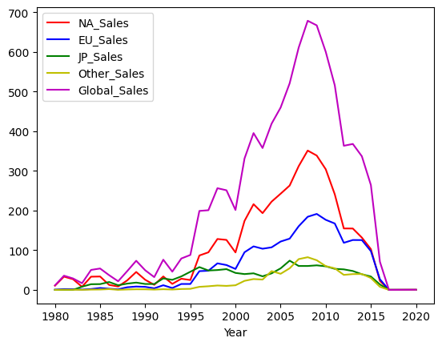

```python
import pandas as pd
import matplotlib.pyplot as plt
from prettytable import PrettyTable
```


```python
# Initialize dataframe
df = pd.read_csv('vgsales.csv', index_col='Rank')
```


```python
# Group by Genre 					--------------------------------------------------
df_genre = df[['Genre', 'NA_Sales', 'EU_Sales', 'JP_Sales', 'Other_Sales', 'Global_Sales']].groupby(['Genre'])
```


```python
# Sum / Total Sales
print(df_genre.sum())
```

                  NA_Sales  EU_Sales  JP_Sales  Other_Sales  Global_Sales
    Genre                                                                
    Action          877.83    525.00    159.95       187.38       1751.18
    Adventure       105.80     64.13     52.07        16.81        239.04
    Fighting        223.59    101.32     87.35        36.68        448.91
    Misc            410.24    215.98    107.76        75.32        809.96
    Platform        447.05    201.63    130.77        51.59        831.37
    Puzzle          123.78     50.78     57.31        12.55        244.95
    Racing          359.42    238.39     56.69        77.27        732.04
    Role-Playing    327.28    188.06    352.31        59.61        927.37
    Shooter         582.60    313.27     38.28       102.69       1037.37
    Simulation      183.31    113.38     63.70        31.52        392.20
    Sports          683.35    376.85    135.37       134.97       1330.93
    Strategy         68.70     45.34     49.46        11.36        175.12
    


```python
# Max
print(df_genre.max())
```

                  NA_Sales  EU_Sales  JP_Sales  Other_Sales  Global_Sales
    Genre                                                                
    Action            9.63      9.27      3.96        10.57         21.40
    Adventure         6.16      2.79      2.69         0.83         11.18
    Fighting          6.75      2.61      2.87         1.41         13.04
    Misc             14.97      9.26      4.16         2.85         29.02
    Platform         29.08      9.23      6.81         2.90         40.24
    Puzzle           23.20      5.36      5.32         1.18         30.26
    Racing           15.85     12.88      4.13         7.53         35.82
    Role-Playing     11.27      8.89     10.22         1.74         31.37
    Shooter          26.93      5.88      1.44         2.52         28.31
    Simulation        9.07     11.00      5.33         2.75         24.76
    Sports           41.49     29.02      3.77         8.46         82.74
    Strategy          3.18      2.27      1.61         0.59          5.45
    


```python
# Count
print(df_genre[['Global_Sales']].count())
```

                  Global_Sales
    Genre                     
    Action                3316
    Adventure             1286
    Fighting               848
    Misc                  1739
    Platform               886
    Puzzle                 582
    Racing                1249
    Role-Playing          1488
    Shooter               1310
    Simulation             867
    Sports                2346
    Strategy               681
    


```python
# Group by Publisher				----------------------------------------------

df_pub = df[['Publisher', 'NA_Sales', 'EU_Sales', 'JP_Sales', 'Other_Sales', 'Global_Sales']].groupby(['Publisher'])
```


```python
# Sum / Total Sales
print(df_pub.sum().sort_values('Global_Sales', ascending=False))
```

                                 NA_Sales  EU_Sales  JP_Sales  Other_Sales  \
    Publisher                                                                
    Nintendo                       816.87    418.74    455.42        95.33   
    Electronic Arts                595.07    371.27     14.04       129.77   
    Activision                     429.70    215.53      6.54        75.34   
    Sony Computer Entertainment    265.22    187.72     74.10        80.45   
    Ubisoft                        253.43    163.32      7.50        50.26   
    ...                               ...       ...       ...          ...   
    Ongakukan                        0.00      0.00      0.01         0.00   
    Commseed                         0.00      0.00      0.01         0.00   
    Takuyo                           0.00      0.00      0.01         0.00   
    Boost On                         0.00      0.00      0.01         0.00   
    Naxat Soft                       0.00      0.00      0.01         0.00   
    
                                 Global_Sales  
    Publisher                                  
    Nintendo                          1786.56  
    Electronic Arts                   1110.32  
    Activision                         727.46  
    Sony Computer Entertainment        607.50  
    Ubisoft                            474.72  
    ...                                   ...  
    Ongakukan                            0.01  
    Commseed                             0.01  
    Takuyo                               0.01  
    Boost On                             0.01  
    Naxat Soft                           0.01  
    
    [578 rows x 5 columns]
    


```python
# Max
print(df_pub.max().sort_values('Global_Sales', ascending=False))
```

                                 NA_Sales  EU_Sales  JP_Sales  Other_Sales  \
    Publisher                                                                
    Nintendo                        41.49     29.02     10.22         8.46   
    Microsoft Game Studios          14.97      4.94      0.24         1.67   
    Take-Two Interactive             9.63      9.27      0.97        10.57   
    Sony Computer Entertainment      6.85      5.09      3.28         7.53   
    Activision                       9.67      6.21      0.65         2.52   
    ...                               ...       ...       ...          ...   
    UIG Entertainment                0.00      0.01      0.00         0.00   
    Stainless Games                  0.01      0.01      0.00         0.00   
    Epic Games                       0.01      0.00      0.00         0.00   
    New World Computing              0.01      0.00      0.00         0.00   
    Naxat Soft                       0.00      0.00      0.01         0.00   
    
                                 Global_Sales  
    Publisher                                  
    Nintendo                            82.74  
    Microsoft Game Studios              21.82  
    Take-Two Interactive                21.40  
    Sony Computer Entertainment         14.98  
    Activision                          14.76  
    ...                                   ...  
    UIG Entertainment                    0.01  
    Stainless Games                      0.01  
    Epic Games                           0.01  
    New World Computing                  0.01  
    Naxat Soft                           0.01  
    
    [578 rows x 5 columns]
    


```python
# Min
print(df_pub.min().sort_values('Global_Sales', ascending=False))
```

                         NA_Sales  EU_Sales  JP_Sales  Other_Sales  Global_Sales
    Publisher                                                                   
    Palcom                   3.38      0.44      0.31         0.04          4.17
    Red Orb                  0.02      0.82      0.00         0.00          2.43
    UEP Systems              1.52      0.46      0.20         0.08          2.25
    Arena Entertainment      1.75      0.25      0.00         0.05          2.05
    Valve                    0.83      0.63      0.02         0.25          1.74
    ...                       ...       ...       ...          ...           ...
    Rain Games               0.00      0.01      0.00         0.00          0.01
    Rebellion                0.01      0.00      0.00         0.00          0.01
    Game Factory             0.01      0.00      0.00         0.00          0.01
    Reef Entertainment       0.00      0.00      0.00         0.00          0.01
    Falcom Corporation       0.00      0.00      0.01         0.00          0.01
    
    [578 rows x 5 columns]
    


```python
# Count
print(df_pub.count().sort_values('Global_Sales', ascending=False)['Global_Sales'])
```

    Publisher
    Electronic Arts                 1351
    Activision                       975
    Namco Bandai Games               932
    Ubisoft                          921
    Konami Digital Entertainment     832
                                    ... 
    Playmates                          1
    Playmore                           1
    Plenty                             1
    Pony Canyon                        1
    SCS Software                       1
    Name: Global_Sales, Length: 578, dtype: int64
    


```python
# Group by Publisher and Genre	----------------------------------------------

df_genre_pub = df[['Genre', 'Publisher', 'NA_Sales', 'EU_Sales', 'JP_Sales', 'Other_Sales', 'Global_Sales']].groupby(['Genre', 'Publisher'])
```


```python
# How much each publisher made per genre
print(df_genre_pub.sum().sort_values('Global_Sales', ascending=False).to_string())
```

                                                         NA_Sales  EU_Sales  JP_Sales  Other_Sales  Global_Sales
    Genre        Publisher                                                                                      
    Sports       Electronic Arts                           270.27    146.97      3.27        59.01        479.67
    Platform     Nintendo                                  220.14     85.21    102.36        19.47        427.21
    Shooter      Activision                                161.39     98.59      4.64        35.16        299.87
    Role-Playing Nintendo                                  105.63     63.92    102.24        13.07        284.90
    Sports       Nintendo                                   98.77     66.18     35.87        17.18        218.01
    Action       Take-Two Interactive                      101.45     70.44      4.44        34.78        211.08
    Misc         Nintendo                                   61.98     51.62     55.25        11.78        180.67
    Shooter      Electronic Arts                            81.15     56.03      2.93        18.20        158.26
    Racing       Nintendo                                   73.55     39.75     29.22         8.81        151.30
                 Electronic Arts                            75.52     51.20      1.20        17.90        145.77
    Action       Ubisoft                                    69.38     54.10      2.11        17.37        142.94
                 Activision                                 87.29     40.02      1.08        13.83        142.33
                 Nintendo                                   63.49     29.02     29.24         6.48        128.18
    Puzzle       Nintendo                                   55.74     26.42     37.09         5.53        124.88
    Action       Warner Bros. Interactive Entertainment     57.74     44.72      0.96        14.81        118.24
                 Electronic Arts                            54.25     44.07      2.49        14.73        115.54
    Racing       Sony Computer Entertainment                42.43     35.42     13.89        18.82        110.57
    Platform     Sony Computer Entertainment                53.04     32.87      7.57        10.50        104.06
    Sports       Konami Digital Entertainment                9.50     30.56     44.39        14.50         98.95
    Misc         Ubisoft                                    58.49     29.65      0.29         9.17         97.53
    Role-Playing Square Enix                                32.39     14.93     41.53         8.26         97.09
    Shooter      Microsoft Game Studios                     64.65     22.79      0.88         7.12         95.46
    Action       Sony Computer Entertainment                46.09     29.84      3.96        14.58         94.52
    Simulation   Electronic Arts                            44.03     35.83      0.88         8.72         89.53
    Action       THQ                                        54.37     24.83      1.94         7.85         89.23
    Simulation   Nintendo                                   29.70     26.05     23.67         5.86         85.27
    Action       Capcom                                     35.93     20.36     22.23         6.59         85.16
    Misc         Sony Computer Entertainment                25.47     33.81      5.58        15.92         80.80
    Sports       Take-Two Interactive                       54.68     13.76      0.27         8.00         76.77
    Misc         Activision                                 48.68     17.63      0.05        10.07         76.55
    Sports       Activision                                 52.88     17.56      0.13         5.42         75.91
    Fighting     THQ                                        42.63     20.58      0.64         9.00         72.86
    Sports       Sega                                       25.65     28.44      9.75         7.84         71.71
    Action       Konami Digital Entertainment               30.47     19.60     12.52         8.62         71.33
    Shooter      Nintendo                                   51.39      9.85      6.07         2.39         69.73
                 Ubisoft                                    35.01     24.04      0.96         7.57         67.65
    Action       Eidos Interactive                          33.43     23.40      3.41         5.41         65.60
                 LucasArts                                  35.61     18.31      0.06         8.01         62.02
    Fighting     Namco Bandai Games                         21.46     14.72     19.83         5.25         61.22
    Platform     Sega                                       33.77     18.48      3.40         5.17         60.84
    Sports       Sony Computer Entertainment                32.09     13.07      8.86         5.63         59.61
    Shooter      Sony Computer Entertainment                31.22     16.70      2.80         6.86         57.52
                 Take-Two Interactive                       29.62     18.38      0.67         5.91         54.47
    Role-Playing Bethesda Softworks                         26.46     20.11      0.90         6.68         54.16
                 Namco Bandai Games                         12.56      9.57     28.17         3.49         53.82
    Fighting     Nintendo                                   27.10      8.64     14.94         2.65         53.35
    Role-Playing SquareSoft                                 10.37      4.47     36.45         1.32         52.59
    Action       Disney Interactive Studios                 29.90     16.50      0.09         5.57         52.20
    Misc         Microsoft Game Studios                     30.61     12.25      0.44         3.71         46.99
    Role-Playing Activision                                 23.58     18.40      0.26         4.55         46.79
    Simulation   Ubisoft                                    28.01     11.70      0.79         4.07         44.67
    Role-Playing Sony Computer Entertainment                15.90      9.21     16.08         2.84         44.00
    Platform     THQ                                        25.92     11.75      0.08         3.33         41.02
    Racing       THQ                                        27.35      9.09      0.02         3.71         40.17
    Action       Namco Bandai Games                          8.75      5.14     21.10         1.82         36.90
    Adventure    Nintendo                                   17.72      7.66      9.01         1.28         35.71
    Role-Playing Electronic Arts                            17.82     11.39      2.66         3.42         35.30
    Racing       Codemasters                                 6.19     22.77      0.66         4.90         34.62
    Platform     Activision                                 23.45      7.85      0.07         2.01         33.40
    Racing       Microsoft Game Studios                     16.83     13.13      0.43         2.72         33.08
    Fighting     Capcom                                     14.62      6.77      9.37         2.20         33.01
    Role-Playing Capcom                                      4.30      2.33     23.45         2.58         32.67
                 Enix Corporation                            0.69      0.25     31.26         0.20         32.41
    Simulation   Konami Digital Entertainment               14.17      5.99      9.33         2.79         32.31
    Action       Sega                                       15.08      7.63      6.20         3.23         32.15
    Fighting     Electronic Arts                            19.88      8.75      0.03         2.78         31.39
    Misc         Namco Bandai Games                         11.78      4.41     12.25         1.10         29.55
    Action       Square Enix                                 9.59     12.79      2.92         3.87         29.16
                 Tecmo Koei                                  7.95      3.85     15.58         1.65         29.04
    Fighting     Sony Computer Entertainment                10.30      8.53      7.24         2.08         28.15
    Strategy     Nintendo                                   11.66      4.42     10.46         0.83         27.35
    Action       Atari                                      18.66      6.45      0.14         1.45         26.65
    Fighting     Atari                                      14.61      3.25      5.47         2.59         25.98
    Misc         Electronic Arts                            14.92      7.30      0.01         2.70         24.95
                 Disney Interactive Studios                 15.09      5.68      0.27         3.77         24.89
    Sports       Ubisoft                                    14.54      7.37      0.08         2.18         24.24
    Misc         THQ                                        17.60      4.66      0.00         1.39         23.68
    Shooter      Atari                                      19.36      2.58      0.09         0.58         22.69
    Platform     Capcom                                     11.97      3.83      5.72         1.10         22.62
    Simulation   505 Games                                  12.78      6.76      0.52         2.12         22.24
    Adventure    Ubisoft                                    11.41      8.08      0.28         2.43         22.19
    Racing       Sega                                        8.55      7.38      3.53         2.39         21.83
    Puzzle       Atari                                      17.88      3.05      0.21         0.39         21.59
    Racing       Take-Two Interactive                       13.94      4.80      0.08         2.43         21.25
    Platform     Ubisoft                                    10.05      9.03      0.04         1.93         21.06
    Misc         MTV Games                                  14.98      4.01      0.01         2.03         20.97
    Role-Playing Microsoft Game Studios                     12.79      5.55      0.59         1.64         20.58
    Action       Virgin Interactive                          8.06      5.28      5.26         1.75         20.35
    Misc         Sega                                        8.65      4.69      5.45         1.43         20.21
    Adventure    THQ                                        11.22      7.17      0.14         1.44         19.98
    Sports       Namco Bandai Games                          3.97      1.50     13.19         0.49         19.16
    Misc         Konami Digital Entertainment               10.57      3.78      3.05         1.21         18.62
    Sports       Acclaim Entertainment                      13.13      3.96      0.00         0.90         18.07
                 Midway Games                               12.17      4.55      0.00         1.17         17.94
    Adventure    Disney Interactive Studios                 11.33      4.76      0.03         1.63         17.76
    Strategy     Activision                                  8.16      7.94      0.00         1.57         17.70
    Racing       Activision                                 12.18      3.66      0.04         1.35         17.31
    Platform     Vivendi Games                              10.12      5.43      0.00         1.54         17.07
    Shooter      LucasArts                                   9.82      5.25      0.07         1.91         17.03
    Fighting     Acclaim Entertainment                      11.62      3.99      0.48         0.69         16.80
    Role-Playing Ubisoft                                     9.06      4.05      2.15         1.48         16.76
    Shooter      Sega                                        6.15      5.29      3.60         1.57         16.59
    Fighting     Midway Games                               11.70      3.31      0.00         1.46         16.51
    Racing       Ubisoft                                     7.73      6.27      0.10         1.71         15.83
    Shooter      THQ                                         7.27      5.67      0.25         1.72         14.90
    Platform     Konami Digital Entertainment                7.06      2.14      4.88         0.73         14.83
    Racing       Acclaim Entertainment                       9.07      4.57      0.08         0.98         14.72
    Role-Playing Sega                                        3.89      1.92      8.04         0.85         14.71
    Fighting     Sega                                        4.51      2.61      6.52         1.02         14.68
    Sports       Microsoft Game Studios                      9.69      3.78      0.21         0.95         14.64
                 505 Games                                   8.28      4.58      0.00         1.46         14.32
    Strategy     Electronic Arts                             8.84      4.10      0.44         0.67         14.08
    Role-Playing Konami Digital Entertainment                5.47      2.06      5.69         0.49         13.74
    Fighting     Warner Bros. Interactive Entertainment      8.68      3.32      0.01         1.69         13.69
    Shooter      Bethesda Softworks                          5.74      5.86      0.20         1.81         13.65
    Adventure    Sony Computer Entertainment                 4.57      4.39      2.73         1.85         13.55
    Action       Deep Silver                                 6.47      4.83      0.50         1.59         13.36
    Sports       THQ                                         7.64      4.23      0.14         1.25         13.22
    Racing       Atari                                       7.10      4.17      0.07         1.33         12.73
    Action       Vivendi Games                               8.38      2.97      0.00         1.21         12.60
    Sports       Atari                                       8.95      2.31      0.34         0.97         12.54
    Simulation   Microsoft Game Studios                      7.10      4.51      0.05         0.81         12.49
    Action       Microsoft Game Studios                      8.09      3.16      0.38         0.81         12.45
    Platform     Universal Interactive                       5.58      4.85      0.24         1.30         11.95
    Strategy     Namco Bandai Games                          0.14      0.04     11.44         0.21         11.83
    Shooter      Vivendi Games                               9.54      1.46      0.17         0.50         11.69
    Racing       Vivendi Games                               5.47      4.60      0.00         1.23         11.28
    Shooter      Capcom                                      5.14      2.81      2.10         1.08         11.15
    Strategy     Konami Digital Entertainment                4.45      1.67      4.25         0.64         10.99
    Misc         Take-Two Interactive                        6.69      2.92      0.05         0.95         10.58
    Role-Playing Atlus                                       3.19      0.78      5.93         0.65         10.49
                 Nippon Ichi Software                        3.77      1.37      4.50         0.92         10.48
    Simulation   Namco Bandai Games                          1.68      0.89      7.38         0.46         10.43
    Adventure    Capcom                                      3.62      1.48      4.61         0.53         10.25
    Strategy     Banpresto                                   0.00      0.00      9.98         0.20         10.18
    Shooter      Namco Bandai Games                          2.42      2.52      4.25         0.65          9.87
    Platform     Disney Interactive Studios                  6.37      2.73      0.12         0.59          9.85
    Action       D3Publisher                                 4.58      2.65      0.68         1.88          9.80
                 Bethesda Softworks                          4.17      3.89      0.35         1.22          9.64
    Misc         Midway Games                                6.02      2.74      0.00         0.82          9.61
    Adventure    Konami Digital Entertainment                5.00      1.46      2.69         0.45          9.57
    Shooter      Konami Digital Entertainment                3.28      1.86      3.65         0.65          9.47
    Puzzle       THQ                                         5.37      2.02      1.10         0.76          9.25
    Racing       Disney Interactive Studios                  4.91      3.14      0.05         1.02          9.12
    Sports       989 Studios                                 5.94      2.44      0.10         0.49          8.97
    Action       GT Interactive                              4.85      3.57      0.02         0.43          8.88
    Misc         RedOctane                                   6.44      1.31      0.03         0.91          8.68
    Simulation   Sony Computer Entertainment                 3.13      2.40      2.38         0.75          8.67
    Strategy     Ubisoft                                     3.23      4.03      0.09         1.12          8.45
    Simulation   Activision                                  5.33      2.14      0.02         0.80          8.26
    Role-Playing Atari                                       3.87      2.02      1.62         0.52          8.07
    Shooter      Eidos Interactive                           4.46      2.60      0.19         0.77          8.06
    Fighting     Virgin Interactive                          2.54      1.63      3.35         0.46          7.98
    Simulation   THQ                                         5.40      1.44      0.49         0.55          7.84
    Adventure    Take-Two Interactive                        3.96      2.58      0.14         0.88          7.56
    Strategy     THQ                                         3.37      2.89      0.21         1.03          7.49
    Platform     Atari                                       6.44      0.82      0.00         0.16          7.45
    Adventure    Sega                                        0.84      0.30      6.06         0.23          7.41
    Strategy     Take-Two Interactive                        4.07      2.45      0.05         0.82          7.40
    Shooter      Square Enix                                 3.14      2.59      0.82         0.85          7.37
    Action       Midway Games                                4.92      1.85      0.00         0.57          7.35
    Misc         Atari                                       5.98      0.73      0.07         0.40          7.21
    Sports       ASCII Entertainment                         0.21      0.14      6.48         0.26          7.08
    Fighting     Ubisoft                                     3.89      1.95      0.58         0.66          7.07
    Racing       Namco Bandai Games                          2.65      2.28      1.38         0.69          7.01
    Strategy     Sega                                        1.19      3.27      1.77         0.62          6.87
    Fighting     GT Interactive                              4.60      1.95      0.00         0.28          6.84
    Role-Playing Tecmo Koei                                  2.40      1.28      2.43         0.70          6.81
    Misc         Hasbro Interactive                          4.62      1.88      0.00         0.29          6.80
    Puzzle       Warner Bros. Interactive Entertainment      4.82      1.31      0.02         0.52          6.65
                 Hudson Soft                                 0.95      0.29      5.23         0.14          6.61
    Misc         Sony Computer Entertainment Europe          1.66      2.94      0.99         1.02          6.60
    Sports       Unknown                                     5.02      0.97      0.00         0.57          6.57
    Racing       Midway Games                                4.36      1.66      0.00         0.51          6.56
    Misc         Unknown                                     3.57      1.38      1.12         0.43          6.53
    Platform     Electronic Arts                             3.16      2.55      0.05         0.74          6.53
    Shooter      Acclaim Entertainment                       3.87      1.77      0.44         0.35          6.41
    Puzzle       Ubisoft                                     2.63      3.05      0.03         0.57          6.33
    Action       3DO                                         4.31      1.67      0.00         0.29          6.28
    Sports       Activision Value                            4.91      0.75      0.00         0.51          6.14
    Puzzle       Namco Bandai Games                          2.13      0.52      3.24         0.22          6.12
    Strategy     Eidos Interactive                           3.38      2.30      0.01         0.41          6.12
    Role-Playing Take-Two Interactive                        3.02      1.82      0.13         1.10          6.07
    Misc         Mindscape                                   3.70      1.86      0.00         0.44          6.03
    Action       Sony Computer Entertainment Europe          2.41      2.28      0.28         1.01          5.99
    Role-Playing Rising Star Games                           3.35      0.75      1.28         0.39          5.80
    Racing       Empire Interactive                          3.11      2.03      0.00         0.62          5.72
    Role-Playing Level 5                                     0.00      0.01      5.68         0.00          5.69
    Misc         Warner Bros. Interactive Entertainment      4.25      0.91      0.00         0.48          5.64
    Strategy     Tecmo Koei                                  0.95      0.42      4.08         0.15          5.63
    Shooter      Midway Games                                3.31      1.78      0.02         0.57          5.62
    Action       Hasbro Interactive                          4.59      0.81      0.00         0.20          5.59
    Shooter      505 Games                                   2.62      2.14      0.08         0.70          5.57
    Adventure    Activision                                  4.04      0.87      0.10         0.41          5.42
                 Namco Bandai Games                          0.86      0.68      3.55         0.19          5.29
    Role-Playing Unknown                                     1.95      0.88      2.11         0.34          5.28
    Adventure    Red Orb                                     1.54      3.61      0.00         0.10          5.24
    Simulation   Sony Computer Entertainment Europe          2.94      0.90      0.70         0.35          4.88
                 Atari                                       1.95      0.21      2.53         0.16          4.88
    Misc         Hudson Soft                                 0.01      0.00      4.85         0.01          4.88
    Shooter      Codemasters                                 2.31      1.77      0.15         0.59          4.86
    Action       Level 5                                     0.00      0.00      4.84         0.00          4.84
    Adventure    Electronic Arts                             2.57      1.65      0.08         0.44          4.75
    Strategy     Virgin Interactive                          2.24      1.95      0.22         0.27          4.67
    Sports       Global Star                                 3.32      0.82      0.00         0.45          4.59
    Simulation   Rising Star Games                           3.11      0.38      0.84         0.27          4.58
    Puzzle       Electronic Arts                             2.66      1.43      0.00         0.46          4.55
    Misc         505 Games                                   3.63      0.52      0.00         0.34          4.53
    Racing       Unknown                                     1.38      2.02      0.48         0.62          4.51
    Shooter      Imagic                                      4.16      0.25      0.00         0.04          4.45
    Action       Unknown                                     2.27      0.93      1.01         0.11          4.32
    Platform     Fox Interactive                             1.98      2.07      0.00         0.25          4.29
    Strategy     Microsoft Game Studios                      1.81      1.94      0.04         0.51          4.29
    Shooter      Virgin Interactive                          2.45      1.61      0.00         0.20          4.27
    Action       Palcom                                      3.38      0.44      0.31         0.04          4.17
    Fighting     Tomy Corporation                            1.32      0.62      1.96         0.24          4.13
    Racing       Psygnosis                                   1.92      1.30      0.65         0.27          4.13
    Simulation   LucasArts                                   2.59      1.29      0.03         0.20          4.11
    Sports       Tecmo Koei                                  0.66      0.34      2.81         0.19          3.99
    Racing       Eidos Interactive                           2.38      1.27      0.00         0.34          3.99
    Sports       Eidos Interactive                           0.28      3.27      0.00         0.33          3.87
    Strategy     Atari                                       2.75      0.80      0.00         0.29          3.87
    Action       Parker Bros.                                3.60      0.21      0.00         0.03          3.85
    Fighting     Tecmo Koei                                  1.29      0.74      1.51         0.27          3.80
    Misc         D3Publisher                                 1.15      0.32      2.09         0.18          3.75
                 Infogrames                                  2.55      0.98      0.05         0.16          3.73
    Shooter      Warner Bros. Interactive Entertainment      1.64      1.49      0.05         0.52          3.71
    Puzzle       Sony Computer Entertainment                 0.64      0.78      1.97         0.34          3.71
    Action       Universal Interactive                       2.15      1.23      0.00         0.31          3.68
    Racing       Infogrames                                  2.10      1.16      0.17         0.25          3.67
    Sports       Majesco Entertainment                       2.25      1.08      0.00         0.34          3.66
                 Spike                                       2.93      0.30      0.03         0.34          3.60
    Adventure    Atari                                       2.49      0.73      0.17         0.17          3.56
    Role-Playing Eidos Interactive                           0.87      0.19      2.34         0.11          3.52
    Platform     Virgin Interactive                          2.40      0.86      0.11         0.13          3.48
    Role-Playing Square                                      0.53      0.29      2.45         0.22          3.48
    Simulation   Sega                                        0.36      1.90      1.08         0.12          3.46
                 Maxis                                       1.88      1.32      0.00         0.19          3.39
    Action       Ubisoft Annecy                              0.82      0.32      2.08         0.18          3.38
    Role-Playing Sony Online Entertainment                   1.82      1.15      0.00         0.39          3.37
    Platform     Take-Two Interactive                        2.46      0.63      0.00         0.30          3.34
    Shooter      City Interactive                            0.94      1.87      0.07         0.43          3.33
    Misc         Nordic Games                                0.33      2.56      0.00         0.35          3.24
    Shooter      Valve Software                              1.74      1.15      0.01         0.32          3.23
    Racing       Zoo Digital Publishing                      2.64      0.37      0.02         0.21          3.22
    Action       505 Games                                   1.31      1.21      0.38         0.31          3.22
    Fighting     Square Enix                                 0.72      0.64      1.43         0.40          3.20
    Sports       Zoo Digital Publishing                      1.81      0.94      0.12         0.32          3.17
    Shooter      GT Interactive                              2.04      0.97      0.00         0.16          3.16
    Sports       Codemasters                                 0.48      2.33      0.01         0.31          3.13
    Puzzle       Midway Games                                0.91      1.76      0.00         0.36          3.05
    Adventure    Square Enix                                 1.07      1.12      0.51         0.25          2.96
    Role-Playing Deep Silver                                 0.91      1.39      0.30         0.38          2.96
    Action       Majesco Entertainment                       2.01      0.80      0.00         0.14          2.95
                 Koch Media                                  1.74      0.59      0.00         0.59          2.92
    Adventure    Mojang                                      1.25      1.30      0.00         0.36          2.89
    Shooter      SCi                                         1.67      1.02      0.00         0.21          2.89
    Platform     Namco Bandai Games                          1.12      0.36      1.29         0.12          2.89
    Role-Playing GungHo                                      0.84      0.02      1.91         0.11          2.88
    Strategy     Warner Bros. Interactive Entertainment      1.88      0.74      0.00         0.24          2.86
    Fighting     Activision                                  1.94      0.76      0.00         0.15          2.86
    Shooter      D3Publisher                                 1.32      0.78      0.47         0.26          2.83
    Simulation   Focus Home Interactive                      0.31      2.07      0.02         0.38          2.81
    Fighting     PQube                                       1.33      0.55      0.69         0.25          2.80
    Platform     Sony Computer Entertainment Europe          1.05      0.96      0.44         0.32          2.78
                 Hudson Soft                                 0.00      0.00      2.77         0.00          2.77
    Sports       Hudson Soft                                 0.93      0.47      1.23         0.14          2.76
    Fighting     Eidos Interactive                           1.43      0.94      0.16         0.23          2.73
    Misc         Majesco Entertainment                       2.11      0.43      0.00         0.14          2.70
    Fighting     Arena Entertainment                         1.95      0.63      0.00         0.09          2.67
    Adventure    Sony Computer Entertainment Europe          0.65      1.43      0.05         0.50          2.64
    Action       989 Studios                                 1.98      0.54      0.00         0.11          2.63
    Misc         Zoo Games                                   2.45      0.00      0.00         0.16          2.63
    Role-Playing Banpresto                                   0.30      0.14      2.11         0.09          2.62
    Misc         Crave Entertainment                         2.09      0.37      0.00         0.15          2.61
    Fighting     SNK                                         0.04      0.03      2.48         0.04          2.59
    Adventure    Telltale Games                              1.23      0.91      0.03         0.37          2.56
    Misc         Zoo Digital Publishing                      1.96      0.53      0.00         0.06          2.55
    Platform     GT Interactive                              1.47      0.94      0.00         0.14          2.54
    Puzzle       Disney Interactive Studios                  1.19      1.05      0.00         0.30          2.54
                 Sega                                        0.76      0.09      1.63         0.05          2.53
    Platform     TDK Mediactive                              1.75      0.69      0.00         0.06          2.51
    Misc         Oxygen Interactive                          1.36      0.80      0.00         0.30          2.48
    Fighting     Microsoft Game Studios                      1.68      0.45      0.24         0.09          2.43
    Puzzle       Compile                                     0.00      0.00      2.32         0.10          2.43
    Adventure    Idea Factory                                0.19      0.00      2.19         0.04          2.42
    Platform     D3Publisher                                 1.34      0.75      0.04         0.29          2.40
    Puzzle       JVC                                         2.10      0.24      0.00         0.07          2.40
    Racing       Capcom                                      0.68      1.12      0.06         0.52          2.38
    Puzzle       505 Games                                   1.68      0.47      0.01         0.19          2.38
    Platform     Acclaim Entertainment                       1.67      0.56      0.04         0.08          2.34
    Strategy     Sony Computer Entertainment                 0.34      0.70      1.04         0.28          2.34
    Role-Playing Ghostlight                                  0.97      0.33      0.86         0.18          2.34
    Sports       Bethesda Softworks                          2.09      0.06      0.00         0.19          2.34
    Racing       TDK Mediactive                              1.35      0.76      0.00         0.21          2.32
    Action       NCSoft                                      0.95      1.06      0.00         0.29          2.30
    Shooter      Red Storm Entertainment                     1.41      0.78      0.00         0.09          2.28
    Fighting     Ignition Entertainment                      1.27      0.55      0.21         0.20          2.26
    Sports       UEP Systems                                 1.52      0.46      0.20         0.08          2.25
    Adventure    Alchemist                                   0.59      0.46      0.95         0.15          2.16
                 ChunSoft                                    0.37      0.00      1.75         0.04          2.16
    Misc         Rising Star Games                           1.24      0.69      0.03         0.18          2.16
    Role-Playing Infogrames                                  1.75      0.18      0.16         0.06          2.14
    Shooter      Fox Interactive                             1.19      0.81      0.00         0.14          2.14
    Sports       Natsume                                     1.46      0.44      0.10         0.13          2.11
    Shooter      Infogrames                                  1.12      0.77      0.00         0.19          2.10
    Simulation   Tecmo Koei                                  0.47      0.30      1.20         0.14          2.10
    Puzzle       Unknown                                     1.00      0.32      0.69         0.09          2.09
    Sports       Arena Entertainment                         1.75      0.25      0.00         0.05          2.05
    Simulation   Majesco Entertainment                       1.76      0.13      0.00         0.12          2.03
    Sports       Deep Silver                                 1.45      0.39      0.00         0.19          2.03
    Racing       GT Interactive                              1.42      0.53      0.00         0.07          2.02
    Adventure    LucasArts                                   0.77      1.07      0.04         0.15          2.01
    Racing       Video System                                0.52      1.00      0.37         0.09          1.99
    Puzzle       Banpresto                                   0.00      0.00      1.96         0.01          1.97
    Misc         Capcom                                      1.12      0.29      0.38         0.14          1.94
    Racing       Bethesda Softworks                          0.98      0.70      0.00         0.22          1.93
    Adventure    Focus Home Interactive                      0.46      1.22      0.00         0.28          1.93
    Sports       RTL                                         0.77      0.94      0.00         0.19          1.89
    Strategy     Square Enix                                 0.46      0.38      0.91         0.12          1.87
    Role-Playing Hudson Soft                                 0.08      0.03      1.75         0.01          1.87
                 ChunSoft                                    0.00      0.00      1.82         0.05          1.87
    Puzzle       D3Publisher                                 1.53      0.15      0.03         0.14          1.86
    Fighting     Takara                                      0.00      0.00      1.80         0.00          1.80
    Strategy     SquareSoft                                  0.10      0.07      1.53         0.07          1.79
    Racing       SouthPeak Games                             1.54      0.05      0.00         0.20          1.79
    Role-Playing Kadokawa Shoten                             0.46      0.31      0.94         0.07          1.78
    Puzzle       Avanquest                                   0.59      1.05      0.00         0.15          1.77
    Racing       Black Bean Games                            0.53      0.99      0.01         0.24          1.77
    Shooter      Valve                                       0.83      0.63      0.02         0.25          1.74
    Platform     Midway Games                                1.20      0.37      0.00         0.15          1.74
    Fighting     Konami Digital Entertainment                0.75      0.26      0.63         0.09          1.73
    Action       20th Century Fox Video Games                1.61      0.09      0.00         0.01          1.72
    Racing       989 Studios                                 1.31      0.32      0.00         0.07          1.72
    Simulation   Taito                                       0.00      0.00      1.55         0.17          1.72
    Misc         Codemasters                                 0.93      0.61      0.00         0.15          1.70
    Adventure    Kadokawa Shoten                             0.00      0.00      1.70         0.00          1.70
    Shooter      Unknown                                     1.18      0.31      0.05         0.12          1.68
    Misc         Play It                                     1.24      0.22      0.00         0.21          1.67
    Adventure    Deep Silver                                 0.63      0.62      0.23         0.17          1.67
    Misc         Sammy Corporation                           0.00      0.00      1.67         0.00          1.67
    Platform     Microsoft Game Studios                      0.94      0.59      0.00         0.12          1.65
    Racing       Crave Entertainment                         0.76      0.57      0.15         0.17          1.65
    Simulation   Deep Silver                                 1.03      0.41      0.00         0.17          1.64
    Action       Rising Star Games                           0.97      0.42      0.09         0.14          1.64
    Adventure    Microsoft Game Studios                      1.09      0.44      0.00         0.08          1.63
                 GSP                                         0.53      0.93      0.00         0.16          1.62
    Action       Ocean                                       1.04      0.51      0.02         0.05          1.62
                 Hello Games                                 0.58      0.74      0.02         0.26          1.60
    Sports       Mastiff                                     1.49      0.00      0.00         0.10          1.59
    Role-Playing Virgin Interactive                          0.87      0.55      0.00         0.17          1.58
    Shooter      Gotham Games                                0.98      0.53      0.00         0.06          1.57
    Adventure    Avanquest Software                          0.95      0.42      0.03         0.17          1.57
    Sports       3DO                                         0.83      0.59      0.00         0.16          1.57
    Misc         Square Enix                                 0.35      0.15      1.02         0.04          1.56
    Fighting     SquareSoft                                  0.42      0.29      0.77         0.08          1.55
    Misc         Vivendi Games                               0.90      0.50      0.00         0.12          1.55
    Role-Playing Marvelous Interactive                       0.80      0.07      0.63         0.06          1.55
    Strategy     Westwood Studios                            1.55      0.00      0.00         0.00          1.55
    Adventure    Vivendi Games                               0.88      0.47      0.06         0.15          1.54
    Platform     Warner Bros. Interactive Entertainment      1.11      0.29      0.00         0.13          1.53
    Action       Acclaim Entertainment                       0.89      0.53      0.00         0.11          1.53
    Puzzle       Empire Interactive                          1.01      0.40      0.00         0.13          1.53
    Racing       Play It                                     0.74      0.58      0.00         0.20          1.52
    Action       Mattel Interactive                          1.40      0.08      0.00         0.01          1.51
    Misc         GSP                                         0.33      1.02      0.00         0.16          1.51
    Simulation   Unknown                                     1.10      0.25      0.02         0.13          1.50
                 Koch Media                                  0.52      0.80      0.00         0.19          1.50
    Strategy     LucasArts                                   0.93      0.39      0.00         0.14          1.50
    Shooter      Empire Interactive                          0.77      0.54      0.00         0.17          1.48
    Role-Playing Disney Interactive Studios                  1.20      0.16      0.00         0.12          1.47
    Fighting     Human Entertainment                         0.00      0.00      1.45         0.02          1.46
    Platform     Coleco                                      1.36      0.08      0.00         0.02          1.46
    Action       Touchstone                                  0.81      0.44      0.02         0.17          1.44
    Puzzle       Ignition Entertainment                      0.78      0.26      0.18         0.18          1.44
    Action       Codemasters                                 0.65      0.61      0.00         0.17          1.43
                 Hudson Soft                                 0.00      0.00      1.42         0.00          1.42
                 Tigervision                                 1.33      0.09      0.00         0.01          1.42
    Role-Playing Focus Home Interactive                      0.63      0.57      0.02         0.18          1.41
    Action       Marvelous Entertainment                     0.50      0.20      0.65         0.06          1.40
    Racing       Slightly Mad Studios                        0.25      0.92      0.02         0.18          1.38
    Platform     Eidos Interactive                           0.81      0.47      0.00         0.09          1.38
    Action       Interplay                                   0.84      0.43      0.00         0.11          1.38
    Simulation   Square Enix                                 0.60      0.05      0.67         0.05          1.37
    Puzzle       Acclaim Entertainment                       0.78      0.46      0.00         0.08          1.35
    Adventure    5pb                                         0.00      0.00      1.34         0.00          1.34
    Puzzle       Zoo Digital Publishing                      1.11      0.16      0.00         0.07          1.33
    Role-Playing Imagineer                                   0.00      0.00      1.33         0.00          1.33
    Simulation   Nobilis                                     1.10      0.13      0.00         0.10          1.32
    Action       Nippon Ichi Software                        0.48      0.15      0.56         0.14          1.32
    Strategy     Kalypso Media                               0.55      0.55      0.04         0.13          1.31
    Racing       Genki                                       0.44      0.34      0.43         0.11          1.31
                 ASC Games                                   0.73      0.50      0.00         0.09          1.31
    Adventure    Global Star                                 0.82      0.38      0.00         0.08          1.30
    Simulation   Game Factory                                1.19      0.01      0.00         0.10          1.30
    Racing       Accolade                                    1.05      0.20      0.00         0.05          1.30
    Adventure    Scholastic Inc.                             1.17      0.03      0.00         0.08          1.29
    Racing       Milestone S.r.l.                            0.23      0.78      0.10         0.16          1.28
    Role-Playing SouthPeak Games                             0.77      0.35      0.03         0.14          1.28
    Racing       Konami Digital Entertainment                0.92      0.25      0.04         0.08          1.27
    Action       Coleco                                      1.19      0.07      0.00         0.01          1.26
                 Psygnosis                                   0.70      0.48      0.00         0.08          1.26
    Misc         Pinnacle                                    0.00      1.17      0.00         0.09          1.26
    Sports       Infogrames                                  0.88      0.35      0.00         0.04          1.26
    Platform     Infogrames                                  0.80      0.41      0.00         0.06          1.26
    Adventure    Acclaim Entertainment                       0.62      0.42      0.10         0.09          1.24
    Shooter      Hudson Soft                                 0.32      0.06      0.84         0.01          1.23
    Racing       LEGO Media                                  0.81      0.36      0.00         0.03          1.21
    Action       Black Label Games                           0.59      0.46      0.00         0.15          1.20
    Strategy     Microprose                                  0.25      0.88      0.00         0.10          1.20
    Fighting     Atlus                                       0.44      0.16      0.50         0.10          1.19
    Misc         Acclaim Entertainment                       0.79      0.34      0.00         0.06          1.19
                 Aruze Corp                                  0.00      0.00      1.09         0.08          1.18
    Sports       Sony Computer Entertainment America         1.04      0.00      0.00         0.13          1.18
    Strategy     Mastertronic                                0.95      0.15      0.00         0.08          1.18
    Puzzle       Scholastic Inc.                             1.09      0.00      0.00         0.08          1.18
    Role-Playing 505 Games                                   0.49      0.27      0.31         0.11          1.17
    Sports       Crave Entertainment                         0.88      0.21      0.00         0.11          1.16
    Simulation   Metro 3D                                    0.37      0.28      0.42         0.10          1.16
    Puzzle       Majesco Entertainment                       1.03      0.04      0.00         0.07          1.16
    Misc         Rocket Company                              0.00      0.00      1.15         0.00          1.15
    Role-Playing Falcom Corporation                          0.28      0.00      0.85         0.03          1.15
    Adventure    Unknown                                     0.64      0.08      0.39         0.04          1.15
    Shooter      Success                                     0.64      0.43      0.00         0.07          1.15
    Role-Playing Crave Entertainment                         0.45      0.30      0.30         0.08          1.14
    Shooter      Trion Worlds                                0.71      0.30      0.00         0.11          1.14
    Action       TDK Mediactive                              0.82      0.28      0.00         0.01          1.13
    Role-Playing THQ                                         0.63      0.40      0.00         0.11          1.13
    Misc         Nippon Ichi Software                        0.40      0.24      0.30         0.19          1.13
                 Eidos Interactive                           0.64      0.38      0.00         0.08          1.12
    Sports       DTP Entertainment                           0.41      0.47      0.00         0.21          1.12
                 Russel                                      0.00      1.12      0.00         0.00          1.12
    Puzzle       Hasbro Interactive                          0.62      0.42      0.00         0.08          1.12
                 Storm City Games                            0.93      0.10      0.00         0.07          1.12
    Racing       Jester Interactive                          0.68      0.28      0.00         0.14          1.11
    Sports       Enterbrain                                  0.00      0.00      1.09         0.00          1.10
    Role-Playing Midway Games                                0.55      0.35      0.10         0.11          1.10
                 Compile Heart                               0.41      0.03      0.60         0.06          1.10
    Puzzle       Level 5                                     0.20      0.26      0.59         0.04          1.10
    Fighting     Rage Software                               0.60      0.38      0.00         0.12          1.10
    Puzzle       Rondomedia                                  0.53      0.47      0.00         0.10          1.09
    Action       Crave Entertainment                         0.87      0.15      0.00         0.05          1.09
                 BAM! Entertainment                          0.65      0.35      0.00         0.09          1.09
    Sports       Agetec                                      0.53      0.41      0.00         0.14          1.08
    Racing       ASCII Entertainment                         0.12      0.05      0.90         0.01          1.08
                 Xplosiv                                     0.35      0.63      0.00         0.09          1.07
    Misc         Mentor Interactive                          0.99      0.00      0.00         0.07          1.07
    Simulation   Titus                                       0.57      0.38      0.00         0.12          1.07
    Puzzle       Activision                                  0.78      0.11      0.15         0.02          1.06
    Role-Playing Vivendi Games                               1.03      0.02      0.00         0.00          1.06
    Fighting     Takara Tomy                                 0.22      0.03      0.78         0.02          1.05
    Shooter      TDK Mediactive                              0.62      0.33      0.00         0.08          1.04
    Simulation   Hudson Soft                                 0.06      0.05      0.92         0.01          1.03
                 Destineer                                   0.98      0.00      0.00         0.05          1.03
    Misc         Interplay                                   0.57      0.38      0.00         0.07          1.02
    Simulation   Eidos Interactive                           0.57      0.35      0.00         0.10          1.01
    Adventure    Tecmo Koei                                  0.00      0.00      1.01         0.00          1.01
    Puzzle       Rising Star Games                           0.49      0.35      0.05         0.08          1.00
    Shooter      Sony Computer Entertainment Europe          0.25      0.49      0.04         0.22          1.00
    Puzzle       Deep Silver                                 0.79      0.12      0.00         0.08          0.99
    Role-Playing Gust                                        0.15      0.05      0.73         0.05          0.99
    Racing       Warner Bros. Interactive Entertainment      0.75      0.15      0.00         0.09          0.98
    Sports       Black Bean Games                            0.44      0.41      0.00         0.13          0.98
    Adventure    Little Orbit                                0.23      0.65      0.00         0.09          0.97
    Action       Spike                                       0.06      0.00      0.90         0.01          0.97
    Sports       XS Games                                    0.91      0.00      0.00         0.07          0.97
                 Disney Interactive Studios                  0.56      0.33      0.00         0.08          0.97
    Fighting     Gotham Games                                0.53      0.34      0.00         0.11          0.97
    Racing       Kemco                                       0.75      0.18      0.00         0.00          0.95
    Simulation   Jorudan                                     0.00      0.00      0.93         0.02          0.95
    Misc         IE Institute                                0.00      0.00      0.94         0.00          0.94
                 GT Interactive                              0.52      0.36      0.00         0.06          0.94
    Sports       Midas Interactive Entertainment             0.51      0.33      0.00         0.10          0.93
    Action       Little Orbit                                0.16      0.66      0.00         0.07          0.92
    Misc         NewKidCo                                    0.59      0.29      0.00         0.04          0.92
    Adventure    Majesco Entertainment                       0.70      0.19      0.00         0.02          0.91
    Platform     Hasbro Interactive                          0.72      0.17      0.00         0.01          0.91
    Action       SouthPeak Games                             0.74      0.07      0.04         0.06          0.91
    Role-Playing ASCII Entertainment                         0.11      0.07      0.70         0.03          0.91
    Fighting     505 Games                                   0.52      0.22      0.06         0.10          0.91
    Puzzle       Eidos Interactive                           0.73      0.08      0.00         0.07          0.90
    Shooter      SouthPeak Games                             0.64      0.17      0.00         0.08          0.90
    Misc         Takara                                      0.16      0.06      0.63         0.04          0.89
    Simulation   Take-Two Interactive                        0.49      0.34      0.00         0.07          0.89
    Racing       Majesco Entertainment                       0.69      0.16      0.00         0.03          0.89
    Strategy     Deep Silver                                 0.62      0.22      0.00         0.06          0.89
    Shooter      CTO SpA                                     0.49      0.33      0.00         0.06          0.88
    Simulation   Disney Interactive Studios                  0.53      0.28      0.00         0.08          0.88
                 Kalypso Media                               0.33      0.40      0.05         0.10          0.88
    Sports       Zushi Games                                 0.77      0.02      0.00         0.06          0.87
    Shooter      TalonSoft                                   0.49      0.33      0.00         0.06          0.87
    Platform     Crystal Dynamics                            0.49      0.33      0.00         0.06          0.87
    Misc         Quelle                                      0.81      0.05      0.00         0.01          0.87
    Shooter      BAM! Entertainment                          0.54      0.24      0.00         0.03          0.87
    Platform     BMG Interactive Entertainment               0.48      0.32      0.00         0.05          0.86
    Action       mixi, Inc                                   0.00      0.00      0.86         0.00          0.86
    Adventure    Game Factory                                0.74      0.06      0.00         0.05          0.86
    Simulation   Psygnosis                                   0.48      0.33      0.00         0.06          0.85
    Platform     Laguna                                      0.12      0.03      0.68         0.01          0.84
                 Brash Entertainment                         0.56      0.18      0.00         0.08          0.84
    Fighting     Arc System Works                            0.41      0.00      0.34         0.09          0.84
    Sports       Bigben Interactive                          0.10      0.62      0.00         0.13          0.84
                 Destineer                                   0.79      0.00      0.00         0.05          0.83
    Puzzle       Konami Digital Entertainment                0.52      0.06      0.18         0.06          0.83
    Adventure    Interplay                                   0.46      0.31      0.00         0.05          0.83
    Shooter      NovaLogic                                   0.48      0.24      0.00         0.07          0.82
    Racing       System 3 Arcade Software                    0.16      0.55      0.00         0.11          0.82
    Action       Mystique                                    0.76      0.05      0.00         0.01          0.82
    Sports       Big Ben Interactive                         0.67      0.08      0.00         0.06          0.81
    Misc         GameMill Entertainment                      0.77      0.00      0.00         0.05          0.81
    Action       Marvelous Interactive                       0.13      0.05      0.57         0.05          0.80
    Simulation   From Software                               0.13      0.09      0.54         0.04          0.80
    Puzzle       Capcom                                      0.64      0.09      0.00         0.05          0.80
    Role-Playing Square EA                                   0.45      0.30      0.00         0.05          0.80
    Misc         Harmonix Music Systems                      0.60      0.09      0.00         0.11          0.80
    Sports       Jaleco                                      0.33      0.22      0.20         0.04          0.79
    Simulation   Hudson Entertainment                        0.00      0.00      0.74         0.05          0.79
    Misc         Telegames                                   0.70      0.05      0.00         0.04          0.79
    Adventure    BAM! Entertainment                          0.57      0.21      0.00         0.02          0.79
    Platform     Ocean                                       0.44      0.30      0.00         0.05          0.79
    Puzzle       PopCap Games                                0.52      0.20      0.00         0.06          0.78
    Shooter      Universal Interactive                       0.48      0.24      0.00         0.06          0.78
    Adventure    Virgin Interactive                          0.01      0.77      0.00         0.00          0.78
    Sports       D3Publisher                                 0.55      0.17      0.00         0.03          0.78
    Action       Zoo Digital Publishing                      0.68      0.08      0.00         0.03          0.78
    Adventure    Codemasters                                 0.60      0.12      0.00         0.06          0.78
    Racing       BAM! Entertainment                          0.46      0.24      0.03         0.05          0.78
    Sports       GT Interactive                              0.63      0.14      0.00         0.00          0.78
    Adventure    Aqua Plus                                   0.00      0.00      0.76         0.01          0.77
    Action       Men-A-Vision                                0.72      0.04      0.00         0.01          0.77
                 Infogrames                                  0.45      0.28      0.00         0.03          0.77
    Adventure    D3Publisher                                 0.04      0.00      0.72         0.00          0.77
    Role-Playing Enterbrain                                  0.09      0.07      0.56         0.06          0.77
    Fighting     Ubisoft Annecy                              0.32      0.29      0.10         0.05          0.77
    Shooter      3DO                                         0.54      0.20      0.00         0.04          0.77
    Misc         Empire Interactive                          0.43      0.28      0.00         0.06          0.77
    Platform     Gotham Games                                0.53      0.21      0.00         0.02          0.76
    Action       Ignition Entertainment                      0.46      0.12      0.11         0.05          0.76
    Platform     BAM! Entertainment                          0.49      0.22      0.00         0.04          0.76
    Shooter      Majesco Entertainment                       0.67      0.01      0.00         0.04          0.75
    Racing       Titus                                       0.38      0.33      0.00         0.03          0.75
    Simulation   Natsume                                     0.41      0.08      0.22         0.04          0.75
    Action       Destineer                                   0.66      0.04      0.00         0.05          0.75
    Adventure    505 Games                                   0.23      0.14      0.33         0.05          0.74
    Role-Playing Xseed Games                                 0.35      0.01      0.33         0.04          0.74
                 Interplay                                   0.35      0.29      0.00         0.10          0.73
    Action       Gamebridge                                  0.30      0.13      0.24         0.06          0.73
    Misc         System 3 Arcade Software                    0.64      0.04      0.00         0.06          0.73
    Adventure    Infogrames                                  0.39      0.27      0.00         0.04          0.72
    Fighting     Rising Star Games                           0.47      0.15      0.05         0.07          0.72
    Simulation   Marvelous Interactive                       0.38      0.00      0.33         0.01          0.72
    Misc         Deep Silver                                 0.04      0.56      0.00         0.09          0.72
    Sports       Home Entertainment Suppliers                0.09      0.49      0.00         0.12          0.71
    Action       Data Age                                    0.66      0.04      0.00         0.00          0.71
    Adventure    ASCII Entertainment                         0.07      0.05      0.55         0.04          0.71
    Role-Playing Quest                                       0.00      0.00      0.71         0.00          0.71
                 Idea Factory                                0.34      0.05      0.24         0.06          0.71
    Fighting     SNK Playmore                                0.15      0.09      0.45         0.02          0.70
    Action       Illusion Softworks                          0.34      0.27      0.00         0.09          0.70
    Simulation   Banpresto                                   0.00      0.00      0.70         0.00          0.70
    Puzzle       Crave Entertainment                         0.63      0.01      0.00         0.04          0.70
    Action       Empire Interactive                          0.35      0.24      0.00         0.10          0.69
    Role-Playing D3Publisher                                 0.50      0.00      0.14         0.04          0.69
    Platform     Interplay                                   0.50      0.17      0.00         0.02          0.69
    Action       Playlogic Game Factory                      0.54      0.09      0.00         0.07          0.68
    Adventure    Eidos Interactive                           0.21      0.38      0.00         0.08          0.68
    Misc         Funbox Media                                0.59      0.04      0.00         0.04          0.68
    Role-Playing DTP Entertainment                           0.35      0.24      0.00         0.08          0.68
    Fighting     Titus                                       0.44      0.22      0.00         0.04          0.68
    Sports       Imagineer                                   0.02      0.01      0.64         0.00          0.67
                 Interplay                                   0.39      0.23      0.00         0.03          0.67
                 SquareSoft                                  0.00      0.00      0.66         0.00          0.66
                 ASC Games                                   0.36      0.25      0.00         0.04          0.66
    Shooter      Activision Value                            0.49      0.11      0.00         0.06          0.66
                 Interplay                                   0.36      0.25      0.00         0.05          0.66
    Racing       Zoo Games                                   0.61      0.00      0.00         0.03          0.65
    Action       Rondomedia                                  0.56      0.04      0.00         0.05          0.65
                 Nordic Games                                0.20      0.36      0.00         0.10          0.65
    Role-Playing Sting                                       0.40      0.07      0.15         0.03          0.65
    Adventure    Banpresto                                   0.00      0.00      0.62         0.01          0.64
    Misc         UFO Interactive                             0.61      0.00      0.00         0.03          0.64
    Sports       Epoch                                       0.00      0.00      0.64         0.00          0.64
    Racing       D3Publisher                                 0.40      0.18      0.00         0.06          0.64
    Action       Idea Factory                                0.00      0.00      0.64         0.00          0.64
                 Kemco                                       0.41      0.18      0.00         0.03          0.63
    Misc         Destineer                                   0.60      0.00      0.00         0.04          0.63
    Action       PQube                                       0.22      0.15      0.19         0.06          0.63
    Sports       TDK Mediactive                              0.47      0.14      0.00         0.02          0.63
    Action       Universal Gamex                             0.58      0.04      0.00         0.01          0.63
    Fighting     Nippon Ichi Software                        0.33      0.13      0.11         0.07          0.63
    Racing       Takara                                      0.00      0.00      0.57         0.04          0.62
    Strategy     Vivendi Games                               0.18      0.35      0.00         0.09          0.62
    Action       Wizard Video Games                          0.58      0.03      0.00         0.01          0.62
    Sports       Play It                                     0.30      0.24      0.00         0.08          0.62
    Racing       Deep Silver                                 0.48      0.07      0.00         0.06          0.61
    Shooter      Taito                                       0.06      0.04      0.49         0.01          0.61
    Racing       Midas Interactive Entertainment             0.31      0.23      0.00         0.08          0.61
    Role-Playing Acquire                                     0.06      0.00      0.55         0.01          0.61
    Fighting     Sammy Corporation                           0.19      0.14      0.24         0.04          0.61
    Action       Wanadoo                                     0.27      0.21      0.06         0.07          0.60
    Shooter      Zoo Digital Publishing                      0.35      0.20      0.00         0.04          0.60
    Puzzle       Square Enix                                 0.33      0.17      0.07         0.05          0.60
    Shooter      Midas Interactive Entertainment             0.31      0.24      0.00         0.07          0.60
    Misc         Hudson Entertainment                        0.11      0.02      0.44         0.04          0.60
    Adventure    City Interactive                            0.33      0.20      0.00         0.05          0.59
                 Warner Bros. Interactive Entertainment      0.31      0.19      0.00         0.08          0.59
    Simulation   Enix Corporation                            0.00      0.00      0.55         0.04          0.59
    Puzzle       Mattel Interactive                          0.55      0.03      0.00         0.01          0.59
    Role-Playing Spike                                       0.24      0.00      0.32         0.02          0.58
    Misc         Avanquest                                   0.26      0.26      0.00         0.05          0.58
    Adventure    Prototype                                   0.00      0.00      0.58         0.00          0.58
    Strategy     Mindscape                                   0.33      0.22      0.00         0.04          0.58
    Puzzle       Parker Bros.                                0.55      0.03      0.00         0.01          0.58
    Sports       Banpresto                                   0.04      0.03      0.49         0.01          0.57
    Platform     505 Games                                   0.17      0.01      0.36         0.02          0.57
    Action       Titus                                       0.38      0.10      0.07         0.01          0.57
    Misc         Spike                                       0.00      0.00      0.57         0.00          0.57
                 Universal Interactive                       0.40      0.15      0.00         0.01          0.56
    Racing       Gathering of Developers                     0.34      0.17      0.00         0.05          0.56
    Action       Takara Tomy                                 0.08      0.00      0.48         0.01          0.56
    Racing       Hasbro Interactive                          0.31      0.21      0.00         0.04          0.56
    Misc         Microprose                                  0.30      0.21      0.00         0.04          0.55
    Fighting     3DO                                         0.31      0.21      0.00         0.04          0.55
                 Infogrames                                  0.38      0.16      0.00         0.02          0.55
    Misc         Enix Corporation                            0.04      0.03      0.47         0.02          0.55
    Platform     Unknown                                     0.22      0.19      0.12         0.02          0.55
    Adventure    Marvelous Interactive                       0.11      0.03      0.37         0.05          0.55
    Shooter      Global Star                                 0.39      0.14      0.00         0.02          0.55
    Misc         Mud Duck Productions                        0.30      0.19      0.00         0.05          0.55
                 TDK Mediactive                              0.33      0.17      0.00         0.05          0.55
    Puzzle       Destineer                                   0.49      0.01      0.00         0.03          0.54
                 Mumbo Jumbo                                 0.50      0.00      0.00         0.04          0.54
    Platform     Parker Bros.                                0.50      0.03      0.00         0.01          0.54
    Shooter      Ignition Entertainment                      0.41      0.05      0.04         0.03          0.54
    Action       CPG Products                                0.50      0.03      0.00         0.01          0.54
                 Screenlife                                  0.00      0.01      0.52         0.00          0.54
    Role-Playing From Software                               0.11      0.09      0.30         0.05          0.53
    Shooter      Deep Silver                                 0.14      0.31      0.03         0.06          0.53
    Simulation   Rondomedia                                  0.00      0.44      0.00         0.09          0.53
    Racing       Ignition Entertainment                      0.26      0.19      0.00         0.06          0.53
    Action       Nippon Columbia                             0.00      0.00      0.53         0.00          0.53
    Sports       Victor Interactive                          0.10      0.07      0.33         0.02          0.52
                 Starfish                                    0.29      0.19      0.00         0.03          0.52
    Puzzle       Game Factory                                0.44      0.04      0.00         0.04          0.52
    Action       DTP Entertainment                           0.27      0.18      0.01         0.07          0.52
    Strategy     Rising Star Games                           0.31      0.11      0.05         0.04          0.52
    Action       Ackkstudios                                 0.00      0.00      0.51         0.00          0.51
                 FuRyu                                       0.00      0.00      0.51         0.00          0.51
    Adventure    NEC Interchannel                            0.00      0.00      0.51         0.00          0.51
    Simulation   Hect                                        0.00      0.00      0.50         0.00          0.50
    Action       Answer Software                             0.46      0.03      0.00         0.01          0.50
                 Idea Factory International                  0.21      0.08      0.11         0.09          0.50
    Strategy     PopCap Games                                0.42      0.04      0.00         0.04          0.50
    Fighting     Vivendi Games                               0.29      0.16      0.00         0.04          0.50
    Adventure    PQube                                       0.14      0.13      0.17         0.06          0.50
    Sports       Gremlin Interactive Ltd                     0.27      0.18      0.00         0.03          0.49
    Racing       Rebellion                                   0.35      0.13      0.00         0.01          0.49
    Sports       Universal Interactive                       0.24      0.19      0.00         0.06          0.49
    Action       Fox Interactive                             0.27      0.18      0.00         0.03          0.49
                 Avanquest                                   0.17      0.26      0.00         0.05          0.48
    Shooter      Zoo Games                                   0.45      0.00      0.00         0.03          0.48
    Role-Playing FuRyu                                       0.11      0.02      0.33         0.01          0.48
    Sports       Human Entertainment                         0.00      0.00      0.47         0.01          0.48
                 Zoo Games                                   0.45      0.00      0.00         0.02          0.48
    Simulation   Pack In Soft                                0.25      0.06      0.11         0.06          0.48
    Action       Activision Blizzard                         0.08      0.36      0.00         0.04          0.48
    Strategy     Codemasters                                 0.37      0.07      0.01         0.03          0.47
    Fighting     Crave Entertainment                         0.36      0.08      0.00         0.03          0.47
    Shooter      Play It                                     0.23      0.18      0.00         0.06          0.47
    Fighting     Empire Interactive                          0.05      0.04      0.38         0.01          0.47
    Racing       LucasArts                                   0.23      0.18      0.00         0.06          0.47
    Sports       Mattel Interactive                          0.33      0.11      0.00         0.01          0.47
    Fighting     Ultravision                                 0.44      0.03      0.00         0.00          0.47
    Sports       Fox Interactive                             0.32      0.13      0.00         0.01          0.47
    Adventure    DTP Entertainment                           0.12      0.28      0.00         0.05          0.46
    Action       SCi                                         0.26      0.14      0.00         0.03          0.46
    Simulation   SouthPeak Games                             0.40      0.03      0.00         0.03          0.46
    Role-Playing JoWood Productions                          0.12      0.26      0.01         0.07          0.46
    Misc         Ignition Entertainment                      0.31      0.08      0.01         0.04          0.46
    Racing       Jaleco                                      0.10      0.05      0.29         0.02          0.46
    Sports       Capcom                                      0.26      0.03      0.16         0.02          0.46
    Racing       SquareSoft                                  0.07      0.05      0.30         0.03          0.44
    Misc         Knowledge Adventure                         0.41      0.00      0.00         0.03          0.44
    Role-Playing Crystal Dynamics                            0.25      0.17      0.00         0.03          0.44
    Racing       Tecmo Koei                                  0.17      0.00      0.25         0.02          0.44
    Sports       Oxygen Interactive                          0.18      0.23      0.00         0.03          0.44
    Simulation   Codemasters                                 0.24      0.16      0.00         0.04          0.44
    Adventure    Broccoli                                    0.00      0.00      0.43         0.00          0.43
    Puzzle       Focus Home Interactive                      0.01      0.33      0.00         0.09          0.43
    Adventure    Asylum Entertainment                        0.00      0.37      0.00         0.05          0.43
    Action       Nihon Falcom Corporation                    0.15      0.01      0.24         0.04          0.43
    Puzzle       Tetris Online                               0.20      0.13      0.06         0.03          0.43
    Misc         Nippon Columbia                             0.00      0.00      0.42         0.00          0.42
                 ASCII Entertainment                         0.19      0.13      0.08         0.02          0.42
    Racing       Global Star                                 0.24      0.14      0.00         0.04          0.42
                 TYO                                         0.23      0.16      0.00         0.03          0.42
    Adventure    Knowledge Adventure                         0.39      0.00      0.00         0.03          0.42
                 Nippon Ichi Software                        0.09      0.01      0.31         0.01          0.42
    Sports       Gotham Games                                0.23      0.16      0.00         0.03          0.42
    Role-Playing ESP                                         0.00      0.00      0.42         0.00          0.42
    Adventure    Psygnosis                                   0.20      0.14      0.07         0.02          0.42
    Role-Playing Success                                     0.33      0.01      0.04         0.00          0.41
    Platform     Majesco Entertainment                       0.32      0.06      0.00         0.03          0.41
    Misc         Game Factory                                0.36      0.02      0.00         0.02          0.41
    Shooter      Mastiff                                     0.40      0.00      0.00         0.03          0.41
    Racing       XS Games                                    0.22      0.15      0.00         0.04          0.41
                 Pioneer LDC                                 0.23      0.16      0.00         0.03          0.41
    Sports       Magical Company                             0.15      0.10      0.12         0.03          0.41
    Platform     Jack of All Games                           0.29      0.10      0.00         0.01          0.40
    Puzzle       Mindscape                                   0.12      0.26      0.00         0.03          0.40
    Strategy     NCS                                         0.00      0.00      0.40         0.00          0.40
    Adventure    Imagineer                                   0.00      0.00      0.40         0.00          0.40
    Role-Playing Takara Tomy                                 0.22      0.00      0.16         0.02          0.39
    Adventure    Zoo Digital Publishing                      0.34      0.01      0.00         0.01          0.39
    Misc         Brash Entertainment                         0.33      0.03      0.00         0.03          0.39
    Racing       Destination Software, Inc                   0.35      0.01      0.00         0.02          0.39
    Misc         Seta Corporation                            0.00      0.00      0.36         0.03          0.39
    Racing       Mattel Interactive                          0.37      0.02      0.00         0.00          0.39
                 Human Entertainment                         0.00      0.00      0.36         0.03          0.38
    Simulation   Sammy Corporation                           0.19      0.14      0.00         0.05          0.38
    Sports       Electronic Arts Victor                      0.21      0.15      0.00         0.03          0.38
    Simulation   bitComposer Games                           0.16      0.17      0.00         0.07          0.38
    Misc         P2 Games                                    0.00      0.33      0.00         0.04          0.38
    Action       Mindscape                                   0.28      0.05      0.00         0.03          0.38
    Sports       989 Sports                                  0.21      0.14      0.00         0.02          0.38
    Adventure    Astragon                                    0.11      0.23      0.00         0.04          0.38
    Shooter      Rising Star Games                           0.17      0.11      0.05         0.03          0.37
    Action       Conspiracy Entertainment                    0.25      0.10      0.00         0.02          0.37
    Strategy     ASCII Entertainment                         0.00      0.00      0.37         0.00          0.37
    Sports       Knowledge Adventure                         0.26      0.10      0.00         0.01          0.37
    Action       TDK Core                                    0.24      0.12      0.00         0.01          0.37
    Adventure    Midway Games                                0.32      0.01      0.00         0.02          0.37
    Racing       Focus Home Interactive                      0.16      0.17      0.00         0.05          0.37
    Action       Scholastic Inc.                             0.35      0.00      0.00         0.02          0.37
    Role-Playing Codemasters                                 0.08      0.25      0.00         0.04          0.37
    Action       Imagic                                      0.35      0.02      0.00         0.00          0.37
    Racing       Interplay                                   0.18      0.13      0.01         0.04          0.37
    Action       Tomy Corporation                            0.28      0.09      0.00         0.00          0.37
    Shooter      Zushi Games                                 0.35      0.00      0.00         0.02          0.37
    Fighting     New                                         0.00      0.00      0.33         0.02          0.36
    Puzzle       Performance Designed Products               0.34      0.00      0.00         0.02          0.36
    Sports       O-Games                                     0.10      0.23      0.00         0.05          0.36
    Fighting     Marvelous Entertainment                     0.13      0.02      0.16         0.05          0.36
    Role-Playing Ignition Entertainment                      0.17      0.04      0.13         0.01          0.36
    Sports       Media Rings                                 0.00      0.00      0.36         0.00          0.36
    Action       Game Factory                                0.29      0.04      0.00         0.01          0.36
    Sports       Atlus                                       0.29      0.07      0.00         0.00          0.36
    Strategy     ArtDink                                     0.00      0.00      0.35         0.03          0.36
    Sports       Focus Home Interactive                      0.14      0.18      0.00         0.03          0.36
    Strategy     Paradox Interactive                         0.03      0.25      0.00         0.04          0.36
    Role-Playing Rocket Company                              0.00      0.00      0.36         0.00          0.36
                 Laguna                                      0.00      0.00      0.36         0.00          0.36
    Adventure    Elf                                         0.00      0.00      0.36         0.00          0.36
                 3DO                                         0.19      0.14      0.00         0.04          0.35
    Misc         Takara Tomy                                 0.00      0.00      0.35         0.00          0.35
                 Nobilis                                     0.32      0.00      0.00         0.03          0.35
    Racing       Ocean                                       0.28      0.07      0.00         0.00          0.35
    Platform     Zoo Digital Publishing                      0.23      0.10      0.00         0.01          0.35
    Action       Laguna                                      0.04      0.01      0.30         0.00          0.35
    Misc         Magix                                       0.17      0.13      0.00         0.04          0.35
                 Tecmo Koei                                  0.05      0.02      0.27         0.01          0.35
    Sports       BAM! Entertainment                          0.25      0.10      0.00         0.00          0.35
    Puzzle       Xplosiv                                     0.05      0.23      0.00         0.06          0.34
    Action       ITT Family Games                            0.32      0.02      0.00         0.00          0.34
                 City Interactive                            0.15      0.16      0.00         0.03          0.34
    Misc         AQ Interactive                              0.28      0.01      0.04         0.03          0.34
    Shooter      Coleco                                      0.32      0.02      0.00         0.00          0.34
    Role-Playing Nihon Falcom Corporation                    0.00      0.00      0.34         0.00          0.34
    Racing       Destineer                                   0.31      0.00      0.00         0.03          0.33
    Misc         Benesse                                     0.01      0.00      0.32         0.00          0.33
    Adventure    Pioneer LDC                                 0.00      0.00      0.32         0.01          0.33
    Misc         Black Bean Games                            0.18      0.10      0.00         0.03          0.33
    Action       Hip Interactive                             0.23      0.08      0.00         0.00          0.33
    Puzzle       Foreign Media Games                         0.07      0.23      0.00         0.03          0.33
    Action       Starpath Corp.                              0.30      0.02      0.00         0.00          0.33
    Misc         Shogakukan                                  0.00      0.00      0.33         0.00          0.33
    Simulation   ASCII Entertainment                         0.00      0.00      0.32         0.00          0.32
    Platform     Yacht Club Games                            0.16      0.11      0.01         0.03          0.32
    Puzzle       BPS                                         0.00      0.00      0.32         0.00          0.32
    Role-Playing Marvelous Entertainment                     0.13      0.00      0.16         0.03          0.32
    Misc         O-Games                                     0.13      0.15      0.00         0.03          0.32
    Simulation   Human Entertainment                         0.00      0.00      0.30         0.02          0.32
    Adventure    Mattel Interactive                          0.18      0.12      0.00         0.02          0.31
    Role-Playing Screenlife                                  0.22      0.00      0.07         0.03          0.31
    Simulation   D3Publisher                                 0.00      0.00      0.31         0.00          0.31
                 Agetec                                      0.07      0.06      0.16         0.02          0.31
                 SquareSoft                                  0.00      0.00      0.29         0.02          0.31
                 Victor Interactive                          0.00      0.00      0.31         0.00          0.31
    Action       CBS Electronics                             0.29      0.02      0.00         0.00          0.31
                 CokeM Interactive                           0.29      0.00      0.00         0.02          0.31
    Misc         Hackberry                                   0.00      0.00      0.31         0.00          0.31
    Platform     Crave Entertainment                         0.26      0.04      0.00         0.00          0.31
    Fighting     Universal Interactive                       0.23      0.07      0.00         0.01          0.31
    Puzzle       GSP                                         0.07      0.21      0.00         0.04          0.31
    Shooter      SquareSoft                                  0.10      0.07      0.13         0.02          0.31
                 Rebellion Developments                      0.08      0.17      0.00         0.04          0.30
    Action       Banpresto                                   0.00      0.00      0.30         0.00          0.30
    Role-Playing Natsume                                     0.22      0.08      0.00         0.00          0.30
    Action       GameMill Entertainment                      0.25      0.04      0.00         0.02          0.30
    Strategy     Capcom                                      0.17      0.10      0.00         0.02          0.30
    Fighting     Marvelous Interactive                       0.07      0.02      0.20         0.00          0.30
    Sports       Mud Duck Productions                        0.22      0.06      0.00         0.01          0.30
    Puzzle       O-Games                                     0.14      0.13      0.00         0.03          0.29
    Platform     Global Star                                 0.18      0.08      0.00         0.01          0.29
    Role-Playing NEC                                         0.00      0.00      0.29         0.00          0.29
                 NCSoft                                      0.10      0.13      0.00         0.04          0.29
    Adventure    Human Entertainment                         0.02      0.01      0.24         0.02          0.29
    Shooter      Wargaming.net                               0.00      0.23      0.00         0.06          0.29
                 Tecmo Koei                                  0.12      0.12      0.02         0.04          0.29
    Role-Playing Angel Studios                               0.00      0.00      0.29         0.00          0.29
    Fighting     Unknown                                     0.16      0.05      0.07         0.00          0.29
    Puzzle       Mastertronic                                0.10      0.14      0.00         0.03          0.28
    Fighting     Zoo Digital Publishing                      0.23      0.03      0.00         0.02          0.28
    Adventure    The Adventure Company                       0.20      0.06      0.00         0.03          0.28
    Simulation   Crave Entertainment                         0.27      0.00      0.00         0.02          0.28
    Action       Broccoli                                    0.00      0.00      0.28         0.00          0.28
    Fighting     Majesco Entertainment                       0.24      0.01      0.02         0.02          0.28
    Misc         Nichibutsu                                  0.00      0.00      0.28         0.00          0.28
    Action       Hamster Corporation                         0.16      0.11      0.00         0.02          0.28
    Shooter      Disney Interactive Studios                  0.26      0.01      0.00         0.02          0.28
    Strategy     Elf                                         0.00      0.00      0.28         0.00          0.28
    Sports       U.S. Gold                                   0.16      0.11      0.00         0.02          0.28
    Racing       Playmates                                   0.16      0.11      0.00         0.02          0.28
    Sports       Ocean                                       0.00      0.00      0.28         0.00          0.28
    Shooter      Gathering of Developers                     0.15      0.11      0.00         0.02          0.28
    Adventure    Daedalic                                    0.00      0.24      0.00         0.06          0.28
    Fighting     Vic Tokai                                   0.19      0.08      0.00         0.01          0.27
    Action       Zoo Games                                   0.26      0.00      0.00         0.01          0.27
                 Blast! Entertainment Ltd                    0.17      0.06      0.00         0.03          0.27
    Simulation   Virgin Interactive                          0.15      0.10      0.00         0.02          0.27
    Racing       Storm City Games                            0.26      0.00      0.00         0.01          0.27
    Adventure    Arc System Works                            0.14      0.00      0.10         0.02          0.27
    Simulation   Microprose                                  0.15      0.10      0.00         0.02          0.27
    Strategy     Jaleco                                      0.15      0.09      0.00         0.02          0.27
    Action       Kadokawa Games                              0.00      0.00      0.27         0.00          0.27
    Puzzle       PlayV                                       0.10      0.14      0.00         0.03          0.26
    Misc         DTP Entertainment                           0.15      0.09      0.00         0.03          0.26
    Fighting     D3Publisher                                 0.11      0.01      0.13         0.00          0.26
    Misc         Nippon Telenet                              0.00      0.00      0.26         0.00          0.26
    Adventure    JoWood Productions                          0.21      0.03      0.00         0.02          0.26
    Racing       Nordic Games                                0.15      0.09      0.00         0.02          0.26
    Simulation   Paradox Interactive                         0.01      0.21      0.00         0.03          0.26
    Sports       Level 5                                     0.00      0.00      0.26         0.00          0.26
    Adventure    NewKidCo                                    0.19      0.07      0.00         0.00          0.26
    Simulation   Indie Games                                 0.06      0.05      0.14         0.02          0.26
    Misc         DSI Games                                   0.20      0.04      0.00         0.01          0.26
    Racing       Liquid Games                                0.18      0.07      0.00         0.00          0.26
    Role-Playing Acclaim Entertainment                       0.19      0.06      0.00         0.01          0.26
    Puzzle       Virgin Interactive                          0.15      0.10      0.00         0.02          0.26
    Misc         Pacific Century Cyber Works                 0.11      0.09      0.03         0.03          0.26
    Sports       Arc System Works                            0.18      0.00      0.06         0.01          0.25
    Fighting     Banpresto                                   0.07      0.03      0.12         0.03          0.25
    Simulation   Empire Interactive                          0.09      0.14      0.00         0.02          0.25
    Shooter      Sunsoft                                     0.14      0.10      0.00         0.02          0.25
    Misc         Paon                                        0.00      0.00      0.25         0.00          0.25
    Role-Playing Aksys Games                                 0.09      0.01      0.11         0.03          0.25
    Adventure    Enterbrain                                  0.00      0.00      0.25         0.00          0.25
    Sports       Axela                                       0.00      0.00      0.24         0.02          0.25
    Fighting     Spike                                       0.09      0.03      0.12         0.00          0.25
    Simulation   GSP                                         0.23      0.00      0.00         0.01          0.25
    Role-Playing 3DO                                         0.14      0.10      0.00         0.02          0.25
    Platform     Nippon Ichi Software                        0.14      0.03      0.05         0.02          0.24
    Adventure    Hudson Soft                                 0.11      0.01      0.12         0.00          0.24
    Role-Playing Tomy Corporation                            0.06      0.02      0.16         0.00          0.24
                 ArtDink                                     0.07      0.05      0.11         0.01          0.24
    Adventure    PopCap Games                                0.13      0.08      0.00         0.02          0.24
    Simulation   DreamCatcher Interactive                    0.23      0.00      0.00         0.01          0.24
    Shooter      Hasbro Interactive                          0.13      0.09      0.00         0.02          0.24
                 Mattel Interactive                          0.22      0.01      0.00         0.00          0.24
    Racing       ValuSoft                                    0.12      0.09      0.00         0.03          0.24
    Simulation   MTO                                         0.00      0.00      0.24         0.00          0.24
    Action       Knowledge Adventure                         0.17      0.06      0.00         0.00          0.24
    Misc         FuRyu                                       0.00      0.00      0.24         0.00          0.24
    Action       Taito                                       0.22      0.01      0.00         0.00          0.24
    Fighting     Xing Entertainment                          0.04      0.03      0.16         0.02          0.24
    Shooter      Crave Entertainment                         0.17      0.04      0.00         0.00          0.23
    Role-Playing Psygnosis                                   0.13      0.09      0.00         0.01          0.23
    Strategy     Majesco Entertainment                       0.21      0.00      0.00         0.01          0.23
    Sports       Ignition Entertainment                      0.16      0.06      0.00         0.01          0.23
    Puzzle       UFO Interactive                             0.22      0.00      0.00         0.01          0.23
    Misc         DreamCatcher Interactive                    0.22      0.00      0.00         0.02          0.23
                 Xplosiv                                     0.21      0.00      0.00         0.02          0.23
    Sports       Rising Star Games                           0.17      0.00      0.06         0.01          0.23
    Shooter      Ocean                                       0.06      0.04      0.12         0.01          0.23
    Action       American Softworks                          0.13      0.09      0.00         0.02          0.23
    Misc         Nordcurrent                                 0.19      0.01      0.00         0.02          0.23
    Sports       Detn8 Games                                 0.21      0.00      0.00         0.02          0.23
    Misc         Daito                                       0.00      0.00      0.23         0.00          0.23
    Strategy     Acclaim Entertainment                       0.12      0.09      0.00         0.02          0.23
    Puzzle       The Adventure Company                       0.14      0.07      0.00         0.02          0.23
    Strategy     Bethesda Softworks                          0.17      0.05      0.00         0.02          0.23
    Action       Agetec                                      0.04      0.03      0.15         0.01          0.23
    Puzzle       Zoo Games                                   0.21      0.00      0.00         0.02          0.22
    Adventure    Acquire                                     0.00      0.00      0.22         0.00          0.22
    Shooter      20th Century Fox Video Games                0.21      0.01      0.00         0.00          0.22
    Role-Playing CCP                                         0.00      0.19      0.00         0.02          0.22
    Action       Bomb                                        0.21      0.01      0.00         0.00          0.22
    Racing       Vatical Entertainment                       0.14      0.07      0.00         0.01          0.22
    Strategy     Ghostlight                                  0.17      0.00      0.03         0.02          0.22
    Misc         TDK Core                                    0.00      0.00      0.22         0.00          0.22
    Sports       Marvelous Interactive                       0.12      0.00      0.09         0.01          0.22
    Platform     System 3                                    0.08      0.10      0.00         0.03          0.22
    Fighting     Ocean                                       0.16      0.05      0.00         0.00          0.22
    Misc         Asgard                                      0.00      0.00      0.22         0.00          0.22
    Adventure    ASCII Media Works                           0.00      0.00      0.21         0.00          0.21
    Fighting     SouthPeak Games                             0.16      0.04      0.00         0.01          0.21
    Action       GungHo                                      0.00      0.00      0.21         0.00          0.21
    Strategy     Slitherine Software                         0.08      0.10      0.00         0.03          0.21
    Adventure    Rising Star Games                           0.17      0.00      0.03         0.01          0.21
    Puzzle       Popcorn Arcade                              0.21      0.00      0.00         0.00          0.21
    Role-Playing Sunsoft                                     0.12      0.08      0.00         0.01          0.21
    Adventure    Microids                                    0.10      0.09      0.00         0.01          0.21
    Sports       Ghostlight                                  0.08      0.11      0.00         0.02          0.21
                 JoWood Productions                          0.15      0.05      0.00         0.02          0.21
    Role-Playing On Demand                                   0.12      0.08      0.00         0.01          0.21
    Puzzle       Sears                                       0.20      0.01      0.00         0.00          0.21
    Fighting     Interplay                                   0.17      0.04      0.00         0.00          0.21
    Role-Playing Seta Corporation                            0.00      0.00      0.20         0.01          0.21
    Platform     Epoch                                       0.00      0.00      0.15         0.06          0.21
    Adventure    Yeti                                        0.00      0.00      0.21         0.00          0.21
    Action       Kalypso Media                               0.12      0.07      0.00         0.02          0.21
    Racing       Metro 3D                                    0.14      0.04      0.00         0.01          0.21
    Action       Agatsuma Entertainment                      0.16      0.00      0.03         0.01          0.20
    Puzzle       Astragon                                    0.12      0.05      0.00         0.01          0.20
    Misc         Mad Catz                                    0.15      0.04      0.00         0.01          0.20
    Shooter      Cave                                        0.04      0.00      0.15         0.00          0.20
    Sports       Kemco                                       0.16      0.04      0.00         0.00          0.20
    Shooter      Playlogic Game Factory                      0.12      0.06      0.00         0.03          0.20
    Adventure    Sunsoft                                     0.08      0.05      0.06         0.01          0.20
    Misc         Graffiti                                    0.19      0.00      0.00         0.01          0.20
    Action       Oxygen Interactive                          0.18      0.00      0.00         0.01          0.20
    Simulation   Aspyr                                       0.19      0.00      0.00         0.01          0.20
    Role-Playing Funcom                                      0.07      0.10      0.00         0.02          0.20
    Racing       BPS                                         0.00      0.00      0.20         0.00          0.20
    Puzzle       Natsume                                     0.19      0.00      0.00         0.01          0.20
                 Nordcurrent                                 0.05      0.13      0.00         0.02          0.20
    Misc         BAM! Entertainment                          0.14      0.05      0.00         0.00          0.20
    Shooter      Gremlin Interactive Ltd                     0.16      0.04      0.00         0.00          0.20
    Sports       Culture Brain                               0.00      0.00      0.20         0.00          0.20
    Shooter      Reef Entertainment                          0.15      0.03      0.00         0.02          0.20
    Strategy     505 Games                                   0.12      0.06      0.00         0.03          0.20
    Adventure    Merscom LLC                                 0.00      0.17      0.00         0.03          0.20
    Role-Playing LucasArts                                   0.02      0.14      0.00         0.03          0.20
    Misc         Gathering of Developers                     0.12      0.07      0.00         0.02          0.20
    Simulation   DTP Entertainment                           0.17      0.01      0.00         0.02          0.20
    Shooter      Psygnosis                                   0.11      0.08      0.00         0.01          0.20
    Adventure    SouthPeak Games                             0.01      0.17      0.00         0.02          0.20
    Racing       Evolved Games                               0.15      0.02      0.00         0.02          0.19
    Platform     Accolade                                    0.10      0.07      0.00         0.01          0.19
    Racing       Gremlin Interactive Ltd                     0.11      0.07      0.00         0.01          0.19
    Simulation   Bethesda Softworks                          0.11      0.06      0.00         0.02          0.19
    Strategy     Unknown                                     0.00      0.15      0.00         0.01          0.19
    Action       Video System                                0.15      0.04      0.00         0.00          0.19
    Sports       Tru Blu Entertainment                       0.01      0.16      0.00         0.02          0.19
    Fighting     Deep Silver                                 0.11      0.03      0.03         0.02          0.19
    Action       Alchemist                                   0.00      0.00      0.19         0.00          0.19
    Platform     System 3 Arcade Software                    0.12      0.04      0.00         0.03          0.19
    Fighting     AQ Interactive                              0.06      0.05      0.07         0.02          0.19
    Sports       Accolade                                    0.10      0.07      0.00         0.01          0.19
    Strategy     SSI                                         0.11      0.07      0.00         0.01          0.19
    Simulation   Core Design Ltd.                            0.10      0.07      0.00         0.01          0.19
    Shooter      Metro 3D                                    0.09      0.07      0.00         0.02          0.19
    Role-Playing Metro 3D                                    0.09      0.07      0.00         0.02          0.19
                 Media Rings                                 0.14      0.05      0.00         0.00          0.19
    Sports       Alternative Software                        0.00      0.16      0.00         0.03          0.18
    Adventure    Destineer                                   0.17      0.00      0.00         0.01          0.18
    Sports       Empire Interactive                          0.10      0.07      0.00         0.01          0.18
    Misc         Alchemist                                   0.00      0.00      0.18         0.00          0.18
    Sports       Aspyr                                       0.16      0.01      0.00         0.01          0.18
    Fighting     Global Star                                 0.09      0.07      0.00         0.02          0.18
    Racing       Valcon Games                                0.16      0.00      0.00         0.01          0.18
    Shooter      Neko Entertainment                          0.10      0.06      0.00         0.02          0.18
    Adventure    LEGO Media                                  0.10      0.07      0.00         0.01          0.18
    Sports       GameMill Entertainment                      0.17      0.00      0.00         0.01          0.18
    Puzzle       Destination Software, Inc                   0.14      0.03      0.00         0.00          0.18
    Simulation   City Interactive                            0.15      0.01      0.00         0.01          0.18
    Puzzle       Funsta                                      0.11      0.05      0.00         0.01          0.18
    Adventure    Oxygen Interactive                          0.15      0.01      0.00         0.02          0.18
    Shooter      Mastertronic                                0.01      0.13      0.00         0.02          0.18
                 DTP Entertainment                           0.14      0.02      0.01         0.01          0.18
    Fighting     Agetec                                      0.05      0.04      0.07         0.01          0.17
    Shooter      Essential Games                             0.00      0.00      0.17         0.00          0.17
    Action       Adeline Software                            0.10      0.07      0.00         0.01          0.17
                 Avalon Interactive                          0.15      0.01      0.00         0.00          0.17
    Sports       Asmik Corp                                  0.00      0.00      0.17         0.00          0.17
    Role-Playing Panther Software                            0.02      0.02      0.12         0.01          0.17
    Adventure    Quinrose                                    0.00      0.00      0.17         0.00          0.17
    Racing       Rage Software                               0.10      0.06      0.00         0.01          0.17
    Misc         SouthPeak Games                             0.13      0.03      0.00         0.01          0.17
                 Tivola                                      0.08      0.07      0.00         0.02          0.17
                 Ubisoft Annecy                              0.07      0.02      0.07         0.02          0.17
    Action       Gremlin Interactive Ltd                     0.09      0.06      0.00         0.01          0.17
                 Rocket Company                              0.00      0.00      0.17         0.00          0.17
    Misc         Irem Software Engineering                   0.00      0.00      0.17         0.00          0.17
    Fighting     Hudson Soft                                 0.07      0.02      0.08         0.00          0.17
    Puzzle       DreamCatcher Interactive                    0.15      0.01      0.00         0.01          0.17
    Racing       Crystal Dynamics                            0.09      0.06      0.00         0.01          0.17
    Sports       Takara Tomy                                 0.09      0.00      0.07         0.01          0.17
    Action       Atlus                                       0.13      0.03      0.00         0.00          0.17
    Misc         Game Life                                   0.04      0.11      0.00         0.02          0.17
    Sports       Virgin Interactive                          0.09      0.06      0.00         0.01          0.17
    Racing       Zushi Games                                 0.16      0.00      0.00         0.01          0.17
    Sports       Aques                                       0.00      0.00      0.15         0.01          0.16
    Action       Irem Software Engineering                   0.06      0.00      0.09         0.01          0.16
    Strategy     Sony Online Entertainment                   0.14      0.00      0.00         0.01          0.16
    Simulation   JoWood Productions                          0.14      0.01      0.00         0.01          0.16
    Action       Vir2L Studios                               0.14      0.01      0.00         0.01          0.16
    Misc         Syscom                                      0.00      0.00      0.15         0.01          0.16
    Action       PlayV                                       0.00      0.14      0.00         0.02          0.16
    Puzzle       White Park Bay Software                     0.13      0.01      0.00         0.01          0.16
                 Vivendi Games                               0.12      0.04      0.00         0.00          0.16
    Simulation   Imagineer                                   0.00      0.00      0.16         0.00          0.16
    Sports       SouthPeak Games                             0.14      0.00      0.00         0.00          0.16
    Racing       Square                                      0.00      0.00      0.15         0.01          0.16
    Action       Telltale Games                              0.05      0.09      0.00         0.02          0.16
                 Acquire                                     0.08      0.00      0.06         0.02          0.16
    Shooter      Swing! Entertainment                        0.07      0.06      0.00         0.02          0.15
    Simulation   Destination Software, Inc                   0.13      0.01      0.00         0.01          0.15
    Action       Jaleco                                      0.06      0.03      0.04         0.01          0.15
    Adventure    Happinet                                    0.00      0.00      0.15         0.00          0.15
    Platform     Kemco                                       0.09      0.05      0.00         0.01          0.15
    Adventure    Crave Entertainment                         0.08      0.06      0.00         0.01          0.15
    Strategy     Gathering of Developers                     0.00      0.12      0.00         0.03          0.15
    Action       JoWood Productions                          0.09      0.06      0.00         0.01          0.15
    Misc         Aqua Plus                                   0.00      0.00      0.15         0.00          0.15
    Shooter      EA Games                                    0.07      0.06      0.00         0.02          0.15
    Role-Playing Nobilis                                     0.14      0.00      0.01         0.01          0.15
    Simulation   Little Orbit                                0.14      0.00      0.00         0.00          0.15
    Sports       Media Factory                               0.00      0.00      0.15         0.00          0.15
    Simulation   Capcom                                      0.14      0.01      0.00         0.01          0.15
    Racing       BMG Interactive Entertainment               0.09      0.06      0.00         0.01          0.15
    Shooter      SNK Playmore                                0.08      0.05      0.00         0.01          0.15
    Action       Microids                                    0.10      0.04      0.00         0.00          0.15
    Adventure    Crystal Dynamics                            0.08      0.06      0.00         0.01          0.15
    Simulation   Marvelous Entertainment                     0.04      0.00      0.10         0.01          0.15
    Action       Black Bean Games                            0.08      0.06      0.00         0.01          0.15
    Adventure    CyberFront                                  0.00      0.00      0.15         0.00          0.15
    Misc         Idea Factory                                0.00      0.00      0.15         0.00          0.15
    Role-Playing Ackkstudios                                 0.06      0.04      0.03         0.01          0.14
    Strategy     SouthPeak Games                             0.12      0.00      0.00         0.01          0.14
                 General Entertainment                       0.00      0.00      0.13         0.01          0.14
    Adventure    Media Factory                               0.00      0.00      0.14         0.00          0.14
    Sports       Valcon Games                                0.06      0.05      0.00         0.01          0.14
    Shooter      BMG Interactive Entertainment               0.08      0.05      0.00         0.01          0.14
    Adventure    NEC                                         0.00      0.00      0.14         0.00          0.14
    Simulation   Global Star                                 0.08      0.05      0.00         0.01          0.14
    Shooter      Tripwire Interactive                        0.04      0.07      0.00         0.02          0.14
    Adventure    Imadio                                      0.00      0.00      0.14         0.00          0.14
    Role-Playing Ubisoft Annecy                              0.06      0.03      0.03         0.02          0.14
    Sports       Kadokawa Shoten                             0.00      0.00      0.14         0.00          0.14
    Simulation   Touchstone                                  0.07      0.06      0.00         0.02          0.14
    Adventure    Swing! Entertainment                        0.11      0.03      0.00         0.01          0.14
    Misc         Sony Music Entertainment                    0.00      0.00      0.14         0.00          0.14
    Puzzle       Jaleco                                      0.13      0.01      0.00         0.01          0.14
    Strategy     Crave Entertainment                         0.09      0.04      0.00         0.01          0.14
    Action       Excalibur Publishing                        0.00      0.12      0.00         0.02          0.14
    Adventure    Daedalic Entertainment                      0.00      0.11      0.00         0.01          0.14
    Role-Playing Global A Entertainment                      0.13      0.00      0.00         0.01          0.14
                 Game Arts                                   0.00      0.00      0.14         0.00          0.14
    Simulation   Excalibur Publishing                        0.00      0.12      0.00         0.02          0.14
    Puzzle       ValuSoft                                    0.13      0.00      0.00         0.01          0.14
    Sports       Mindscape                                   0.08      0.05      0.00         0.01          0.14
    Adventure    Rondomedia                                  0.00      0.11      0.00         0.01          0.14
    Puzzle       Telegames                                   0.12      0.00      0.00         0.01          0.14
    Adventure    Aksys Games                                 0.09      0.00      0.03         0.02          0.14
    Simulation   ArtDink                                     0.00      0.00      0.13         0.00          0.13
    Puzzle       Midas Interactive Entertainment             0.07      0.01      0.05         0.00          0.13
    Role-Playing Havas Interactive                           0.01      0.09      0.00         0.02          0.13
    Adventure    Foreign Media Games                         0.08      0.04      0.00         0.01          0.13
    Action       5pb                                         0.00      0.00      0.13         0.00          0.13
    Role-Playing Zushi Games                                 0.10      0.00      0.01         0.01          0.13
    Puzzle       SouthPeak Games                             0.12      0.00      0.00         0.00          0.13
    Adventure    Comfort                                     0.00      0.00      0.13         0.00          0.13
    Misc         Conspiracy Entertainment                    0.12      0.00      0.00         0.01          0.13
    Sports       Data Design Interactive                     0.11      0.00      0.00         0.01          0.13
    Simulation   Game Life                                   0.09      0.02      0.00         0.01          0.13
    Sports       responDESIGN                                0.09      0.04      0.00         0.01          0.13
    Adventure    TDK Mediactive                              0.07      0.05      0.00         0.02          0.13
    Shooter      Moss                                        0.10      0.00      0.02         0.01          0.13
    Platform     3DO                                         0.06      0.05      0.00         0.02          0.13
    Strategy     Midas Interactive Entertainment             0.03      0.02      0.06         0.00          0.13
    Adventure    Success                                     0.00      0.00      0.13         0.00          0.13
    Simulation   Mercury Games                               0.12      0.00      0.00         0.01          0.13
    Action       Telstar                                     0.07      0.05      0.00         0.01          0.13
    Platform     DreamWorks Interactive                      0.07      0.05      0.00         0.01          0.13
    Misc         Myelin Media                                0.09      0.04      0.00         0.01          0.13
    Sports       Koch Media                                  0.00      0.11      0.00         0.03          0.13
    Racing       Mindscape                                   0.07      0.05      0.00         0.00          0.13
                 Rondomedia                                  0.08      0.04      0.00         0.01          0.13
    Simulation   Tomy Corporation                            0.12      0.00      0.00         0.01          0.13
    Action       SCS Software                                0.00      0.12      0.00         0.02          0.13
    Strategy     Level 5                                     0.00      0.00      0.13         0.00          0.13
    Role-Playing NEC Interchannel                            0.00      0.00      0.13         0.00          0.13
                 Avalon Interactive                          0.07      0.04      0.00         0.01          0.12
                 Taito                                       0.08      0.04      0.00         0.01          0.12
    Strategy     Focus Home Interactive                      0.01      0.09      0.00         0.02          0.12
    Role-Playing Epoch                                       0.00      0.00      0.12         0.00          0.12
    Platform     SCi                                         0.07      0.04      0.00         0.01          0.12
    Fighting     JVC                                         0.00      0.00      0.12         0.00          0.12
    Sports       SPS                                         0.07      0.04      0.00         0.01          0.12
    Fighting     Angel Studios                               0.00      0.00      0.12         0.00          0.12
    Misc         Aspyr                                       0.08      0.03      0.00         0.02          0.12
    Racing       FunSoft                                     0.07      0.05      0.00         0.01          0.12
                 Atlus                                       0.00      0.00      0.12         0.00          0.12
    Action       Insomniac Games                             0.10      0.00      0.00         0.01          0.12
    Sports       Enix Corporation                            0.00      0.00      0.12         0.00          0.12
    Action       Takara                                      0.00      0.00      0.12         0.00          0.12
    Misc         Taito                                       0.05      0.00      0.07         0.00          0.12
    Shooter      NDA Productions                             0.09      0.02      0.00         0.00          0.12
    Misc         Kadokawa Games                              0.00      0.00      0.12         0.00          0.12
    Strategy     Aqua Plus                                   0.00      0.00      0.12         0.00          0.12
    Adventure    From Software                               0.03      0.02      0.07         0.01          0.12
    Simulation   DHM Interactive                             0.11      0.00      0.00         0.01          0.12
    Shooter      Bohemia Interactive                         0.00      0.10      0.00         0.02          0.12
    Adventure    Level 5                                     0.00      0.00      0.12         0.00          0.12
                 Kadokawa Games                              0.00      0.00      0.12         0.00          0.12
    Sports       T&E Soft                                    0.00      0.00      0.12         0.00          0.12
    Misc         Tommo                                       0.10      0.00      0.00         0.00          0.11
    Role-Playing Idea Factory International                  0.02      0.00      0.09         0.00          0.11
    Puzzle       City Interactive                            0.07      0.03      0.00         0.01          0.11
    Sports       Ackkstudios                                 0.00      0.00      0.11         0.00          0.11
    Adventure    Gainax Network Systems                      0.00      0.00      0.11         0.01          0.11
    Sports       Tradewest                                   0.02      0.06      0.00         0.01          0.11
    Shooter      From Software                               0.04      0.01      0.06         0.00          0.11
    Role-Playing Majesco Entertainment                       0.09      0.00      0.00         0.00          0.11
    Sports       Time Warner Interactive                     0.05      0.04      0.00         0.01          0.11
    Shooter      Rage Software                               0.08      0.02      0.00         0.00          0.11
    Strategy     Success                                     0.06      0.04      0.00         0.01          0.11
    Role-Playing TOHO                                        0.00      0.00      0.11         0.00          0.11
    Adventure    Shogakukan                                  0.00      0.00      0.11         0.00          0.11
                 HMH Interactive                             0.00      0.08      0.00         0.02          0.11
    Role-Playing Paradox Interactive                         0.01      0.08      0.00         0.01          0.11
    Adventure    Data East                                   0.00      0.00      0.11         0.00          0.11
    Sports       Vivendi Games                               0.09      0.02      0.00         0.00          0.11
    Fighting     BAM! Entertainment                          0.06      0.04      0.00         0.01          0.11
    Adventure    Funbox Media                                0.08      0.02      0.00         0.01          0.11
                 Empire Interactive                          0.07      0.03      0.00         0.00          0.11
    Sports       Simon & Schuster Interactive                0.08      0.02      0.00         0.00          0.11
                 Nordcurrent                                 0.10      0.00      0.00         0.01          0.11
    Shooter      Atlus                                       0.00      0.00      0.11         0.00          0.11
    Strategy     JoWood Productions                          0.04      0.06      0.00         0.01          0.11
    Action       Genki                                       0.05      0.01      0.05         0.00          0.11
    Misc         Foreign Media Games                         0.07      0.02      0.00         0.01          0.11
    Strategy     3DO                                         0.05      0.04      0.00         0.01          0.11
    Platform     Sunsoft                                     0.09      0.02      0.00         0.00          0.11
    Shooter      Titus                                       0.08      0.02      0.00         0.00          0.11
    Role-Playing Aqua Plus                                   0.00      0.00      0.11         0.00          0.11
    Strategy     DTP Entertainment                           0.00      0.10      0.00         0.02          0.11
                 Atlus                                       0.05      0.03      0.02         0.01          0.11
    Fighting     Time Warner Interactive                     0.06      0.04      0.00         0.01          0.11
    Puzzle       3DO                                         0.05      0.04      0.00         0.01          0.11
    Misc         Gamecock                                    0.10      0.00      0.00         0.00          0.11
                 Gameloft                                    0.10      0.00      0.00         0.01          0.11
    Puzzle       Phenomedia                                  0.09      0.00      0.00         0.00          0.11
    Simulation   O3 Entertainment                            0.10      0.00      0.00         0.01          0.11
    Action       Global Star                                 0.08      0.02      0.00         0.00          0.11
    Misc         Jaleco                                      0.00      0.00      0.11         0.00          0.11
    Action       Funbox Media                                0.04      0.06      0.00         0.01          0.11
    Racing       Syscom                                      0.06      0.04      0.00         0.01          0.11
    Misc         TopWare Interactive                         0.00      0.09      0.00         0.02          0.11
    Sports       Xicat Interactive                           0.05      0.04      0.00         0.01          0.11
    Strategy     PopTop Software                             0.06      0.04      0.00         0.01          0.11
    Adventure    Compile Heart                               0.00      0.00      0.11         0.00          0.11
    Simulation   Zoo Digital Publishing                      0.08      0.03      0.00         0.00          0.11
    Action       Xseed Games                                 0.04      0.01      0.04         0.02          0.11
    Simulation   Atlus                                       0.10      0.00      0.00         0.01          0.11
                 Swing! Entertainment                        0.05      0.04      0.00         0.01          0.11
    Fighting     Asmik Ace Entertainment                     0.00      0.00      0.09         0.01          0.10
    Puzzle       Playlogic Game Factory                      0.08      0.01      0.00         0.00          0.10
    Adventure    Type-Moon                                   0.00      0.00      0.10         0.00          0.10
    Misc         Kemco                                       0.08      0.02      0.00         0.00          0.10
    Strategy     Idea Factory                                0.00      0.00      0.10         0.00          0.10
                 Compile Heart                               0.09      0.00      0.00         0.01          0.10
    Adventure    Interchannel                                0.00      0.00      0.10         0.00          0.10
    Misc         PM Studios                                  0.09      0.00      0.00         0.01          0.10
                 Playlogic Game Factory                      0.09      0.00      0.00         0.01          0.10
    Racing       Media Rings                                 0.00      0.00      0.10         0.00          0.10
    Adventure    Spike                                       0.00      0.00      0.10         0.00          0.10
                 dramatic create                             0.00      0.00      0.10         0.00          0.10
    Fighting     Aqua Plus                                   0.05      0.00      0.05         0.01          0.10
    Misc         Marvelous Entertainment                     0.00      0.00      0.10         0.00          0.10
    Strategy     Ignition Entertainment                      0.09      0.00      0.00         0.01          0.10
                 LEGO Media                                  0.06      0.04      0.00         0.01          0.10
    Shooter      Enjoy Gaming ltd.                           0.09      0.00      0.00         0.01          0.10
    Role-Playing Starfish                                    0.00      0.00      0.10         0.00          0.10
    Adventure    Gust                                        0.00      0.00      0.10         0.00          0.10
                 SNK Playmore                                0.00      0.00      0.10         0.00          0.10
    Simulation   Mastiff                                     0.07      0.03      0.00         0.00          0.10
                 Avalon Interactive                          0.06      0.04      0.00         0.01          0.10
    Misc         Broccoli                                    0.00      0.00      0.10         0.00          0.10
    Sports       Pinnacle                                    0.00      0.10      0.00         0.00          0.10
    Misc         Cave                                        0.10      0.00      0.00         0.01          0.10
    Fighting     Natsume                                     0.08      0.02      0.00         0.00          0.10
    Adventure    CDV Software Entertainment                  0.09      0.00      0.00         0.01          0.10
    Shooter      Conspiracy Entertainment                    0.08      0.00      0.00         0.00          0.10
    Role-Playing Image Epoch                                 0.00      0.00      0.10         0.00          0.10
    Simulation   Interplay                                   0.04      0.04      0.00         0.01          0.10
    Racing       MTO                                         0.00      0.00      0.09         0.01          0.10
    Platform     Ignition Entertainment                      0.09      0.01      0.00         0.00          0.10
    Action       Core Design Ltd.                            0.06      0.04      0.00         0.01          0.10
    Shooter      Interplay Productions                       0.05      0.04      0.00         0.01          0.10
    Puzzle       Oxygen Interactive                          0.10      0.00      0.00         0.00          0.10
    Misc         GameTek                                     0.08      0.02      0.00         0.00          0.10
    Platform     Game Factory                                0.08      0.01      0.00         0.00          0.10
    Racing       PQube                                       0.10      0.00      0.00         0.01          0.10
    Role-Playing inXile Entertainment                        0.02      0.06      0.00         0.01          0.10
                 Micro Cabin                                 0.00      0.00      0.10         0.00          0.10
    Puzzle       Microsoft Game Studios                      0.07      0.02      0.00         0.00          0.10
    Shooter      Evolved Games                               0.09      0.01      0.00         0.01          0.10
    Adventure    Reef Entertainment                          0.00      0.08      0.00         0.01          0.10
                 TGL                                         0.00      0.00      0.10         0.00          0.10
    Action       Kadokawa Shoten                             0.00      0.00      0.09         0.00          0.09
    Adventure    Koch Media                                  0.05      0.04      0.00         0.01          0.09
    Misc         Edia                                        0.00      0.00      0.09         0.00          0.09
                 Nippon Amuse                                0.00      0.00      0.09         0.00          0.09
    Platform     Tecmo Koei                                  0.02      0.01      0.05         0.01          0.09
    Racing       JVC                                         0.05      0.03      0.00         0.00          0.09
    Simulation   Asmik Ace Entertainment                     0.00      0.00      0.09         0.00          0.09
                 Origin Systems                              0.05      0.03      0.00         0.01          0.09
    Racing       Game Factory                                0.06      0.02      0.00         0.01          0.09
    Simulation   Asylum Entertainment                        0.09      0.00      0.00         0.00          0.09
    Action       Tru Blu Entertainment                       0.00      0.09      0.00         0.00          0.09
    Racing       Data Design Interactive                     0.07      0.01      0.00         0.01          0.09
    Strategy     Time Warner Interactive                     0.05      0.03      0.00         0.01          0.09
                 Media Works                                 0.00      0.00      0.09         0.00          0.09
    Misc         Zushi Games                                 0.08      0.00      0.00         0.01          0.09
    Shooter      Big Ben Interactive                         0.04      0.03      0.00         0.01          0.09
    Adventure    DreamCatcher Interactive                    0.04      0.04      0.00         0.01          0.09
    Sports       Hudson Entertainment                        0.09      0.00      0.00         0.01          0.09
    Action       Midas Interactive Entertainment             0.00      0.04      0.04         0.00          0.09
    Fighting     Game Factory                                0.09      0.00      0.00         0.00          0.09
    Sports       DreamCatcher Interactive                    0.04      0.03      0.00         0.01          0.09
    Strategy     Natsume                                     0.04      0.03      0.00         0.01          0.09
    Puzzle       Sunsoft                                     0.07      0.00      0.02         0.00          0.09
    Simulation   Hearty Robin                                0.00      0.00      0.08         0.01          0.09
    Shooter      Valcon Games                                0.06      0.03      0.00         0.01          0.09
    Strategy     Zoo Digital Publishing                      0.09      0.00      0.00         0.01          0.09
    Sports       Griffin International                       0.08      0.00      0.00         0.01          0.09
    Shooter      Phantom EFX                                 0.09      0.00      0.00         0.01          0.09
    Role-Playing Aspyr                                       0.09      0.00      0.00         0.01          0.09
    Puzzle       Culture Publishers                          0.05      0.03      0.00         0.01          0.09
    Shooter      PQube                                       0.08      0.00      0.00         0.00          0.09
    Strategy     Takara Tomy                                 0.08      0.00      0.00         0.01          0.09
    Role-Playing Graffiti                                    0.09      0.00      0.00         0.00          0.09
                 Empire Interactive                          0.05      0.00      0.04         0.00          0.09
    Racing       Takara Tomy                                 0.07      0.00      0.01         0.01          0.09
    Shooter      O3 Entertainment                            0.07      0.02      0.00         0.00          0.09
    Adventure    GameMill Entertainment                      0.09      0.00      0.00         0.01          0.09
    Racing       Popcorn Arcade                              0.07      0.00      0.00         0.00          0.09
    Shooter      Groove Games                                0.07      0.02      0.00         0.00          0.09
    Adventure    Natsume                                     0.07      0.00      0.00         0.01          0.08
    Platform     Rising Star Games                           0.05      0.02      0.00         0.00          0.08
    Strategy     Infogrames                                  0.05      0.02      0.00         0.00          0.08
    Adventure    Nordic Games                                0.00      0.07      0.00         0.01          0.08
    Puzzle       Ocean                                       0.06      0.02      0.00         0.00          0.08
    Strategy     Glams                                       0.00      0.00      0.08         0.00          0.08
    Adventure    KID                                         0.00      0.00      0.08         0.00          0.08
    Action       Abylight                                    0.07      0.00      0.00         0.01          0.08
    Shooter      DreamCatcher Interactive                    0.05      0.04      0.00         0.00          0.08
    Action       Popcorn Arcade                              0.07      0.00      0.00         0.01          0.08
    Role-Playing Flight-Plan                                 0.00      0.00      0.08         0.00          0.08
    Simulation   Spike                                       0.00      0.00      0.08         0.00          0.08
                 Avanquest                                   0.05      0.02      0.00         0.00          0.08
    Sports       Avanquest                                   0.05      0.02      0.00         0.00          0.08
    Strategy     Broccoli                                    0.00      0.00      0.08         0.00          0.08
    Misc         Mastiff                                     0.04      0.02      0.00         0.01          0.08
    Racing       Telstar                                     0.05      0.03      0.00         0.01          0.08
    Strategy     NEC Interchannel                            0.00      0.00      0.08         0.00          0.08
    Fighting     Cloud Imperium Games Corporation            0.08      0.00      0.00         0.00          0.08
    Misc         JVC                                         0.04      0.03      0.00         0.00          0.08
    Role-Playing Mercury Games                               0.05      0.00      0.02         0.01          0.08
    Strategy     Telegames                                   0.08      0.00      0.00         0.01          0.08
                 Acquire                                     0.00      0.00      0.08         0.00          0.08
    Misc         Epoch                                       0.00      0.00      0.08         0.00          0.08
    Sports       Conspiracy Entertainment                    0.04      0.03      0.00         0.01          0.08
    Misc         Destination Software, Inc                   0.06      0.02      0.00         0.00          0.08
                 Agetec                                      0.04      0.03      0.00         0.01          0.08
                 Agatsuma Entertainment                      0.06      0.02      0.00         0.00          0.08
    Shooter      Banpresto                                   0.00      0.00      0.07         0.01          0.08
    Misc         XS Games                                    0.05      0.02      0.00         0.00          0.08
    Sports       Crystal Dynamics                            0.04      0.03      0.00         0.01          0.08
    Shooter      Mitsui                                      0.06      0.02      0.00         0.00          0.08
    Platform     LSP Games                                   0.05      0.03      0.00         0.01          0.08
    Simulation   Micro Cabin                                 0.00      0.00      0.08         0.00          0.08
    Shooter      Alchemist                                   0.00      0.00      0.08         0.00          0.08
    Action       Avanquest Software                          0.00      0.07      0.00         0.00          0.08
    Shooter      Milestone                                   0.08      0.00      0.00         0.00          0.08
    Platform     Hudson Entertainment                        0.06      0.02      0.00         0.00          0.08
    Action       Success                                     0.07      0.00      0.00         0.01          0.08
                 Seventh Chord                               0.00      0.00      0.08         0.00          0.08
    Platform     Deep Silver                                 0.06      0.01      0.00         0.01          0.08
    Simulation   RTL                                         0.03      0.04      0.00         0.01          0.08
    Sports       Nordic Games                                0.02      0.05      0.00         0.01          0.08
    Simulation   Elite                                       0.04      0.03      0.00         0.00          0.07
                 GT Interactive                              0.04      0.03      0.00         0.00          0.07
    Strategy     Playlogic Game Factory                      0.07      0.00      0.00         0.00          0.07
    Simulation   Mad Catz                                    0.07      0.00      0.00         0.01          0.07
    Sports       Misawa                                      0.00      0.00      0.07         0.00          0.07
                 Rocket Company                              0.00      0.00      0.07         0.00          0.07
    Strategy     Global Star                                 0.05      0.01      0.00         0.00          0.07
                 Human Entertainment                         0.04      0.03      0.00         0.00          0.07
    Simulation   Zoo Games                                   0.07      0.00      0.00         0.00          0.07
    Sports       Vir2L Studios                               0.06      0.00      0.00         0.00          0.07
    Strategy     Zushi Games                                 0.07      0.00      0.00         0.00          0.07
    Platform     Asylum Entertainment                        0.00      0.06      0.00         0.01          0.07
    Action       Enix Corporation                            0.03      0.03      0.00         0.01          0.07
    Role-Playing Locus                                       0.00      0.00      0.07         0.00          0.07
    Action       Sunrise Interactive                         0.00      0.00      0.07         0.00          0.07
    Adventure    Ackkstudios                                 0.07      0.00      0.00         0.00          0.07
                 Aria                                        0.00      0.00      0.07         0.00          0.07
                 Athena                                      0.00      0.00      0.07         0.00          0.07
                 Blast! Entertainment Ltd                    0.02      0.05      0.00         0.00          0.07
                 Kemco                                       0.06      0.01      0.00         0.00          0.07
    Action       Gamecock                                    0.06      0.00      0.00         0.00          0.07
    Racing       Tomy Corporation                            0.04      0.02      0.00         0.00          0.07
    Adventure    Princess Soft                               0.00      0.00      0.07         0.00          0.07
    Shooter      Altron                                      0.05      0.02      0.00         0.00          0.07
    Action       From Software                               0.04      0.00      0.02         0.00          0.07
                 Evolution Games                             0.00      0.00      0.06         0.00          0.07
    Adventure    Sammy Corporation                           0.03      0.03      0.00         0.01          0.07
    Fighting     Midas Interactive Entertainment             0.04      0.03      0.00         0.00          0.07
    Misc         Scholastic Inc.                             0.06      0.00      0.00         0.00          0.07
    Platform     Metro 3D                                    0.06      0.00      0.00         0.00          0.07
                 Popcorn Arcade                              0.06      0.00      0.00         0.00          0.07
    Misc         Data Design Interactive                     0.07      0.00      0.00         0.00          0.07
    Puzzle       Codemasters                                 0.07      0.00      0.00         0.01          0.07
    Fighting     Screenlife                                  0.00      0.00      0.07         0.00          0.07
                 NewKidCo                                    0.05      0.01      0.00         0.00          0.07
                 Enterbrain                                  0.03      0.03      0.00         0.01          0.07
    Adventure    Warp                                        0.00      0.00      0.07         0.00          0.07
    Puzzle       Take-Two Interactive                        0.05      0.02      0.00         0.00          0.07
                 Zushi Games                                 0.06      0.01      0.00         0.00          0.07
    Adventure    Revolution Software                         0.00      0.07      0.00         0.01          0.07
    Action       Kaga Create                                 0.00      0.00      0.07         0.00          0.07
    Role-Playing ASCII Media Works                           0.00      0.00      0.06         0.00          0.06
    Racing       505 Games                                   0.00      0.05      0.00         0.01          0.06
    Action       NewKidCo                                    0.05      0.01      0.00         0.00          0.06
                 Nobilis                                     0.05      0.01      0.00         0.00          0.06
    Racing       Big Ben Interactive                         0.05      0.00      0.00         0.00          0.06
    Puzzle       Psygnosis                                   0.03      0.02      0.00         0.00          0.06
    Action       Crimson Cow                                 0.00      0.05      0.00         0.01          0.06
    Simulation   Foreign Media Games                         0.05      0.01      0.00         0.00          0.06
    Fighting     Grand Prix Games                            0.00      0.00      0.06         0.00          0.06
                 Falcom Corporation                          0.00      0.00      0.06         0.00          0.06
    Action       Compile Heart                               0.00      0.00      0.06         0.00          0.06
    Fighting     Ecole                                       0.00      0.00      0.06         0.00          0.06
    Simulation   ESP                                         0.00      0.00      0.06         0.00          0.06
    Adventure    Yumedia                                     0.00      0.00      0.06         0.00          0.06
    Simulation   Creative Core                               0.00      0.00      0.06         0.00          0.06
    Puzzle       HAL Laboratory                              0.06      0.00      0.00         0.00          0.06
                 iWin                                        0.00      0.05      0.00         0.01          0.06
    Sports       PQube                                       0.00      0.04      0.00         0.01          0.06
    Racing       Conspiracy Entertainment                    0.06      0.00      0.00         0.00          0.06
    Sports       Psygnosis                                   0.03      0.02      0.00         0.00          0.06
    Adventure    O-Games                                     0.02      0.03      0.00         0.01          0.06
                 Neko Entertainment                          0.06      0.00      0.00         0.00          0.06
                 MC2 Entertainment                           0.03      0.02      0.00         0.00          0.06
    Fighting     Irem Software Engineering                   0.05      0.00      0.01         0.00          0.06
                 Sunsoft                                     0.00      0.00      0.06         0.00          0.06
    Adventure    Indie Games                                 0.03      0.02      0.00         0.00          0.06
    Misc         Sonnet                                      0.00      0.00      0.06         0.00          0.06
                 Zenrin                                      0.00      0.00      0.06         0.00          0.06
    Simulation   Pack-In-Video                               0.00      0.00      0.06         0.00          0.06
    Misc         Titus                                       0.05      0.01      0.00         0.00          0.06
    Simulation   Office Create                               0.00      0.00      0.06         0.00          0.06
    Misc         Success                                     0.01      0.01      0.04         0.00          0.06
    Platform     Focus Home Interactive                      0.00      0.04      0.00         0.01          0.06
    Simulation   NEC Interchannel                            0.00      0.00      0.06         0.00          0.06
    Platform     LEGO Media                                  0.04      0.02      0.00         0.00          0.06
    Fighting     Take-Two Interactive                        0.06      0.00      0.00         0.00          0.06
    Platform     Oxygen Interactive                          0.04      0.00      0.00         0.00          0.06
    Misc         Imax                                        0.00      0.00      0.06         0.00          0.06
    Simulation   Infogrames                                  0.03      0.02      0.00         0.00          0.06
    Misc         City Interactive                            0.06      0.00      0.00         0.00          0.06
    Sports       DigiCube                                    0.00      0.00      0.06         0.00          0.06
    Action       Arc System Works                            0.00      0.00      0.06         0.00          0.06
    Puzzle       DTP Entertainment                           0.01      0.04      0.00         0.00          0.06
    Action       JVC                                         0.03      0.02      0.00         0.00          0.06
    Shooter      Hudson Entertainment                        0.05      0.01      0.00         0.00          0.06
                 Nordic Games                                0.02      0.03      0.00         0.01          0.06
    Role-Playing Sunrise Interactive                         0.00      0.00      0.06         0.00          0.06
    Shooter      Tommo                                       0.06      0.00      0.00         0.00          0.06
    Role-Playing Game Factory                                0.06      0.00      0.00         0.00          0.06
    Action       Starfish                                    0.06      0.00      0.00         0.00          0.06
    Role-Playing Experience Inc.                             0.00      0.00      0.06         0.00          0.06
    Shooter      Telstar                                     0.04      0.02      0.00         0.00          0.06
    Strategy     CDV Software Entertainment                  0.00      0.05      0.00         0.00          0.06
                 10TACLE Studios                             0.06      0.00      0.00         0.00          0.06
                 Black Bean Games                            0.05      0.00      0.00         0.00          0.06
                 Activision Value                            0.05      0.01      0.00         0.00          0.06
    Role-Playing Midas Interactive Entertainment             0.05      0.00      0.00         0.00          0.06
    Adventure    FuRyu                                       0.00      0.00      0.06         0.00          0.06
                 Fortyfive                                   0.00      0.00      0.06         0.00          0.06
    Action       MTO                                         0.00      0.00      0.06         0.00          0.06
    Role-Playing Ascaron Entertainment GmbH                  0.00      0.05      0.00         0.01          0.06
    Fighting     Imagineer                                   0.04      0.01      0.00         0.00          0.05
    Misc         Arc System Works                            0.05      0.00      0.00         0.00          0.05
    Action       Aksys Games                                 0.01      0.00      0.04         0.00          0.05
    Platform     U.S. Gold                                   0.03      0.02      0.00         0.00          0.05
    Misc         Coconuts Japan                              0.00      0.00      0.05         0.00          0.05
    Simulation   Ertain                                      0.05      0.00      0.00         0.00          0.05
    Misc         Activision Value                            0.04      0.01      0.00         0.00          0.05
    Action       Marvel Entertainment                        0.00      0.00      0.05         0.00          0.05
    Fighting     Yuke's                                      0.00      0.00      0.05         0.00          0.05
    Action       Swing! Entertainment                        0.03      0.02      0.00         0.00          0.05
    Simulation   Graffiti                                    0.05      0.00      0.00         0.00          0.05
    Misc         Gainax Network Systems                      0.00      0.00      0.05         0.00          0.05
    Sports       UFO Interactive                             0.05      0.00      0.00         0.00          0.05
    Puzzle       JoWood Productions                          0.05      0.00      0.00         0.00          0.05
                 Easy Interactive                            0.00      0.03      0.00         0.00          0.05
    Adventure    GN Software                                 0.00      0.00      0.05         0.00          0.05
    Misc         JoWood Productions                          0.05      0.00      0.00         0.00          0.05
    Puzzle       Kemco                                       0.04      0.01      0.00         0.00          0.05
    Simulation   Phantagram                                  0.03      0.01      0.01         0.00          0.05
    Action       Nordcurrent                                 0.05      0.00      0.00         0.00          0.05
    Misc         Vap                                         0.00      0.00      0.05         0.00          0.05
    Simulation   PQube                                       0.04      0.01      0.00         0.00          0.05
    Platform     DreamCatcher Interactive                    0.02      0.02      0.00         0.01          0.05
    Role-Playing Max Five                                    0.03      0.02      0.00         0.00          0.05
    Platform     ESP                                         0.03      0.02      0.00         0.00          0.05
    Action       Quinrose                                    0.00      0.00      0.05         0.00          0.05
    Platform     Gremlin Interactive Ltd                     0.03      0.02      0.00         0.00          0.05
    Simulation   Monte Christo Multimedia                    0.00      0.04      0.00         0.01          0.05
    Role-Playing Kemco                                       0.00      0.00      0.05         0.00          0.05
    Action       ASC Games                                   0.03      0.02      0.00         0.00          0.05
    Role-Playing Kadokawa Games                              0.00      0.00      0.05         0.00          0.05
    Action       Activision Value                            0.04      0.00      0.00         0.00          0.05
    Platform     Midas Interactive Entertainment             0.02      0.02      0.00         0.01          0.05
    Misc         PopCap Games                                0.03      0.02      0.00         0.00          0.05
                 Pony Canyon                                 0.03      0.02      0.00         0.00          0.05
    Simulation   Zushi Games                                 0.04      0.00      0.00         0.00          0.05
    Action       Russel                                      0.00      0.00      0.05         0.00          0.05
    Platform     Phenomedia                                  0.04      0.00      0.00         0.00          0.05
    Shooter      JVC                                         0.03      0.02      0.00         0.00          0.05
    Misc         Kaga Create                                 0.00      0.00      0.05         0.00          0.05
    Strategy     Team17 Software                             0.00      0.04      0.00         0.01          0.05
    Shooter      5pb                                         0.00      0.00      0.05         0.00          0.05
    Sports       Navarre Corp                                0.04      0.00      0.00         0.00          0.05
    Racing       Avalon Interactive                          0.03      0.02      0.00         0.01          0.05
    Strategy     Ascaron Entertainment GmbH                  0.00      0.04      0.00         0.01          0.05
    Racing       Dusenberry Martin Racing                    0.05      0.00      0.00         0.01          0.05
    Sports       Playlogic Game Factory                      0.04      0.00      0.00         0.00          0.05
    Action       Licensed 4U                                 0.00      0.04      0.00         0.00          0.05
    Adventure    Pack-In-Video                               0.00      0.00      0.05         0.00          0.05
    Racing       Milestone S.r.l                             0.00      0.05      0.00         0.01          0.05
    Role-Playing Titus                                       0.04      0.01      0.00         0.00          0.05
    Strategy     1C Company                                  0.01      0.03      0.00         0.01          0.05
    Adventure    Media Works                                 0.00      0.00      0.05         0.00          0.05
                 Mastiff                                     0.04      0.00      0.00         0.00          0.05
    Sports       Storm City Games                            0.04      0.00      0.00         0.00          0.05
    Racing       SCi                                         0.01      0.03      0.00         0.01          0.05
    Shooter      Xseed Games                                 0.02      0.02      0.00         0.01          0.05
    Racing       The Learning Company                        0.03      0.02      0.00         0.00          0.05
    Shooter      Destineer                                   0.04      0.00      0.00         0.00          0.05
    Role-Playing Mindscape                                   0.04      0.01      0.00         0.00          0.05
    Adventure    Zushi Games                                 0.04      0.00      0.00         0.00          0.05
    Puzzle       Pow                                         0.00      0.00      0.05         0.00          0.05
    Adventure    WayForward Technologies                     0.05      0.00      0.00         0.01          0.05
    Shooter      TechnoSoft                                  0.03      0.02      0.00         0.00          0.05
    Puzzle       MediaQuest                                  0.03      0.02      0.00         0.00          0.05
    Adventure    Sweets                                      0.00      0.00      0.05         0.00          0.05
    Role-Playing Arika                                       0.03      0.02      0.00         0.01          0.05
                 Nordic Games                                0.04      0.00      0.00         0.01          0.05
    Misc         Storm City Games                            0.04      0.00      0.00         0.00          0.04
                 Rondomedia                                  0.00      0.03      0.00         0.00          0.04
    Action       ChunSoft                                    0.00      0.00      0.04         0.00          0.04
    Sports       MLB.com                                     0.04      0.00      0.00         0.00          0.04
    Action       Red Storm Entertainment                     0.02      0.02      0.00         0.00          0.04
    Sports       Summitsoft                                  0.03      0.01      0.00         0.00          0.04
                 System 3 Arcade Software                    0.03      0.00      0.00         0.00          0.04
    Misc         Alvion                                      0.00      0.00      0.04         0.00          0.04
    Strategy     Kool Kizz                                   0.03      0.01      0.00         0.00          0.04
    Adventure    Legacy Interactive                          0.04      0.00      0.00         0.00          0.04
    Strategy     Iceberg Interactive                         0.00      0.04      0.00         0.00          0.04
    Fighting     5pb                                         0.02      0.00      0.02         0.00          0.04
    Strategy     Nippon Ichi Software                        0.00      0.00      0.04         0.00          0.04
    Adventure    Kalypso Media                               0.00      0.03      0.00         0.00          0.04
    Misc         Virgin Interactive                          0.02      0.02      0.00         0.00          0.04
                 Virtual Play Games                          0.04      0.00      0.00         0.00          0.04
    Sports       Tommo                                       0.04      0.00      0.00         0.00          0.04
    Misc         Yamasa Entertainment                        0.00      0.00      0.04         0.00          0.04
    Adventure    Ignition Entertainment                      0.03      0.00      0.00         0.00          0.04
    Fighting     Playmore                                    0.00      0.00      0.04         0.00          0.04
    Action       Astragon                                    0.01      0.02      0.00         0.01          0.04
    Sports       Reef Entertainment                          0.02      0.02      0.00         0.00          0.04
    Misc         Gakken                                      0.00      0.00      0.04         0.00          0.04
    Action       Destination Software, Inc                   0.04      0.00      0.00         0.00          0.04
    Strategy     Alawar Entertainment                        0.00      0.03      0.00         0.01          0.04
    Misc         Avanquest Software                          0.00      0.04      0.00         0.00          0.04
    Action       Electronic Arts Victor                      0.02      0.02      0.00         0.00          0.04
    Strategy     Essential Games                             0.01      0.00      0.03         0.00          0.04
    Action       DSI Games                                   0.04      0.00      0.00         0.00          0.04
    Misc         CyberFront                                  0.01      0.00      0.03         0.00          0.04
    Adventure    Russel                                      0.00      0.00      0.04         0.00          0.04
    Sports       Blast! Entertainment Ltd                    0.04      0.00      0.00         0.00          0.04
    Action       Flashpoint Games                            0.03      0.01      0.00         0.00          0.04
    Misc         GungHo                                      0.00      0.00      0.04         0.00          0.04
    Adventure    Societa                                     0.00      0.00      0.04         0.00          0.04
    Strategy     Flight-Plan                                 0.00      0.00      0.04         0.00          0.04
    Sports       Microids                                    0.03      0.01      0.00         0.00          0.04
    Misc         Media Works                                 0.00      0.00      0.04         0.00          0.04
                 Natsume                                     0.04      0.00      0.00         0.00          0.04
                 Ocean                                       0.02      0.01      0.00         0.00          0.04
    Simulation   Rocket Company                              0.00      0.00      0.04         0.00          0.04
    Sports       49Games                                     0.00      0.04      0.00         0.00          0.04
    Strategy     D3Publisher                                 0.00      0.00      0.04         0.00          0.04
    Misc         PQube                                       0.00      0.04      0.00         0.01          0.04
    Sports       Genki                                       0.00      0.00      0.04         0.00          0.04
    Adventure    Asmik Ace Entertainment                     0.00      0.00      0.04         0.00          0.04
    Misc         Jester Interactive                          0.02      0.01      0.00         0.00          0.04
    Simulation   Riverhillsoft                               0.00      0.00      0.04         0.00          0.04
    Platform     Flashpoint Games                            0.04      0.00      0.00         0.00          0.04
    Shooter      Starfish                                    0.04      0.00      0.00         0.00          0.04
    Racing       Imagineer                                   0.03      0.01      0.00         0.00          0.04
    Role-Playing Hudson Entertainment                        0.02      0.00      0.00         0.00          0.04
                 Iceberg Interactive                         0.02      0.01      0.00         0.00          0.04
    Racing       Banpresto                                   0.00      0.00      0.04         0.00          0.04
                 Agetec                                      0.03      0.00      0.00         0.00          0.04
    Shooter      Popcorn Arcade                              0.04      0.00      0.00         0.00          0.04
    Simulation   7G//AMES                                    0.00      0.03      0.00         0.00          0.04
    Racing       1C Company                                  0.00      0.03      0.00         0.01          0.04
    Puzzle       2D Boy                                      0.00      0.03      0.00         0.01          0.04
    Platform     JoWood Productions                          0.02      0.01      0.00         0.00          0.04
    Shooter      Time Warner Interactive                     0.02      0.01      0.00         0.00          0.04
    Simulation   5pb                                         0.00      0.00      0.04         0.00          0.04
    Puzzle       Rage Software                               0.03      0.01      0.00         0.00          0.04
    Role-Playing Data East                                   0.00      0.00      0.04         0.00          0.04
    Shooter      DHM Interactive                             0.03      0.00      0.00         0.00          0.04
    Platform     Banpresto                                   0.00      0.00      0.04         0.00          0.04
    Shooter      Graffiti                                    0.03      0.00      0.00         0.00          0.04
    Puzzle       Koch Media                                  0.00      0.04      0.00         0.00          0.04
                 Conspiracy Entertainment                    0.03      0.00      0.00         0.00          0.04
    Shooter      Avalon Interactive                          0.03      0.01      0.00         0.00          0.04
    Simulation   Enterbrain                                  0.00      0.00      0.04         0.00          0.04
    Puzzle       Ivolgamus                                   0.03      0.00      0.00         0.00          0.04
    Adventure    Kids Station                                0.00      0.00      0.03         0.00          0.03
    Platform     Atlus                                       0.00      0.03      0.00         0.00          0.03
    Adventure    Mindscape                                   0.02      0.01      0.00         0.00          0.03
    Racing       Vir2L Studios                               0.02      0.00      0.00         0.00          0.03
                 Phenomedia                                  0.03      0.00      0.00         0.00          0.03
    Adventure    Minato Station                              0.00      0.00      0.03         0.00          0.03
                 Mastertronic                                0.00      0.03      0.00         0.00          0.03
                 Mamba Games                                 0.00      0.03      0.00         0.01          0.03
    Shooter      id Software                                 0.02      0.00      0.00         0.00          0.03
    Sports       Seta Corporation                            0.00      0.00      0.03         0.00          0.03
    Racing       RTL                                         0.03      0.00      0.00         0.00          0.03
    Adventure    Rocket Company                              0.00      0.00      0.03         0.00          0.03
                 Nobilis                                     0.00      0.02      0.01         0.00          0.03
    Simulation   Aerosoft                                    0.01      0.02      0.00         0.00          0.03
    Racing       Xicat Interactive                           0.02      0.01      0.00         0.00          0.03
    Simulation   Broccoli                                    0.00      0.00      0.03         0.00          0.03
                 Conspiracy Entertainment                    0.03      0.00      0.00         0.00          0.03
    Adventure    Storm City Games                            0.03      0.00      0.00         0.00          0.03
    Puzzle       Pinnacle                                    0.00      0.03      0.00         0.00          0.03
    Sports       Mad Catz                                    0.02      0.01      0.00         0.00          0.03
    Fighting     Broccoli                                    0.00      0.00      0.03         0.00          0.03
                 ESP                                         0.00      0.00      0.03         0.00          0.03
                 G.Rev                                       0.00      0.00      0.03         0.00          0.03
    Puzzle       Hudson Entertainment                        0.00      0.00      0.03         0.00          0.03
    Fighting     Kokopeli Digital Studios                    0.02      0.01      0.00         0.00          0.03
    Adventure    Her Interactive                             0.03      0.00      0.00         0.00          0.03
    Role-Playing 5pb                                         0.00      0.00      0.03         0.00          0.03
    Adventure    Headup Games                                0.00      0.03      0.00         0.00          0.03
    Action       Encore                                      0.02      0.01      0.00         0.00          0.03
                 Maximum Family Games                        0.03      0.00      0.00         0.00          0.03
    Shooter      O-Games                                     0.03      0.00      0.00         0.00          0.03
    Action       LSP Games                                   0.02      0.01      0.00         0.00          0.03
    Role-Playing Xicat Interactive                           0.02      0.01      0.00         0.00          0.03
    Action       FuRyu Corporation                           0.02      0.00      0.00         0.01          0.03
    Role-Playing imageepoch Inc.                             0.00      0.00      0.03         0.00          0.03
    Strategy     Pinnacle                                    0.00      0.02      0.00         0.01          0.03
    Shooter      ESP                                         0.00      0.00      0.03         0.00          0.03
    Role-Playing Nexon                                       0.00      0.00      0.03         0.00          0.03
    Strategy     Strategy First                              0.00      0.02      0.00         0.00          0.03
                 Sunflowers                                  0.00      0.02      0.00         0.01          0.03
                 System Soft                                 0.00      0.00      0.03         0.00          0.03
    Action       Big Fish Games                              0.00      0.03      0.00         0.00          0.03
                 Berkeley                                    0.02      0.01      0.00         0.00          0.03
                 Asgard                                      0.00      0.00      0.03         0.00          0.03
    Shooter      Irem Software Engineering                   0.01      0.01      0.00         0.00          0.03
    Strategy     Irem Software Engineering                   0.00      0.00      0.03         0.00          0.03
    Action       Prototype                                   0.00      0.00      0.03         0.00          0.03
    Racing       Yuke's                                      0.01      0.01      0.00         0.00          0.03
    Strategy     Angel Studios                               0.00      0.00      0.03         0.00          0.03
    Adventure    Fuji                                        0.00      0.00      0.03         0.00          0.03
    Racing       bitComposer Games                           0.00      0.03      0.00         0.01          0.03
    Adventure    Datam Polystar                              0.00      0.00      0.03         0.00          0.03
                 Creative Core                               0.00      0.00      0.03         0.00          0.03
    Puzzle       Focus Multimedia                            0.00      0.03      0.00         0.00          0.03
    Adventure    BushiRoad                                   0.00      0.00      0.03         0.00          0.03
    Strategy     Agetec                                      0.02      0.01      0.00         0.00          0.03
    Adventure    Atlus                                       0.00      0.00      0.03         0.00          0.03
    Strategy     Hudson Soft                                 0.02      0.01      0.00         0.00          0.03
    Adventure    Aspyr                                       0.03      0.00      0.00         0.00          0.03
    Role-Playing Compile                                     0.00      0.00      0.03         0.00          0.03
                 Culture Brain                               0.00      0.00      0.03         0.00          0.03
                 CyberFront                                  0.00      0.00      0.03         0.00          0.03
                 Destination Software, Inc                   0.02      0.01      0.00         0.00          0.03
    Strategy     CyberFront                                  0.00      0.00      0.03         0.00          0.03
    Role-Playing Extreme Entertainment Group                 0.02      0.00      0.01         0.00          0.03
    Simulation   FuRyu                                       0.00      0.00      0.03         0.00          0.03
    Racing       Nobilis                                     0.00      0.02      0.00         0.00          0.03
    Simulation   Valcon Games                                0.02      0.00      0.00         0.00          0.03
    Misc         Neko Entertainment                          0.03      0.00      0.00         0.00          0.03
    Simulation   TDK Core                                    0.00      0.00      0.03         0.00          0.03
    Platform     Psygnosis                                   0.01      0.01      0.00         0.00          0.03
    Misc         Sunsoft                                     0.00      0.00      0.03         0.00          0.03
    Shooter      Hip Interactive                             0.03      0.01      0.00         0.00          0.03
    Platform     Play It                                     0.02      0.01      0.00         0.00          0.03
                 Swing! Entertainment                        0.02      0.01      0.00         0.00          0.03
                 Intergrow                                   0.00      0.00      0.03         0.00          0.03
    Misc         HMH Interactive                             0.00      0.03      0.00         0.00          0.03
    Sports       BMG Interactive Entertainment               0.02      0.01      0.00         0.00          0.03
    Simulation   Kando Games                                 0.02      0.01      0.00         0.00          0.03
    Platform     Number None                                 0.00      0.02      0.00         0.01          0.03
    Puzzle       10TACLE Studios                             0.00      0.03      0.00         0.00          0.03
    Misc         Psygnosis                                   0.02      0.01      0.00         0.00          0.03
                 Paon Corporation                            0.00      0.00      0.03         0.00          0.03
                 Paradox Interactive                         0.00      0.03      0.00         0.00          0.03
    Platform     Wanadoo                                     0.02      0.00      0.00         0.00          0.03
    Misc         Fields                                      0.00      0.00      0.03         0.00          0.03
    Simulation   Vivendi Games                               0.00      0.02      0.00         0.00          0.03
    Misc         Dorart                                      0.00      0.00      0.03         0.00          0.03
                 Tomy Corporation                            0.02      0.00      0.00         0.00          0.03
    Platform     Evolved Games                               0.02      0.01      0.00         0.00          0.03
                 Cygames                                     0.00      0.00      0.03         0.00          0.03
    Misc         ASK                                         0.00      0.00      0.03         0.00          0.03
    Platform     Agatsuma Entertainment                      0.00      0.00      0.03         0.00          0.03
    Misc         Level 5                                     0.00      0.00      0.03         0.00          0.03
                 Kamui                                       0.00      0.00      0.03         0.00          0.03
    Platform     Conspiracy Entertainment                    0.02      0.01      0.00         0.00          0.03
    Misc         Marvelous Interactive                       0.00      0.00      0.03         0.00          0.03
    Fighting     Tryfirst                                    0.00      0.00      0.03         0.00          0.03
    Simulation   Lexicon Entertainment                       0.02      0.00      0.00         0.00          0.03
    Misc         7G//AMES                                    0.00      0.02      0.00         0.00          0.03
    Simulation   Just Flight                                 0.00      0.03      0.00         0.01          0.03
    Misc         Midas Interactive Entertainment             0.00      0.03      0.00         0.00          0.03
                 Mastertronic                                0.00      0.03      0.00         0.00          0.03
    Puzzle       CDV Software Entertainment                  0.02      0.00      0.00         0.00          0.03
    Misc         KSS                                         0.00      0.00      0.03         0.00          0.03
    Simulation   Graphsim Entertainment                      0.00      0.02      0.00         0.00          0.02
    Role-Playing GOA                                         0.00      0.02      0.00         0.00          0.02
    Simulation   Lighthouse Interactive                      0.00      0.01      0.00         0.00          0.02
    Strategy     Blue Byte                                   0.00      0.02      0.00         0.00          0.02
    Shooter      UFO Interactive                             0.02      0.00      0.00         0.00          0.02
    Action       Saurus                                      0.01      0.01      0.00         0.00          0.02
                 Sold Out                                    0.01      0.01      0.00         0.00          0.02
    Strategy     Gamecock                                    0.00      0.02      0.00         0.00          0.02
    Simulation   Masque Publishing                           0.01      0.00      0.00         0.00          0.02
    Role-Playing King Records                                0.00      0.00      0.02         0.00          0.02
    Action       Zushi Games                                 0.00      0.02      0.00         0.00          0.02
    Role-Playing Encore                                      0.00      0.02      0.00         0.00          0.02
                 Alchemist                                   0.00      0.00      0.02         0.00          0.02
    Action       UFO Interactive                             0.02      0.00      0.00         0.00          0.02
    Simulation   fonfun                                      0.00      0.00      0.02         0.00          0.02
    Role-Playing Codemasters Online                          0.00      0.02      0.00         0.00          0.02
    Adventure    10TACLE Studios                             0.01      0.01      0.00         0.00          0.02
                 Big Fish Games                              0.00      0.01      0.00         0.00          0.02
    Action       Views                                       0.00      0.00      0.02         0.00          0.02
    Misc         Mirai Shounen                               0.00      0.00      0.02         0.00          0.02
    Adventure    Big Ben Interactive                         0.00      0.02      0.00         0.00          0.02
    Role-Playing Koch Media                                  0.00      0.01      0.00         0.00          0.02
    Strategy     Nordic Games                                0.00      0.02      0.00         0.00          0.02
    Action       Essential Games                             0.00      0.00      0.02         0.00          0.02
    Shooter      Devolver Digital                            0.00      0.02      0.00         0.00          0.02
                 Funsta                                      0.02      0.00      0.00         0.00          0.02
                 MC2 Entertainment                           0.00      0.01      0.00         0.00          0.02
    Action       CyberFront                                  0.00      0.00      0.02         0.00          0.02
    Strategy     Storm City Games                            0.02      0.00      0.00         0.00          0.02
    Shooter      Lexicon Entertainment                       0.02      0.00      0.00         0.00          0.02
    Platform     Destineer                                   0.02      0.00      0.00         0.00          0.02
    Misc         Victor Interactive                          0.00      0.00      0.02         0.00          0.02
    Action       Comfort                                     0.00      0.00      0.02         0.00          0.02
                 Cave                                        0.00      0.00      0.02         0.00          0.02
    Shooter      Gaga                                        0.00      0.00      0.02         0.00          0.02
                 Kemco                                       0.02      0.00      0.00         0.00          0.02
    Strategy     Titus                                       0.01      0.01      0.00         0.00          0.02
    Action       Alternative Software                        0.00      0.02      0.00         0.00          0.02
    Shooter      Jack of All Games                           0.02      0.00      0.00         0.00          0.02
    Platform     Big Ben Interactive                         0.02      0.00      0.00         0.00          0.02
    Shooter      Arika                                       0.00      0.00      0.02         0.00          0.02
    Simulation   Telegames                                   0.01      0.01      0.00         0.00          0.02
    Misc         PlayV                                       0.00      0.02      0.00         0.00          0.02
    Simulation   Midas Interactive Entertainment             0.00      0.02      0.00         0.00          0.02
    Misc         Plenty                                      0.00      0.00      0.02         0.00          0.02
    Shooter      Phoenix Games                               0.02      0.00      0.00         0.00          0.02
    Platform     NewKidCo                                    0.01      0.00      0.00         0.00          0.02
    Misc         Karin Entertainment                         0.00      0.00      0.02         0.00          0.02
    Action       Neko Entertainment                          0.00      0.01      0.00         0.00          0.02
    Strategy     Kadokawa Shoten                             0.00      0.00      0.02         0.00          0.02
    Action       Mycom                                       0.00      0.00      0.02         0.00          0.02
                 Minato Station                              0.00      0.00      0.02         0.00          0.02
    Platform     Natsume                                     0.01      0.01      0.00         0.00          0.02
    Shooter      Nippon Ichi Software                        0.01      0.00      0.00         0.00          0.02
    Role-Playing Takara                                      0.00      0.00      0.02         0.00          0.02
    Strategy     Mamba Games                                 0.00      0.01      0.00         0.00          0.02
    Role-Playing Victor Interactive                          0.01      0.01      0.00         0.00          0.02
    Action       Introversion Software                       0.01      0.01      0.00         0.00          0.02
    Strategy     Mumbo Jumbo                                 0.01      0.00      0.00         0.00          0.02
    Action       IE Institute                                0.00      0.00      0.02         0.00          0.02
                 Giza10                                      0.00      0.00      0.02         0.00          0.02
    Adventure    Coconuts Japan                              0.01      0.01      0.00         0.00          0.02
    Puzzle       O3 Entertainment                            0.02      0.00      0.00         0.00          0.02
    Adventure    Crimson Cow                                 0.00      0.01      0.00         0.00          0.02
    Simulation   Imageworks                                  0.00      0.00      0.02         0.00          0.02
                 Kadokawa Shoten                             0.00      0.00      0.02         0.00          0.02
    Puzzle       Licensed 4U                                 0.00      0.02      0.00         0.00          0.02
    Racing       O-Games                                     0.02      0.00      0.00         0.00          0.02
    Simulation   Kadokawa Games                              0.00      0.00      0.02         0.00          0.02
    Sports       CTO SpA                                     0.01      0.01      0.00         0.00          0.02
    Misc         Arika                                       0.01      0.01      0.00         0.00          0.02
    Adventure    NetRevo                                     0.00      0.00      0.02         0.00          0.02
    Misc         Atlus                                       0.00      0.00      0.02         0.00          0.02
    Puzzle       Micro Cabin                                 0.00      0.00      0.02         0.00          0.02
                 Neko Entertainment                          0.01      0.01      0.00         0.00          0.02
                 P2 Games                                    0.02      0.00      0.00         0.00          0.02
    Racing       Encore                                      0.02      0.00      0.00         0.00          0.02
    Simulation   Astragon                                    0.00      0.02      0.00         0.00          0.02
    Misc         Culture Brain                               0.00      0.00      0.02         0.00          0.02
    Puzzle       DHM Interactive                             0.02      0.00      0.00         0.00          0.02
    Adventure    Quintet                                     0.00      0.00      0.02         0.00          0.02
                 Zoo Games                                   0.02      0.00      0.00         0.00          0.02
                 RED Entertainment                           0.00      0.00      0.02         0.00          0.02
                 Revolution (Japan)                          0.00      0.00      0.02         0.00          0.02
                 Culture Brain                               0.00      0.00      0.02         0.00          0.02
    Sports       DSI Games                                   0.02      0.00      0.00         0.00          0.02
    Simulation   DSI Games                                   0.02      0.00      0.00         0.00          0.02
    Sports       Mastertronic                                0.01      0.01      0.00         0.00          0.02
                 Mumbo Jumbo                                 0.02      0.00      0.00         0.00          0.02
    Puzzle       System 3 Arcade Software                    0.01      0.00      0.00         0.00          0.02
    Adventure    Victor Interactive                          0.00      0.00      0.02         0.00          0.02
                 System Soft                                 0.00      0.00      0.02         0.00          0.02
                 Taito                                       0.00      0.00      0.02         0.00          0.02
                 Marvelous Games                             0.00      0.00      0.02         0.00          0.02
    Misc         Focus Multimedia                            0.00      0.02      0.00         0.00          0.02
                 Happinet                                    0.00      0.00      0.02         0.00          0.02
    Racing       Wanadoo                                     0.01      0.00      0.00         0.00          0.02
    Puzzle       Devolver Digital                            0.00      0.02      0.00         0.00          0.02
    Fighting     Sunrise Interactive                         0.00      0.00      0.02         0.00          0.02
    Sports       Virtual Play Games                          0.02      0.00      0.00         0.00          0.02
    Simulation   Ghostlight                                  0.00      0.02      0.00         0.00          0.02
                 Hamster Corporation                         0.00      0.00      0.02         0.00          0.02
    Misc         Kadokawa Shoten                             0.00      0.00      0.02         0.00          0.02
    Adventure    Giga                                        0.00      0.00      0.02         0.00          0.02
                 GungHo                                      0.00      0.00      0.02         0.00          0.02
    Sports       Athena                                      0.02      0.00      0.00         0.00          0.02
    Fighting     Metro 3D                                    0.02      0.01      0.00         0.00          0.02
                 Yeti                                        0.00      0.00      0.02         0.00          0.02
    Adventure    HuneX                                       0.00      0.00      0.02         0.00          0.02
    Platform     Storm City Games                            0.02      0.00      0.00         0.00          0.02
    Adventure    Kaga Create                                 0.00      0.00      0.02         0.00          0.02
    Racing       Virgin Interactive                          0.01      0.01      0.00         0.00          0.02
    Sports       Technos Japan Corporation                   0.00      0.00      0.02         0.00          0.02
    Shooter      Visco                                       0.02      0.00      0.00         0.00          0.02
    Racing       Sunrise Interactive                         0.00      0.00      0.02         0.00          0.02
    Shooter      Warashi                                     0.00      0.00      0.02         0.00          0.02
    Simulation   Paradox Development                         0.00      0.01      0.00         0.00          0.01
    Misc         Banpresto                                   0.00      0.00      0.01         0.00          0.01
    Action       Alawar Entertainment                        0.00      0.01      0.00         0.00          0.01
    Adventure    Views                                       0.00      0.00      0.01         0.00          0.01
    Strategy     New World Computing                         0.01      0.00      0.00         0.00          0.01
    Simulation   Happinet                                    0.00      0.00      0.01         0.00          0.01
    Adventure    Valcon Games                                0.01      0.00      0.00         0.00          0.01
                 ValuSoft                                    0.01      0.00      0.00         0.00          0.01
    Sports       Interworks Unlimited, Inc.                  0.01      0.00      0.00         0.00          0.01
    Puzzle       Success                                     0.01      0.00      0.00         0.00          0.01
                 Liquid Games                                0.01      0.00      0.00         0.00          0.01
                 7G//AMES                                    0.00      0.01      0.00         0.00          0.01
    Shooter      Jaleco                                      0.01      0.01      0.00         0.00          0.01
    Action       Focus Home Interactive                      0.00      0.01      0.00         0.00          0.01
    Adventure    imageepoch Inc.                             0.00      0.00      0.01         0.00          0.01
    Fighting     Nitroplus                                   0.00      0.00      0.01         0.00          0.01
    Simulation   Ongakukan                                   0.00      0.00      0.01         0.00          0.01
    Strategy     Trion Worlds                                0.01      0.00      0.00         0.00          0.01
    Puzzle       Genterprise                                 0.00      0.00      0.01         0.00          0.01
    Shooter      LSP Games                                   0.01      0.00      0.00         0.00          0.01
    Action       Epic Games                                  0.01      0.00      0.00         0.00          0.01
    Simulation   Success                                     0.00      0.00      0.01         0.00          0.01
    Shooter      G.Rev                                       0.00      0.00      0.01         0.00          0.01
    Fighting     Jaleco                                      0.01      0.01      0.00         0.00          0.01
    Action       HuneX                                       0.00      0.00      0.01         0.00          0.01
    Simulation   Blue Byte                                   0.00      0.01      0.00         0.00          0.01
    Adventure    Takuyo                                      0.00      0.00      0.01         0.00          0.01
    Role-Playing Broccoli                                    0.00      0.00      0.01         0.00          0.01
    Strategy     EON Digital Entertainment                   0.01      0.00      0.00         0.00          0.01
    Platform     Titus                                       0.01      0.00      0.00         0.00          0.01
    Misc         Global A Entertainment                      0.00      0.00      0.01         0.00          0.01
    Action       Yeti                                        0.00      0.00      0.01         0.00          0.01
                 dramatic create                             0.00      0.00      0.01         0.00          0.01
    Misc         Naxat Soft                                  0.00      0.00      0.01         0.00          0.01
    Platform     Rain Games                                  0.00      0.01      0.00         0.00          0.01
    Strategy     Ascaron Entertainment                       0.00      0.01      0.00         0.00          0.01
    Misc         Media Entertainment                         0.00      0.00      0.01         0.00          0.01
    Action       Stainless Games                             0.01      0.01      0.00         0.00          0.01
    Role-Playing Arc System Works                            0.00      0.00      0.01         0.00          0.01
    Adventure    Avanquest                                   0.00      0.01      0.00         0.00          0.01
    Strategy     Ackkstudios                                 0.00      0.00      0.01         0.00          0.01
    Misc         Kalypso Media                               0.00      0.01      0.00         0.00          0.01
    Adventure    Boost On                                    0.00      0.00      0.01         0.00          0.01
    Role-Playing 1C Company                                  0.00      0.01      0.00         0.00          0.01
    Adventure    DSI Games                                   0.01      0.00      0.00         0.00          0.01
                 Cave                                        0.00      0.00      0.01         0.00          0.01
    Action       Storm City Games                            0.01      0.00      0.00         0.00          0.01
    Strategy     Funbox Media                                0.00      0.01      0.00         0.00          0.01
    Action       Inti Creates                                0.00      0.00      0.01         0.00          0.01
    Misc         Creative Core                               0.00      0.00      0.01         0.00          0.01
    Role-Playing TopWare Interactive                         0.00      0.01      0.00         0.00          0.01
    Action       LEGO Media                                  0.00      0.01      0.00         0.00          0.01
    Simulation   UIG Entertainment                           0.00      0.01      0.00         0.00          0.01
    Sports       Destination Software, Inc                   0.01      0.00      0.00         0.00          0.01
    Misc         Commseed                                    0.00      0.00      0.01         0.00          0.01
    Simulation   CDV Software Entertainment                  0.00      0.01      0.00         0.00          0.01
    Role-Playing SNK Playmore                                0.00      0.00      0.01         0.00          0.01
    Strategy     Koch Media                                  0.00      0.01      0.00         0.00          0.01
    Action       NetRevo                                     0.00      0.00      0.01         0.00          0.01
    Misc         Focus Home Interactive                      0.00      0.01      0.00         0.00          0.01
    Strategy     Interchannel-Holon                          0.00      0.00      0.01         0.00          0.01
    Role-Playing Michaelsoft                                 0.00      0.00      0.01         0.00          0.01
    Adventure    Piacci                                      0.00      0.00      0.01         0.00          0.01
    Strategy     Gust                                        0.00      0.00      0.01         0.00          0.01
    Racing       Mastertronic                                0.00      0.01      0.00         0.00          0.01
    Adventure    Otomate                                     0.00      0.00      0.01         0.00          0.01
    Role-Playing Irem Software Engineering                   0.00      0.00      0.01         0.00          0.01
    Adventure    Nitroplus                                   0.00      0.00      0.01         0.00          0.01
    Fighting     Taito                                       0.00      0.00      0.01         0.00          0.01
    


```python
# How many games did each publisher make per genre
print(df_genre_pub.size().to_string())
```

    Genre         Publisher                             
    Action        20th Century Fox Video Games                4
                  3DO                                        17
                  505 Games                                  21
                  5pb                                         5
                  989 Studios                                 2
                  ASC Games                                   1
                  Abylight                                    1
                  Acclaim Entertainment                      14
                  Ackkstudios                                 4
                  Acquire                                     2
                  Activision                                310
                  Activision Blizzard                         1
                  Activision Value                            1
                  Adeline Software                            1
                  Agatsuma Entertainment                      1
                  Agetec                                      2
                  Aksys Games                                 1
                  Alawar Entertainment                        1
                  Alchemist                                   3
                  Alternative Software                        1
                  American Softworks                          1
                  Answer Software                             1
                  Arc System Works                            3
                  Asgard                                      2
                  Astragon                                    1
                  Atari                                      54
                  Atlus                                       3
                  Avalon Interactive                          1
                  Avanquest                                   4
                  Avanquest Software                          4
                  BAM! Entertainment                          9
                  Banpresto                                   4
                  Berkeley                                    1
                  Bethesda Softworks                         17
                  Big Fish Games                              1
                  Black Bean Games                            1
                  Black Label Games                           1
                  Blast! Entertainment Ltd                    2
                  Bomb                                        1
                  Broccoli                                    5
                  CBS Electronics                             1
                  CPG Products                                1
                  Capcom                                    154
                  Cave                                        1
                  ChunSoft                                    1
                  City Interactive                            1
                  Codemasters                                 9
                  CokeM Interactive                           1
                  Coleco                                      3
                  Comfort                                     1
                  Compile Heart                               2
                  Conspiracy Entertainment                    3
                  Core Design Ltd.                            1
                  Crave Entertainment                        11
                  Crimson Cow                                 1
                  CyberFront                                  1
                  D3Publisher                                53
                  DSI Games                                   1
                  DTP Entertainment                           5
                  Data Age                                    2
                  Deep Silver                                27
                  Destination Software, Inc                   2
                  Destineer                                   6
                  Disney Interactive Studios                 96
                  Eidos Interactive                          84
                  Electronic Arts                           183
                  Electronic Arts Victor                      1
                  Empire Interactive                          5
                  Encore                                      1
                  Enix Corporation                            1
                  Epic Games                                  1
                  Essential Games                             1
                  Evolution Games                             1
                  Excalibur Publishing                        1
                  Flashpoint Games                            1
                  Focus Home Interactive                      1
                  Fox Interactive                             1
                  From Software                               3
                  FuRyu                                      11
                  FuRyu Corporation                           1
                  Funbox Media                                3
                  GT Interactive                             10
                  Game Factory                                8
                  GameMill Entertainment                      3
                  Gamebridge                                  2
                  Gamecock                                    1
                  Genki                                       2
                  Giza10                                      1
                  Global Star                                 1
                  Gremlin Interactive Ltd                     1
                  GungHo                                      2
                  Hamster Corporation                         1
                  Hasbro Interactive                          2
                  Hello Games                                 1
                  Hip Interactive                             4
                  Hudson Soft                                 6
                  HuneX                                       1
                  IE Institute                                1
                  ITT Family Games                            1
                  Idea Factory                               28
                  Idea Factory International                  4
                  Ignition Entertainment                      5
                  Illusion Softworks                          1
                  Imagic                                      1
                  Infogrames                                  5
                  Insomniac Games                             3
                  Interplay                                   6
                  Inti Creates                                1
                  Introversion Software                       1
                  Irem Software Engineering                   3
                  JVC                                         1
                  Jaleco                                      2
                  JoWood Productions                          3
                  Kadokawa Games                              5
                  Kadokawa Shoten                             2
                  Kaga Create                                 3
                  Kalypso Media                               3
                  Kemco                                       6
                  Knowledge Adventure                         1
                  Koch Media                                  4
                  Konami Digital Entertainment              148
                  LEGO Media                                  1
                  LSP Games                                   1
                  Laguna                                      1
                  Level 5                                     6
                  Licensed 4U                                 2
                  Little Orbit                               17
                  LucasArts                                  48
                  MTO                                         3
                  Majesco Entertainment                      15
                  Marvel Entertainment                        1
                  Marvelous Entertainment                     6
                  Marvelous Interactive                      10
                  Mattel Interactive                          4
                  Maximum Family Games                        1
                  Men-A-Vision                                1
                  Microids                                    3
                  Microsoft Game Studios                     21
                  Midas Interactive Entertainment             2
                  Midway Games                               27
                  Minato Station                              1
                  Mindscape                                   4
                  Mycom                                       1
                  Mystique                                    1
                  NCSoft                                      1
                  Namco Bandai Games                        248
                  Neko Entertainment                          1
                  NetRevo                                     1
                  NewKidCo                                    2
                  Nihon Falcom Corporation                    2
                  Nintendo                                   79
                  Nippon Columbia                             4
                  Nippon Ichi Software                       13
                  Nobilis                                     2
                  Nordcurrent                                 1
                  Nordic Games                                8
                  Ocean                                       3
                  Oxygen Interactive                          3
                  PQube                                      10
                  Palcom                                      1
                  Parker Bros.                                5
                  PlayV                                       1
                  Playlogic Game Factory                      6
                  Popcorn Arcade                              1
                  Prototype                                   1
                  Psygnosis                                   5
                  Quinrose                                    3
                  Red Storm Entertainment                     1
                  Rising Star Games                           8
                  Rocket Company                              3
                  Rondomedia                                  1
                  Russel                                      2
                  SCS Software                                1
                  SCi                                         5
                  Saurus                                      1
                  Scholastic Inc.                             1
                  Screenlife                                  3
                  Sega                                      101
                  Seventh Chord                               1
                  Sold Out                                    1
                  Sony Computer Entertainment                90
                  Sony Computer Entertainment Europe          1
                  SouthPeak Games                             9
                  Spike                                      10
                  Square Enix                                52
                  Stainless Games                             1
                  Starfish                                    1
                  Starpath Corp.                              1
                  Storm City Games                            1
                  Success                                     1
                  Sunrise Interactive                         1
                  Swing! Entertainment                        1
                  TDK Core                                    2
                  TDK Mediactive                              8
                  THQ                                       194
                  Taito                                       1
                  Takara                                      3
                  Takara Tomy                                12
                  Take-Two Interactive                       93
                  Tecmo Koei                                137
                  Telltale Games                              2
                  Telstar                                     1
                  Tigervision                                 3
                  Titus                                       4
                  Tomy Corporation                            2
                  Touchstone                                  3
                  Tru Blu Entertainment                       4
                  UFO Interactive                             1
                  Ubisoft                                   193
                  Ubisoft Annecy                             10
                  Universal Gamex                             1
                  Universal Interactive                       9
                  Unknown                                    28
                  Video System                                1
                  Views                                       1
                  Vir2L Studios                               1
                  Virgin Interactive                         12
                  Vivendi Games                              46
                  Wanadoo                                     2
                  Warner Bros. Interactive Entertainment    165
                  Wizard Video Games                          1
                  Xseed Games                                 1
                  Yeti                                        1
                  Zoo Digital Publishing                      8
                  Zoo Games                                   3
                  Zushi Games                                 1
                  dramatic create                             1
                  mixi, Inc                                   1
    Adventure     10TACLE Studios                             1
                  3DO                                         3
                  505 Games                                   7
                  5pb                                        49
                  ASCII Entertainment                         2
                  ASCII Media Works                           7
                  Acclaim Entertainment                       4
                  Ackkstudios                                 1
                  Acquire                                     2
                  Activision                                 25
                  Aksys Games                                 3
                  Alchemist                                  32
                  Aqua Plus                                  13
                  Arc System Works                           10
                  Aria                                        1
                  Asmik Ace Entertainment                     1
                  Aspyr                                       1
                  Astragon                                    2
                  Asylum Entertainment                        3
                  Atari                                      17
                  Athena                                      1
                  Atlus                                       1
                  Avanquest                                   1
                  Avanquest Software                          3
                  BAM! Entertainment                          3
                  Banpresto                                   6
                  Big Ben Interactive                         1
                  Big Fish Games                              1
                  Blast! Entertainment Ltd                    2
                  Boost On                                    1
                  Broccoli                                    9
                  BushiRoad                                   1
                  CDV Software Entertainment                  1
                  Capcom                                     22
                  Cave                                        1
                  ChunSoft                                   11
                  City Interactive                            5
                  Coconuts Japan                              1
                  Codemasters                                 6
                  Comfort                                     5
                  Compile Heart                               4
                  Crave Entertainment                         1
                  Creative Core                               1
                  Crimson Cow                                 1
                  Crystal Dynamics                            1
                  Culture Brain                               1
                  CyberFront                                  8
                  D3Publisher                                31
                  DSI Games                                   1
                  DTP Entertainment                          10
                  Daedalic                                    3
                  Daedalic Entertainment                      3
                  Data East                                   1
                  Datam Polystar                              2
                  Deep Silver                                10
                  Destineer                                   2
                  Disney Interactive Studios                 29
                  DreamCatcher Interactive                    3
                  Eidos Interactive                           5
                  Electronic Arts                            13
                  Elf                                         1
                  Empire Interactive                          3
                  Enterbrain                                  3
                  Focus Home Interactive                     17
                  Foreign Media Games                         1
                  Fortyfive                                   1
                  From Software                               1
                  FuRyu                                       3
                  Fuji                                        1
                  Funbox Media                                1
                  GN Software                                 3
                  GSP                                         6
                  Gainax Network Systems                      1
                  Game Factory                                4
                  GameMill Entertainment                      1
                  Giga                                        1
                  Global Star                                 6
                  GungHo                                      1
                  Gust                                        1
                  HMH Interactive                             1
                  Happinet                                    3
                  Headup Games                                1
                  Her Interactive                             1
                  Hudson Soft                                 3
                  Human Entertainment                         2
                  HuneX                                       1
                  Idea Factory                               81
                  Ignition Entertainment                      1
                  Imadio                                      1
                  Imagineer                                   3
                  Indie Games                                 2
                  Infogrames                                  4
                  Interchannel                                4
                  Interplay                                   1
                  JoWood Productions                          3
                  KID                                         4
                  Kadokawa Games                              6
                  Kadokawa Shoten                            33
                  Kaga Create                                 2
                  Kalypso Media                               2
                  Kemco                                       1
                  Kids Station                                1
                  Knowledge Adventure                         1
                  Koch Media                                  2
                  Konami Digital Entertainment               53
                  LEGO Media                                  1
                  Legacy Interactive                          1
                  Level 5                                     4
                  Little Orbit                                7
                  LucasArts                                   3
                  MC2 Entertainment                           2
                  Majesco Entertainment                       4
                  Mamba Games                                 1
                  Marvelous Games                             1
                  Marvelous Interactive                      14
                  Mastertronic                                1
                  Mastiff                                     1
                  Mattel Interactive                          2
                  Media Factory                               1
                  Media Works                                 2
                  Merscom LLC                                 1
                  Microids                                    6
                  Microsoft Game Studios                      3
                  Midway Games                                4
                  Minato Station                              2
                  Mindscape                                   1
                  Mojang                                      5
                  NEC                                         1
                  NEC Interchannel                            5
                  Namco Bandai Games                         58
                  Natsume                                     1
                  Neko Entertainment                          2
                  NetRevo                                     1
                  NewKidCo                                    1
                  Nintendo                                   35
                  Nippon Ichi Software                       12
                  Nitroplus                                   1
                  Nobilis                                     2
                  Nordic Games                                2
                  O-Games                                     1
                  Otomate                                     1
                  Oxygen Interactive                          2
                  PQube                                       5
                  Pack-In-Video                               1
                  Piacci                                      1
                  Pioneer LDC                                 3
                  PopCap Games                                1
                  Princess Soft                               3
                  Prototype                                  26
                  Psygnosis                                   6
                  Quinrose                                   11
                  Quintet                                     1
                  RED Entertainment                           1
                  Red Orb                                     2
                  Reef Entertainment                          4
                  Revolution (Japan)                          1
                  Revolution Software                         2
                  Rising Star Games                           5
                  Rocket Company                              1
                  Rondomedia                                  3
                  Russel                                      3
                  SNK Playmore                                3
                  Sammy Corporation                           1
                  Scholastic Inc.                             5
                  Sega                                       31
                  Shogakukan                                  2
                  Societa                                     1
                  Sony Computer Entertainment                41
                  Sony Computer Entertainment Europe          3
                  SouthPeak Games                             2
                  Spike                                       3
                  Square Enix                                10
                  Storm City Games                            1
                  Success                                     4
                  Sunsoft                                     2
                  Sweets                                      2
                  Swing! Entertainment                        1
                  System Soft                                 1
                  TDK Mediactive                              2
                  TGL                                         4
                  THQ                                        47
                  Taito                                       1
                  Take-Two Interactive                       12
                  Takuyo                                      1
                  Tecmo Koei                                 17
                  Telltale Games                             23
                  The Adventure Company                       3
                  Type-Moon                                   1
                  Ubisoft                                    59
                  Unknown                                    17
                  Valcon Games                                1
                  ValuSoft                                    1
                  Victor Interactive                          1
                  Views                                       1
                  Virgin Interactive                          1
                  Vivendi Games                               7
                  Warner Bros. Interactive Entertainment      3
                  Warp                                        1
                  WayForward Technologies                     1
                  Yeti                                        9
                  Yumedia                                     1
                  Zoo Digital Publishing                      7
                  Zoo Games                                   1
                  Zushi Games                                 1
                  dramatic create                             4
                  imageepoch Inc.                             1
    Fighting      3DO                                         1
                  505 Games                                  11
                  5pb                                         1
                  AQ Interactive                              2
                  Acclaim Entertainment                      31
                  Activision                                  7
                  Agetec                                      1
                  Angel Studios                               1
                  Aqua Plus                                   1
                  Arc System Works                            7
                  Arena Entertainment                         1
                  Asmik Ace Entertainment                     1
                  Atari                                      37
                  Atlus                                       5
                  BAM! Entertainment                          1
                  Banpresto                                   6
                  Broccoli                                    2
                  Capcom                                     58
                  Cloud Imperium Games Corporation            2
                  Crave Entertainment                         5
                  D3Publisher                                 3
                  Deep Silver                                 2
                  ESP                                         1
                  Ecole                                       1
                  Eidos Interactive                           7
                  Electronic Arts                            39
                  Empire Interactive                          1
                  Enterbrain                                  1
                  Falcom Corporation                          1
                  G.Rev                                       1
                  GT Interactive                              7
                  Game Factory                                2
                  Global Star                                 1
                  Gotham Games                                2
                  Grand Prix Games                            1
                  Hudson Soft                                 4
                  Human Entertainment                         6
                  Ignition Entertainment                     21
                  Imagineer                                   1
                  Infogrames                                  2
                  Interplay                                   1
                  Irem Software Engineering                   1
                  JVC                                         1
                  Jaleco                                      1
                  Kokopeli Digital Studios                    1
                  Konami Digital Entertainment               20
                  Majesco Entertainment                       3
                  Marvelous Entertainment                     1
                  Marvelous Interactive                       9
                  Metro 3D                                    1
                  Microsoft Game Studios                      5
                  Midas Interactive Entertainment             1
                  Midway Games                               25
                  Namco Bandai Games                        134
                  Natsume                                     1
                  New                                         1
                  NewKidCo                                    1
                  Nintendo                                   18
                  Nippon Ichi Software                        2
                  Nitroplus                                   1
                  Ocean                                       2
                  PQube                                      17
                  Playmore                                    1
                  Rage Software                               3
                  Rising Star Games                           3
                  SNK                                        22
                  SNK Playmore                               12
                  Sammy Corporation                           4
                  Screenlife                                  1
                  Sega                                       37
                  Sony Computer Entertainment                30
                  SouthPeak Games                             3
                  Spike                                       2
                  Square Enix                                 3
                  SquareSoft                                  4
                  Sunrise Interactive                         1
                  Sunsoft                                     2
                  THQ                                        71
                  Taito                                       1
                  Takara                                      4
                  Takara Tomy                                10
                  Take-Two Interactive                        1
                  Tecmo Koei                                 12
                  Time Warner Interactive                     1
                  Titus                                       3
                  Tomy Corporation                           10
                  Tryfirst                                    1
                  Ubisoft                                    19
                  Ubisoft Annecy                              2
                  Ultravision                                 1
                  Universal Interactive                       1
                  Unknown                                     6
                  Vic Tokai                                   2
                  Virgin Interactive                         19
                  Vivendi Games                               4
                  Warner Bros. Interactive Entertainment     11
                  Xing Entertainment                          1
                  Yeti                                        1
                  Yuke's                                      2
                  Zoo Digital Publishing                      3
    Misc          505 Games                                  31
                  7G//AMES                                    1
                  AQ Interactive                              3
                  ASCII Entertainment                         2
                  ASK                                         1
                  Acclaim Entertainment                       5
                  Activision                                103
                  Activision Value                            1
                  Agatsuma Entertainment                      1
                  Agetec                                      1
                  Alchemist                                   4
                  Alvion                                      2
                  Aqua Plus                                   5
                  Arc System Works                            1
                  Arika                                       1
                  Aruze Corp                                  3
                  Asgard                                      6
                  Aspyr                                       3
                  Atari                                      26
                  Atlus                                       1
                  Avanquest                                   3
                  Avanquest Software                          2
                  BAM! Entertainment                          1
                  Banpresto                                   1
                  Benesse                                     6
                  Black Bean Games                            5
                  Brash Entertainment                         3
                  Broccoli                                    1
                  Capcom                                     11
                  Cave                                        1
                  City Interactive                            1
                  Coconuts Japan                              1
                  Codemasters                                 7
                  Commseed                                    1
                  Conspiracy Entertainment                    2
                  Crave Entertainment                        18
                  Creative Core                               1
                  Culture Brain                               1
                  CyberFront                                  2
                  D3Publisher                                32
                  DSI Games                                   2
                  DTP Entertainment                           5
                  Daito                                       4
                  Data Design Interactive                     1
                  Deep Silver                                 7
                  Destination Software, Inc                   1
                  Destineer                                   4
                  Disney Interactive Studios                 44
                  Dorart                                      2
                  DreamCatcher Interactive                    3
                  Edia                                        2
                  Eidos Interactive                           5
                  Electronic Arts                            46
                  Empire Interactive                          6
                  Enix Corporation                            2
                  Epoch                                       1
                  Fields                                      1
                  Focus Home Interactive                      1
                  Focus Multimedia                            1
                  Foreign Media Games                         2
                  FuRyu                                       4
                  Funbox Media                                1
                  GSP                                         5
                  GT Interactive                              1
                  Gainax Network Systems                      1
                  Gakken                                      2
                  Game Factory                                5
                  Game Life                                   1
                  GameMill Entertainment                      3
                  GameTek                                     1
                  Gamecock                                    2
                  Gameloft                                    1
                  Gathering of Developers                     2
                  Global A Entertainment                      1
                  Graffiti                                    2
                  GungHo                                      1
                  HMH Interactive                             1
                  Hackberry                                   7
                  Happinet                                    1
                  Harmonix Music Systems                      2
                  Hasbro Interactive                          8
                  Hudson Entertainment                        3
                  Hudson Soft                                21
                  IE Institute                                4
                  Idea Factory                                5
                  Ignition Entertainment                      4
                  Imax                                        1
                  Infogrames                                  7
                  Interplay                                   2
                  Irem Software Engineering                   5
                  JVC                                         1
                  Jaleco                                      2
                  Jester Interactive                          1
                  JoWood Productions                          1
                  KSS                                         1
                  Kadokawa Games                              1
                  Kadokawa Shoten                             1
                  Kaga Create                                 1
                  Kalypso Media                               1
                  Kamui                                       1
                  Karin Entertainment                         1
                  Kemco                                       1
                  Knowledge Adventure                         1
                  Konami Digital Entertainment               77
                  Level 5                                     1
                  MTV Games                                  41
                  Mad Catz                                    1
                  Magix                                       2
                  Majesco Entertainment                      21
                  Marvelous Entertainment                     2
                  Marvelous Interactive                       2
                  Mastertronic                                1
                  Mastiff                                     2
                  Media Entertainment                         1
                  Media Works                                 1
                  Mentor Interactive                          5
                  Microprose                                  1
                  Microsoft Game Studios                     34
                  Midas Interactive Entertainment             1
                  Midway Games                               20
                  Mindscape                                  15
                  Mirai Shounen                               1
                  Mud Duck Productions                        2
                  Myelin Media                                3
                  Namco Bandai Games                         97
                  Natsume                                     1
                  Naxat Soft                                  1
                  Neko Entertainment                          1
                  NewKidCo                                    4
                  Nichibutsu                                  1
                  Nintendo                                  100
                  Nippon Amuse                                1
                  Nippon Columbia                             3
                  Nippon Ichi Software                        3
                  Nippon Telenet                              2
                  Nobilis                                     1
                  Nordcurrent                                 1
                  Nordic Games                               11
                  O-Games                                     4
                  Ocean                                       1
                  Oxygen Interactive                          8
                  P2 Games                                    2
                  PM Studios                                  1
                  PQube                                       1
                  Pacific Century Cyber Works                 1
                  Paon                                        6
                  Paon Corporation                            1
                  Paradox Interactive                         1
                  Pinnacle                                    2
                  Play It                                     4
                  PlayV                                       1
                  Playlogic Game Factory                      1
                  Plenty                                      1
                  Pony Canyon                                 1
                  PopCap Games                                2
                  Psygnosis                                   1
                  Quelle                                      1
                  RedOctane                                   4
                  Rising Star Games                           6
                  Rocket Company                              5
                  Rondomedia                                  1
                  Sammy Corporation                           4
                  Scholastic Inc.                             1
                  Sega                                       62
                  Seta Corporation                            4
                  Shogakukan                                  3
                  Sonnet                                      2
                  Sony Computer Entertainment               128
                  Sony Computer Entertainment Europe          4
                  Sony Music Entertainment                    1
                  SouthPeak Games                             2
                  Spike                                       4
                  Square Enix                                 6
                  Storm City Games                            1
                  Success                                     2
                  Sunsoft                                     1
                  Syscom                                      1
                  System 3 Arcade Software                    3
                  TDK Core                                    2
                  TDK Mediactive                              5
                  THQ                                        66
                  Taito                                       3
                  Takara                                      4
                  Takara Tomy                                 6
                  Take-Two Interactive                       27
                  Tecmo Koei                                 14
                  Telegames                                   4
                  Titus                                       1
                  Tivola                                      3
                  Tommo                                       3
                  Tomy Corporation                            1
                  TopWare Interactive                         3
                  UFO Interactive                             8
                  Ubisoft                                   151
                  Ubisoft Annecy                              1
                  Universal Interactive                       1
                  Unknown                                    31
                  Vap                                         1
                  Victor Interactive                          1
                  Virgin Interactive                          1
                  Virtual Play Games                          1
                  Vivendi Games                               8
                  Warner Bros. Interactive Entertainment     22
                  XS Games                                    2
                  Xplosiv                                     3
                  Yamasa Entertainment                        2
                  Zenrin                                      2
                  Zoo Digital Publishing                     18
                  Zoo Games                                  11
                  Zushi Games                                 1
    Platform      3DO                                         1
                  505 Games                                   6
                  Acclaim Entertainment                       5
                  Accolade                                    1
                  Activision                                 60
                  Agatsuma Entertainment                      1
                  Asylum Entertainment                        1
                  Atari                                      21
                  Atlus                                       1
                  BAM! Entertainment                          4
                  BMG Interactive Entertainment               3
                  Banpresto                                   1
                  Big Ben Interactive                         1
                  Brash Entertainment                         7
                  Capcom                                     46
                  Coleco                                      1
                  Conspiracy Entertainment                    1
                  Crave Entertainment                         3
                  Crystal Dynamics                            1
                  Cygames                                     1
                  D3Publisher                                12
                  Deep Silver                                 3
                  Destineer                                   1
                  Disney Interactive Studios                 20
                  DreamCatcher Interactive                    1
                  DreamWorks Interactive                      1
                  ESP                                         1
                  Eidos Interactive                           4
                  Electronic Arts                            16
                  Epoch                                       2
                  Evolved Games                               2
                  Flashpoint Games                            1
                  Focus Home Interactive                      2
                  Fox Interactive                             2
                  GT Interactive                              3
                  Game Factory                                4
                  Global Star                                 5
                  Gotham Games                                3
                  Gremlin Interactive Ltd                     1
                  Hasbro Interactive                          1
                  Hudson Entertainment                        1
                  Hudson Soft                                 3
                  Ignition Entertainment                      3
                  Infogrames                                 10
                  Intergrow                                   1
                  Interplay                                   3
                  Jack of All Games                           2
                  JoWood Productions                          2
                  Kemco                                       2
                  Konami Digital Entertainment               40
                  LEGO Media                                  1
                  LSP Games                                   2
                  Laguna                                      2
                  Majesco Entertainment                       4
                  Metro 3D                                    1
                  Microsoft Game Studios                      6
                  Midas Interactive Entertainment             1
                  Midway Games                               14
                  Namco Bandai Games                         19
                  Natsume                                     1
                  NewKidCo                                    1
                  Nintendo                                  112
                  Nippon Ichi Software                        3
                  Number None                                 1
                  Ocean                                       3
                  Oxygen Interactive                          2
                  Parker Bros.                                1
                  Phenomedia                                  1
                  Play It                                     1
                  Popcorn Arcade                              2
                  Psygnosis                                   1
                  Rain Games                                  1
                  Rising Star Games                           2
                  SCi                                         2
                  Sega                                       52
                  Sony Computer Entertainment                66
                  Sony Computer Entertainment Europe          4
                  Storm City Games                            1
                  Sunsoft                                     1
                  Swing! Entertainment                        1
                  System 3                                    3
                  System 3 Arcade Software                    2
                  TDK Mediactive                              8
                  THQ                                        85
                  Take-Two Interactive                       11
                  Tecmo Koei                                  1
                  Titus                                       1
                  U.S. Gold                                   1
                  Ubisoft                                    70
                  Universal Interactive                       7
                  Unknown                                    10
                  Virgin Interactive                          6
                  Vivendi Games                              37
                  Wanadoo                                     2
                  Warner Bros. Interactive Entertainment      8
                  Yacht Club Games                            3
                  Zoo Digital Publishing                      2
    Puzzle        10TACLE Studios                             1
                  2D Boy                                      1
                  3DO                                         1
                  505 Games                                  15
                  7G//AMES                                    1
                  Acclaim Entertainment                       9
                  Activision                                  7
                  Astragon                                    2
                  Atari                                      22
                  Avanquest                                  14
                  BPS                                         1
                  Banpresto                                   2
                  CDV Software Entertainment                  1
                  Capcom                                      6
                  City Interactive                            2
                  Codemasters                                 1
                  Compile                                     5
                  Conspiracy Entertainment                    3
                  Crave Entertainment                        10
                  Culture Publishers                          1
                  D3Publisher                                11
                  DHM Interactive                             1
                  DTP Entertainment                           2
                  Deep Silver                                 7
                  Destination Software, Inc                   2
                  Destineer                                   7
                  Devolver Digital                            1
                  Disney Interactive Studios                  3
                  DreamCatcher Interactive                    2
                  Easy Interactive                            2
                  Eidos Interactive                           8
                  Electronic Arts                             7
                  Empire Interactive                          8
                  Focus Home Interactive                      6
                  Focus Multimedia                            2
                  Foreign Media Games                         4
                  Funsta                                      3
                  GSP                                         3
                  Game Factory                                4
                  Genterprise                                 1
                  HAL Laboratory                              1
                  Hasbro Interactive                          2
                  Hudson Entertainment                        2
                  Hudson Soft                                12
                  Ignition Entertainment                      8
                  Ivolgamus                                   1
                  JVC                                         1
                  Jaleco                                      3
                  JoWood Productions                          1
                  Kemco                                       3
                  Koch Media                                  1
                  Konami Digital Entertainment               10
                  Level 5                                     3
                  Licensed 4U                                 1
                  Liquid Games                                1
                  Majesco Entertainment                       9
                  Mastertronic                                4
                  Mattel Interactive                          1
                  MediaQuest                                  1
                  Micro Cabin                                 1
                  Microsoft Game Studios                      1
                  Midas Interactive Entertainment             3
                  Midway Games                                4
                  Mindscape                                   5
                  Mumbo Jumbo                                 4
                  Namco Bandai Games                         20
                  Natsume                                     2
                  Neko Entertainment                          1
                  Nintendo                                   74
                  Nordcurrent                                 1
                  O-Games                                     5
                  O3 Entertainment                            1
                  Ocean                                       1
                  Oxygen Interactive                          2
                  P2 Games                                    1
                  Parker Bros.                                1
                  Performance Designed Products               2
                  Phenomedia                                  2
                  Pinnacle                                    1
                  PlayV                                       2
                  Playlogic Game Factory                      2
                  PopCap Games                                9
                  Popcorn Arcade                              2
                  Pow                                         1
                  Psygnosis                                   1
                  Rage Software                               1
                  Rising Star Games                          13
                  Rondomedia                                  5
                  Scholastic Inc.                             3
                  Sears                                       1
                  Sega                                       22
                  Sony Computer Entertainment                12
                  SouthPeak Games                             2
                  Square Enix                                 4
                  Storm City Games                            7
                  Success                                     1
                  Sunsoft                                     1
                  System 3 Arcade Software                    1
                  THQ                                        17
                  Take-Two Interactive                        1
                  Telegames                                   2
                  Tetris Online                               1
                  The Adventure Company                       2
                  UFO Interactive                             4
                  Ubisoft                                    24
                  Unknown                                    17
                  ValuSoft                                    2
                  Virgin Interactive                          2
                  Vivendi Games                               2
                  Warner Bros. Interactive Entertainment      8
                  White Park Bay Software                     1
                  Xplosiv                                     2
                  Zoo Digital Publishing                     14
                  Zoo Games                                   3
                  Zushi Games                                 2
                  iWin                                        1
    Racing        1C Company                                  1
                  505 Games                                   2
                  989 Studios                                 3
                  ASC Games                                   1
                  ASCII Entertainment                         3
                  Acclaim Entertainment                      44
                  Accolade                                    1
                  Activision                                 74
                  Agetec                                      1
                  Atari                                      36
                  Atlus                                       1
                  Avalon Interactive                          1
                  BAM! Entertainment                          7
                  BMG Interactive Entertainment               1
                  BPS                                         1
                  Banpresto                                   1
                  Bethesda Softworks                          7
                  Big Ben Interactive                         2
                  Black Bean Games                           19
                  Capcom                                     13
                  Codemasters                                89
                  Conspiracy Entertainment                    1
                  Crave Entertainment                         4
                  Crystal Dynamics                            1
                  D3Publisher                                 6
                  Data Design Interactive                     1
                  Deep Silver                                 7
                  Destination Software, Inc                   3
                  Destineer                                   4
                  Disney Interactive Studios                 14
                  Dusenberry Martin Racing                    2
                  Eidos Interactive                          14
                  Electronic Arts                           159
                  Empire Interactive                         21
                  Encore                                      2
                  Evolved Games                               4
                  Focus Home Interactive                      3
                  FunSoft                                     1
                  GT Interactive                              6
                  Game Factory                                2
                  Gathering of Developers                     2
                  Genki                                       5
                  Global Star                                 5
                  Gremlin Interactive Ltd                     2
                  Hasbro Interactive                          2
                  Human Entertainment                         1
                  Ignition Entertainment                      3
                  Imagineer                                   1
                  Infogrames                                 15
                  Interplay                                   4
                  JVC                                         2
                  Jaleco                                      6
                  Jester Interactive                          2
                  Kemco                                       5
                  Konami Digital Entertainment               13
                  LEGO Media                                  3
                  Liquid Games                                1
                  LucasArts                                   2
                  MTO                                         1
                  Majesco Entertainment                       5
                  Mastertronic                                1
                  Mattel Interactive                          1
                  Media Rings                                 1
                  Metro 3D                                    4
                  Microsoft Game Studios                     22
                  Midas Interactive Entertainment             3
                  Midway Games                               25
                  Milestone S.r.l                             2
                  Milestone S.r.l.                           16
                  Mindscape                                   2
                  Namco Bandai Games                         27
                  Nintendo                                   37
                  Nobilis                                     1
                  Nordic Games                                7
                  O-Games                                     1
                  Ocean                                       2
                  PQube                                       1
                  Phenomedia                                  1
                  Pioneer LDC                                 1
                  Play It                                     4
                  Playmates                                   1
                  Popcorn Arcade                              4
                  Psygnosis                                   8
                  RTL                                         1
                  Rage Software                               2
                  Rebellion                                   2
                  Rondomedia                                  2
                  SCi                                         2
                  Sega                                       48
                  Slightly Mad Studios                        3
                  Sony Computer Entertainment                65
                  SouthPeak Games                             3
                  Square                                      1
                  SquareSoft                                  1
                  Storm City Games                            6
                  Sunrise Interactive                         1
                  Syscom                                      1
                  System 3 Arcade Software                    7
                  TDK Mediactive                              6
                  THQ                                       101
                  TYO                                         1
                  Takara                                      4
                  Takara Tomy                                 2
                  Take-Two Interactive                       20
                  Tecmo Koei                                  5
                  Telstar                                     1
                  The Learning Company                        1
                  Titus                                       4
                  Tomy Corporation                            1
                  Ubisoft                                    52
                  Unknown                                    13
                  Valcon Games                                3
                  ValuSoft                                    1
                  Vatical Entertainment                       2
                  Video System                                3
                  Vir2L Studios                               1
                  Virgin Interactive                          1
                  Vivendi Games                              14
                  Wanadoo                                     1
                  Warner Bros. Interactive Entertainment      3
                  XS Games                                    5
                  Xicat Interactive                           1
                  Xplosiv                                     5
                  Yuke's                                      1
                  Zoo Digital Publishing                     26
                  Zoo Games                                   6
                  Zushi Games                                 3
                  bitComposer Games                           1
    Role-Playing  1C Company                                  1
                  3DO                                         1
                  505 Games                                  10
                  5pb                                         1
                  ASCII Entertainment                         3
                  ASCII Media Works                           2
                  Acclaim Entertainment                       1
                  Ackkstudios                                 2
                  Acquire                                     8
                  Activision                                 41
                  Aksys Games                                 4
                  Alchemist                                   1
                  Angel Studios                               1
                  Aqua Plus                                   2
                  Arc System Works                            1
                  Arika                                       1
                  ArtDink                                     3
                  Ascaron Entertainment GmbH                  1
                  Aspyr                                       1
                  Atari                                      28
                  Atlus                                      46
                  Avalon Interactive                          2
                  Banpresto                                  17
                  Bethesda Softworks                         17
                  Broccoli                                    1
                  CCP                                         1
                  Capcom                                     38
                  ChunSoft                                    6
                  Codemasters                                 3
                  Codemasters Online                          1
                  Compile                                     1
                  Compile Heart                              13
                  Crave Entertainment                         2
                  Crystal Dynamics                            1
                  Culture Brain                               1
                  CyberFront                                  1
                  D3Publisher                                 4
                  DTP Entertainment                           7
                  Data East                                   1
                  Deep Silver                                17
                  Destination Software, Inc                   1
                  Disney Interactive Studios                  3
                  ESP                                         1
                  Eidos Interactive                           9
                  Electronic Arts                            35
                  Empire Interactive                          1
                  Encore                                      1
                  Enix Corporation                           23
                  Enterbrain                                  6
                  Epoch                                       2
                  Experience Inc.                             3
                  Extreme Entertainment Group                 1
                  Falcom Corporation                         15
                  Flight-Plan                                 1
                  Focus Home Interactive                     12
                  From Software                               4
                  FuRyu                                       8
                  Funcom                                      2
                  GOA                                         1
                  Game Arts                                   1
                  Game Factory                                1
                  Ghostlight                                  9
                  Global A Entertainment                      3
                  Graffiti                                    2
                  GungHo                                      9
                  Gust                                       11
                  Havas Interactive                           1
                  Hudson Entertainment                        2
                  Hudson Soft                                12
                  Iceberg Interactive                         1
                  Idea Factory                               13
                  Idea Factory International                  2
                  Ignition Entertainment                      3
                  Image Epoch                                 1
                  Imagineer                                   4
                  Infogrames                                  2
                  Interplay                                   3
                  Irem Software Engineering                   1
                  JoWood Productions                          5
                  Kadokawa Games                              2
                  Kadokawa Shoten                            11
                  Kemco                                       1
                  King Records                                1
                  Koch Media                                  1
                  Konami Digital Entertainment               37
                  Laguna                                      1
                  Level 5                                    11
                  Locus                                       1
                  LucasArts                                   2
                  Majesco Entertainment                       2
                  Marvelous Entertainment                     2
                  Marvelous Interactive                      13
                  Max Five                                    1
                  Media Rings                                 1
                  Mercury Games                               2
                  Metro 3D                                    2
                  Michaelsoft                                 1
                  Micro Cabin                                 1
                  Microsoft Game Studios                     16
                  Midas Interactive Entertainment             1
                  Midway Games                                4
                  Mindscape                                   1
                  NCSoft                                      5
                  NEC                                         2
                  NEC Interchannel                            1
                  Namco Bandai Games                        151
                  Natsume                                     2
                  Nexon                                       1
                  Nihon Falcom Corporation                    5
                  Nintendo                                  106
                  Nippon Ichi Software                       69
                  Nobilis                                     2
                  Nordic Games                                1
                  On Demand                                   1
                  Panther Software                            1
                  Paradox Interactive                         5
                  Psygnosis                                   1
                  Quest                                       1
                  Rising Star Games                          26
                  Rocket Company                              6
                  SNK Playmore                                1
                  Screenlife                                  2
                  Sega                                       64
                  Seta Corporation                            1
                  Sony Computer Entertainment                49
                  Sony Online Entertainment                   7
                  SouthPeak Games                             2
                  Spike                                       6
                  Square                                      5
                  Square EA                                   1
                  Square Enix                               129
                  SquareSoft                                 38
                  Starfish                                    5
                  Sting                                       9
                  Success                                     7
                  Sunrise Interactive                         1
                  Sunsoft                                     2
                  THQ                                         8
                  TOHO                                        1
                  Taito                                       2
                  Takara                                      1
                  Takara Tomy                                 3
                  Take-Two Interactive                        6
                  Tecmo Koei                                 47
                  Titus                                       1
                  Tomy Corporation                            3
                  TopWare Interactive                         1
                  Ubisoft                                    41
                  Ubisoft Annecy                              1
                  Unknown                                    22
                  Victor Interactive                          1
                  Virgin Interactive                          3
                  Vivendi Games                               1
                  Xicat Interactive                           1
                  Xseed Games                                 2
                  Zushi Games                                 1
                  imageepoch Inc.                             1
                  inXile Entertainment                        1
    Shooter       20th Century Fox Video Games                1
                  3DO                                         5
                  505 Games                                  18
                  5pb                                         3
                  Acclaim Entertainment                      17
                  Activision                                159
                  Activision Value                            4
                  Alchemist                                   3
                  Altron                                      1
                  Arika                                       1
                  Atari                                      40
                  Atlus                                       2
                  Avalon Interactive                          1
                  BAM! Entertainment                          8
                  BMG Interactive Entertainment               2
                  Banpresto                                   1
                  Bethesda Softworks                         21
                  Big Ben Interactive                         1
                  Bohemia Interactive                         1
                  CTO SpA                                     1
                  Capcom                                     25
                  Cave                                        7
                  City Interactive                            8
                  Codemasters                                20
                  Coleco                                      1
                  Conspiracy Entertainment                    2
                  Crave Entertainment                         3
                  D3Publisher                                12
                  DHM Interactive                             1
                  DTP Entertainment                           1
                  Deep Silver                                 5
                  Destineer                                   2
                  Devolver Digital                            1
                  Disney Interactive Studios                  3
                  DreamCatcher Interactive                    3
                  EA Games                                    1
                  ESP                                         1
                  Eidos Interactive                          35
                  Electronic Arts                           139
                  Empire Interactive                          5
                  Enjoy Gaming ltd.                           1
                  Essential Games                             1
                  Evolved Games                               2
                  Fox Interactive                             3
                  From Software                               1
                  Funsta                                      1
                  G.Rev                                       1
                  GT Interactive                             12
                  Gaga                                        1
                  Gathering of Developers                     3
                  Global Star                                 8
                  Gotham Games                                1
                  Graffiti                                    1
                  Gremlin Interactive Ltd                     1
                  Groove Games                                2
                  Hasbro Interactive                          1
                  Hip Interactive                             1
                  Hudson Entertainment                        1
                  Hudson Soft                                 4
                  Ignition Entertainment                      6
                  Imagic                                      3
                  Infogrames                                  6
                  Interplay                                   5
                  Interplay Productions                       1
                  Irem Software Engineering                   1
                  JVC                                         2
                  Jack of All Games                           1
                  Jaleco                                      1
                  Kemco                                       1
                  Konami Digital Entertainment               40
                  LSP Games                                   1
                  Lexicon Entertainment                       1
                  LucasArts                                  19
                  MC2 Entertainment                           1
                  Majesco Entertainment                       9
                  Mastertronic                                4
                  Mastiff                                     4
                  Mattel Interactive                          1
                  Metro 3D                                    1
                  Microsoft Game Studios                     28
                  Midas Interactive Entertainment             4
                  Midway Games                               17
                  Milestone                                   1
                  Mitsui                                      1
                  Moss                                        2
                  NDA Productions                             1
                  Namco Bandai Games                         37
                  Neko Entertainment                          2
                  Nintendo                                   26
                  Nippon Ichi Software                        1
                  Nordic Games                                2
                  NovaLogic                                   3
                  O-Games                                     1
                  O3 Entertainment                            1
                  Ocean                                       1
                  PQube                                       2
                  Phantom EFX                                 1
                  Phoenix Games                               1
                  Play It                                     4
                  Playlogic Game Factory                      2
                  Popcorn Arcade                              1
                  Psygnosis                                   3
                  Rage Software                               1
                  Rebellion Developments                      2
                  Red Storm Entertainment                     2
                  Reef Entertainment                          2
                  Rising Star Games                           4
                  SCi                                         8
                  SNK Playmore                                2
                  Sega                                       40
                  Sony Computer Entertainment                51
                  Sony Computer Entertainment Europe          1
                  SouthPeak Games                             8
                  Square Enix                                16
                  SquareSoft                                  1
                  Starfish                                    1
                  Success                                     1
                  Sunsoft                                     1
                  Swing! Entertainment                        2
                  TDK Mediactive                              4
                  THQ                                        36
                  Taito                                       4
                  Take-Two Interactive                       65
                  TalonSoft                                   1
                  TechnoSoft                                  1
                  Tecmo Koei                                  3
                  Telstar                                     1
                  Time Warner Interactive                     1
                  Titus                                       2
                  Tommo                                       1
                  Trion Worlds                                3
                  Tripwire Interactive                        1
                  UFO Interactive                             1
                  Ubisoft                                    92
                  Universal Interactive                       4
                  Unknown                                    13
                  Valcon Games                                1
                  Valve                                       1
                  Valve Software                              3
                  Virgin Interactive                          7
                  Visco                                       1
                  Vivendi Games                              30
                  Warashi                                     1
                  Wargaming.net                               1
                  Warner Bros. Interactive Entertainment     10
                  Xseed Games                                 1
                  Zoo Digital Publishing                      8
                  Zoo Games                                   4
                  Zushi Games                                 2
                  id Software                                 1
    Simulation    505 Games                                  41
                  5pb                                         2
                  7G//AMES                                    2
                  ASCII Entertainment                         1
                  Activision                                 23
                  Aerosoft                                    2
                  Agetec                                      1
                  ArtDink                                     3
                  Asmik Ace Entertainment                     1
                  Aspyr                                       1
                  Astragon                                    1
                  Asylum Entertainment                        2
                  Atari                                       9
                  Atlus                                       1
                  Avalon Interactive                          1
                  Avanquest                                   2
                  Banpresto                                   3
                  Bethesda Softworks                          2
                  Blue Byte                                   1
                  Broccoli                                    1
                  CDV Software Entertainment                  1
                  Capcom                                      2
                  City Interactive                            2
                  Codemasters                                 3
                  Conspiracy Entertainment                    1
                  Core Design Ltd.                            1
                  Crave Entertainment                         2
                  Creative Core                               1
                  D3Publisher                                 6
                  DHM Interactive                             1
                  DSI Games                                   1
                  DTP Entertainment                           3
                  Deep Silver                                17
                  Destination Software, Inc                   2
                  Destineer                                  11
                  Disney Interactive Studios                  5
                  DreamCatcher Interactive                    4
                  ESP                                         1
                  Eidos Interactive                           8
                  Electronic Arts                           116
                  Elite                                       1
                  Empire Interactive                          1
                  Enix Corporation                            2
                  Enterbrain                                  1
                  Ertain                                      1
                  Excalibur Publishing                        3
                  Focus Home Interactive                      6
                  Foreign Media Games                         2
                  From Software                               6
                  FuRyu                                       1
                  GSP                                         2
                  GT Interactive                              1
                  Game Factory                                2
                  Game Life                                   1
                  Ghostlight                                  1
                  Global Star                                 2
                  Graffiti                                    1
                  Graphsim Entertainment                      1
                  Hamster Corporation                         1
                  Happinet                                    1
                  Hearty Robin                                1
                  Hect                                        3
                  Hudson Entertainment                        1
                  Hudson Soft                                 3
                  Human Entertainment                         1
                  Imageworks                                  1
                  Imagineer                                   1
                  Indie Games                                 1
                  Infogrames                                  1
                  Interplay                                   2
                  JoWood Productions                          2
                  Jorudan                                     3
                  Just Flight                                 1
                  Kadokawa Games                              1
                  Kadokawa Shoten                             1
                  Kalypso Media                               7
                  Kando Games                                 1
                  Koch Media                                  6
                  Konami Digital Entertainment               86
                  Lexicon Entertainment                       1
                  Lighthouse Interactive                      1
                  Little Orbit                                2
                  LucasArts                                   6
                  MTO                                         4
                  Mad Catz                                    1
                  Majesco Entertainment                      13
                  Marvelous Entertainment                     1
                  Marvelous Interactive                       6
                  Masque Publishing                           1
                  Mastiff                                     1
                  Maxis                                       3
                  Mercury Games                               2
                  Metro 3D                                    3
                  Micro Cabin                                 1
                  Microprose                                  1
                  Microsoft Game Studios                     18
                  Midas Interactive Entertainment             1
                  Monte Christo Multimedia                    1
                  NEC Interchannel                            1
                  Namco Bandai Games                         29
                  Natsume                                     3
                  Nintendo                                   29
                  Nobilis                                     5
                  O3 Entertainment                            1
                  Office Create                               2
                  Ongakukan                                   1
                  Origin Systems                              1
                  PQube                                       1
                  Pack In Soft                                1
                  Pack-In-Video                               1
                  Paradox Development                         1
                  Paradox Interactive                         4
                  Phantagram                                  1
                  Psygnosis                                   4
                  RTL                                         2
                  Rising Star Games                          11
                  Riverhillsoft                               1
                  Rocket Company                              1
                  Rondomedia                                  2
                  Sammy Corporation                           2
                  Sega                                       12
                  Sony Computer Entertainment                15
                  Sony Computer Entertainment Europe          2
                  SouthPeak Games                             2
                  Spike                                       1
                  Square Enix                                 4
                  SquareSoft                                  1
                  Success                                     1
                  Swing! Entertainment                        1
                  TDK Core                                    1
                  THQ                                        27
                  Taito                                       7
                  Take-Two Interactive                        4
                  Tecmo Koei                                 13
                  Telegames                                   1
                  Titus                                       2
                  Tomy Corporation                            1
                  Touchstone                                  1
                  UIG Entertainment                           1
                  Ubisoft                                   119
                  Unknown                                    13
                  Valcon Games                                1
                  Victor Interactive                          2
                  Virgin Interactive                          2
                  Vivendi Games                               1
                  Zoo Digital Publishing                      1
                  Zoo Games                                   1
                  Zushi Games                                 2
                  bitComposer Games                           4
                  fonfun                                      1
    Sports        3DO                                         6
                  49Games                                     1
                  505 Games                                  27
                  989 Sports                                  1
                  989 Studios                                 9
                  ASC Games                                   1
                  ASCII Entertainment                         8
                  Acclaim Entertainment                      52
                  Accolade                                    1
                  Ackkstudios                                 2
                  Activision                                144
                  Activision Value                           22
                  Agetec                                      1
                  Alternative Software                        5
                  Aques                                       1
                  Arc System Works                            4
                  Arena Entertainment                         1
                  Asmik Corp                                  2
                  Aspyr                                       2
                  Atari                                      56
                  Athena                                      1
                  Atlus                                       4
                  Avanquest                                   2
                  Axela                                       1
                  BAM! Entertainment                          2
                  BMG Interactive Entertainment               1
                  Banpresto                                   3
                  Bethesda Softworks                          5
                  Big Ben Interactive                         2
                  Bigben Interactive                         13
                  Black Bean Games                            8
                  Blast! Entertainment Ltd                    2
                  CTO SpA                                     1
                  Capcom                                      3
                  Codemasters                                10
                  Conspiracy Entertainment                    1
                  Crave Entertainment                        10
                  Crystal Dynamics                            1
                  Culture Brain                               1
                  D3Publisher                                11
                  DSI Games                                   1
                  DTP Entertainment                          11
                  Data Design Interactive                     1
                  Deep Silver                                10
                  Destination Software, Inc                   1
                  Destineer                                   8
                  Detn8 Games                                 1
                  DigiCube                                    1
                  Disney Interactive Studios                  1
                  DreamCatcher Interactive                    1
                  Eidos Interactive                           8
                  Electronic Arts                           561
                  Electronic Arts Victor                      1
                  Empire Interactive                          1
                  Enix Corporation                            2
                  Enterbrain                                  4
                  Epoch                                       2
                  Focus Home Interactive                      7
                  Fox Interactive                             2
                  GT Interactive                              5
                  GameMill Entertainment                      1
                  Genki                                       1
                  Ghostlight                                  3
                  Global Star                                10
                  Gotham Games                                1
                  Gremlin Interactive Ltd                     4
                  Griffin International                       1
                  Home Entertainment Suppliers                5
                  Hudson Entertainment                        1
                  Hudson Soft                                12
                  Human Entertainment                         2
                  Ignition Entertainment                      6
                  Imagineer                                   6
                  Infogrames                                  7
                  Interplay                                   3
                  Interworks Unlimited, Inc.                  1
                  Jaleco                                      5
                  JoWood Productions                          1
                  Kadokawa Shoten                             1
                  Kemco                                       1
                  Knowledge Adventure                         1
                  Koch Media                                  2
                  Konami Digital Entertainment              280
                  Level 5                                     1
                  MLB.com                                     1
                  Mad Catz                                    1
                  Magical Company                             1
                  Majesco Entertainment                       5
                  Marvelous Interactive                       2
                  Mastertronic                                1
                  Mastiff                                     8
                  Mattel Interactive                          3
                  Media Factory                               1
                  Media Rings                                 1
                  Microids                                    1
                  Microsoft Game Studios                     17
                  Midas Interactive Entertainment             4
                  Midway Games                               58
                  Mindscape                                   1
                  Misawa                                      2
                  Mud Duck Productions                        1
                  Mumbo Jumbo                                 1
                  Namco Bandai Games                         51
                  Natsume                                     5
                  Navarre Corp                                1
                  Nintendo                                   55
                  Nordcurrent                                 2
                  Nordic Games                                2
                  O-Games                                     5
                  Ocean                                       1
                  Oxygen Interactive                          5
                  PQube                                       2
                  Pinnacle                                    1
                  Play It                                     1
                  Playlogic Game Factory                      1
                  Psygnosis                                   2
                  RTL                                         5
                  Reef Entertainment                          1
                  Rising Star Games                           4
                  Rocket Company                              1
                  Russel                                      1
                  SPS                                         1
                  Sega                                      135
                  Seta Corporation                            1
                  Simon & Schuster Interactive                1
                  Sony Computer Entertainment               124
                  Sony Computer Entertainment America         3
                  SouthPeak Games                             3
                  Spike                                      11
                  SquareSoft                                  3
                  Starfish                                    3
                  Storm City Games                            1
                  Summitsoft                                  1
                  System 3 Arcade Software                    1
                  T&E Soft                                    1
                  TDK Mediactive                              3
                  THQ                                        31
                  Takara Tomy                                 3
                  Take-Two Interactive                      151
                  Technos Japan Corporation                   1
                  Tecmo Koei                                 39
                  Time Warner Interactive                     2
                  Tommo                                       1
                  Tradewest                                   3
                  Tru Blu Entertainment                       4
                  U.S. Gold                                   3
                  UEP Systems                                 1
                  UFO Interactive                             2
                  Ubisoft                                    72
                  Universal Interactive                       1
                  Unknown                                    26
                  Valcon Games                                2
                  Victor Interactive                          4
                  Vir2L Studios                               1
                  Virgin Interactive                          2
                  Virtual Play Games                          1
                  Vivendi Games                               2
                  XS Games                                    5
                  Xicat Interactive                           1
                  Zoo Digital Publishing                     16
                  Zoo Games                                   4
                  Zushi Games                                 3
                  responDESIGN                                2
    Strategy      10TACLE Studios                             1
                  1C Company                                  1
                  3DO                                         1
                  505 Games                                   3
                  ASCII Entertainment                         1
                  Acclaim Entertainment                       2
                  Ackkstudios                                 1
                  Acquire                                     1
                  Activision                                 22
                  Activision Value                            1
                  Agetec                                      1
                  Alawar Entertainment                        1
                  Angel Studios                               1
                  Aqua Plus                                   2
                  ArtDink                                     3
                  Ascaron Entertainment                       1
                  Ascaron Entertainment GmbH                  2
                  Atari                                      17
                  Atlus                                       2
                  Banpresto                                  28
                  Bethesda Softworks                          2
                  Black Bean Games                            1
                  Blue Byte                                   1
                  Broccoli                                    3
                  CDV Software Entertainment                  3
                  Capcom                                      3
                  Codemasters                                 4
                  Compile Heart                               1
                  Crave Entertainment                         2
                  CyberFront                                  2
                  D3Publisher                                 3
                  DTP Entertainment                           1
                  Deep Silver                                10
                  EON Digital Entertainment                   1
                  Eidos Interactive                          11
                  Electronic Arts                            37
                  Elf                                         1
                  Essential Games                             1
                  Flight-Plan                                 1
                  Focus Home Interactive                      3
                  Funbox Media                                1
                  Gamecock                                    1
                  Gathering of Developers                     2
                  General Entertainment                       1
                  Ghostlight                                  2
                  Glams                                       1
                  Global Star                                 1
                  Gust                                        1
                  Hudson Soft                                 1
                  Human Entertainment                         1
                  Iceberg Interactive                         2
                  Idea Factory                                2
                  Ignition Entertainment                      1
                  Infogrames                                  3
                  Interchannel-Holon                          1
                  Irem Software Engineering                   1
                  Jaleco                                      3
                  JoWood Productions                          4
                  Kadokawa Shoten                             1
                  Kalypso Media                              16
                  Koch Media                                  1
                  Konami Digital Entertainment               28
                  Kool Kizz                                   1
                  LEGO Media                                  1
                  Level 5                                     1
                  LucasArts                                  10
                  Majesco Entertainment                       2
                  Mamba Games                                 1
                  Mastertronic                                1
                  Media Works                                 2
                  Microprose                                  4
                  Microsoft Game Studios                     18
                  Midas Interactive Entertainment             3
                  Mindscape                                   3
                  Mumbo Jumbo                                 1
                  NCS                                         3
                  NEC Interchannel                            1
                  Namco Bandai Games                         61
                  Natsume                                     1
                  New World Computing                         1
                  Nintendo                                   32
                  Nippon Ichi Software                        2
                  Nordic Games                                2
                  Paradox Interactive                        13
                  Pinnacle                                    1
                  Playlogic Game Factory                      2
                  PopCap Games                                3
                  PopTop Software                             1
                  Rising Star Games                           4
                  SSI                                         1
                  Sega                                       35
                  Slitherine Software                         4
                  Sony Computer Entertainment                12
                  Sony Online Entertainment                   1
                  SouthPeak Games                             1
                  Square Enix                                 9
                  SquareSoft                                  4
                  Storm City Games                            1
                  Strategy First                              1
                  Success                                     2
                  Sunflowers                                  1
                  System Soft                                 3
                  THQ                                        32
                  Takara Tomy                                 1
                  Take-Two Interactive                       22
                  Team17 Software                             1
                  Tecmo Koei                                 50
                  Telegames                                   1
                  Time Warner Interactive                     1
                  Titus                                       1
                  Trion Worlds                                1
                  Ubisoft                                    29
                  Unknown                                     7
                  Virgin Interactive                          6
                  Vivendi Games                              12
                  Warner Bros. Interactive Entertainment      2
                  Westwood Studios                            1
                  Zoo Digital Publishing                      1
                  Zushi Games                                 2
    


```python
# Is it more profitable to specialize or diversify?
df_pub2 = df[['Publisher', 'Genre', 'Global_Sales']].groupby(['Publisher'])

pub2_nun = df_pub2.agg({'Genre': pd.Series.nunique, 'Global_Sales': pd.Series.sum})
print(pub2_nun.sort_values('Global_Sales', ascending=False).to_string())
```

                                            Genre  Global_Sales
    Publisher                                                  
    Nintendo                                   12       1786.56
    Electronic Arts                            12       1110.32
    Activision                                 12        727.46
    Sony Computer Entertainment                12        607.50
    Ubisoft                                    12        474.72
    Take-Two Interactive                       12        399.54
    THQ                                        12        340.77
    Konami Digital Entertainment               12        283.64
    Sega                                       12        272.99
    Namco Bandai Games                         12        254.09
    Microsoft Game Studios                     12        245.79
    Capcom                                     12        200.89
    Atari                                      12        157.22
    Warner Bros. Interactive Entertainment      9        153.89
    Square Enix                                 9        145.18
    Disney Interactive Studios                 10        119.96
    Eidos Interactive                          12         98.98
    LucasArts                                   7         87.34
    Bethesda Softworks                          7         82.14
    Midway Games                               10         69.85
    Acclaim Entertainment                      11         64.14
    Vivendi Games                              12         58.21
    SquareSoft                                  7         57.65
    505 Games                                  12         55.91
    Tecmo Koei                                 11         53.55
    Codemasters                                10         47.87
    Virgin Interactive                         12         43.87
    Unknown                                    12         34.66
    Enix Corporation                            5         33.74
    Deep Silver                                12         25.67
    GT Interactive                              8         25.23
    D3Publisher                                12         24.13
    Sony Computer Entertainment Europe          6         23.89
    Hudson Soft                                11         23.01
    MTV Games                                   1         20.97
    Universal Interactive                       6         17.77
    Banpresto                                  12         17.40
    Rising Star Games                          11         17.31
    Infogrames                                 11         16.34
    Majesco Entertainment                      12         16.08
    Hasbro Interactive                          6         15.22
    Nippon Ichi Software                        8         14.28
    989 Studios                                 3         13.32
    Zoo Digital Publishing                     11         12.87
    Atlus                                      11         12.74
    Level 5                                     7         12.17
    Empire Interactive                         10         11.29
    ASCII Entertainment                         7         10.89
    3DO                                         9         10.12
    Crave Entertainment                        12          9.93
    RedOctane                                   1          8.68
    TDK Mediactive                              7          8.31
    Mindscape                                   8          7.74
    Global Star                                 9          7.65
    Focus Home Interactive                     10          7.51
    Fox Interactive                             4          7.39
    Psygnosis                                  10          7.27
    Activision Value                            5          6.96
    Ignition Entertainment                     11          6.82
    Interplay                                  10          6.66
    SouthPeak Games                            11          6.35
    Spike                                       7          6.15
    Red Orb                                     1          5.24
    Tomy Corporation                            6          4.97
    Parker Bros.                                3          4.97
    BAM! Entertainment                          8          4.95
    Imagic                                      2          4.82
    Zoo Games                                   8          4.82
    Arena Entertainment                         2          4.72
    Koch Media                                  7          4.71
    City Interactive                            6          4.61
    Ubisoft Annecy                              4          4.46
    Nordic Games                                8          4.44
    Destineer                                   9          4.36
    Play It                                     5          4.31
    PQube                                       8          4.27
    Marvelous Interactive                       7          4.17
    Palcom                                      1          4.17
    ChunSoft                                    3          4.07
    Idea Factory                                5          4.02
    Game Factory                                9          3.79
    Kadokawa Shoten                             7          3.77
    Gotham Games                                4          3.72
    GSP                                         4          3.69
    Natsume                                     9          3.69
    Square                                      2          3.64
    Ocean                                       8          3.61
    DTP Entertainment                           9          3.59
    Sony Online Entertainment                   2          3.53
    SCi                                         4          3.52
    Mattel Interactive                          6          3.51
    Oxygen Interactive                          6          3.46
    Takara                                      5          3.45
    Maxis                                       1          3.39
    Titus                                       9          3.32
    Black Bean Games                            5          3.29
    Valve Software                              1          3.23
    GungHo                                      4          3.15
    Coleco                                      3          3.06
    Human Entertainment                         6          3.00
    Avanquest                                   6          3.00
    Scholastic Inc.                             4          2.91
    Mojang                                      1          2.89
    Taito                                       7          2.84
    JVC                                         6          2.80
    Ghostlight                                  4          2.79
    Sammy Corporation                           4          2.73
    Midas Interactive Entertainment            11          2.72
    Telltale Games                              2          2.72
    Takara Tomy                                 7          2.70
    Imagineer                                   6          2.65
    Alchemist                                   5          2.63
    SNK                                         1          2.59
    NCSoft                                      2          2.59
    Rondomedia                                  6          2.58
    Compile                                     2          2.46
    Kalypso Media                               5          2.45
    Marvelous Entertainment                     5          2.33
    Red Storm Entertainment                     2          2.32
    UEP Systems                                 1          2.25
    Enterbrain                                  5          2.23
    Mastiff                                     5          2.23
    Kemco                                       9          2.22
    Video System                                2          2.18
    Little Orbit                                3          2.04
    Microprose                                  3          2.02
    ASC Games                                   3          2.02
    RTL                                         3          2.00
    Success                                     8          1.96
    Jaleco                                      8          1.94
    Nobilis                                     6          1.94
    20th Century Fox Video Games                2          1.94
    Agetec                                      7          1.94
    Zushi Games                                10          1.89
    Metro 3D                                    6          1.84
    Rocket Company                              6          1.82
    System 3 Arcade Software                    5          1.80
    Valve                                       1          1.74
    Mastertronic                                7          1.73
    Crystal Dynamics                            5          1.71
    Avanquest Software                          3          1.69
    Hudson Entertainment                        7          1.69
    Accolade                                    3          1.68
    Xplosiv                                     3          1.64
    From Software                               5          1.63
    5pb                                         6          1.63
    Hello Games                                 1          1.60
    Touchstone                                  2          1.58
    PopCap Games                                4          1.57
    Storm City Games                            8          1.56
    LEGO Media                                  5          1.56
    Westwood Studios                            1          1.55
    Laguna                                      3          1.55
    JoWood Productions                          9          1.49
    Arc System Works                            6          1.48
    Knowledge Adventure                         4          1.47
    XS Games                                    3          1.46
    Genki                                       3          1.46
    Rage Software                               4          1.42
    Pinnacle                                    4          1.42
    Tigervision                                 1          1.42
    Slightly Mad Studios                        1          1.38
    GameMill Entertainment                      4          1.38
    Compile Heart                               4          1.37
    NewKidCo                                    5          1.33
    FuRyu                                       5          1.32
    Milestone S.r.l.                            1          1.28
    Aqua Plus                                   5          1.25
    Brash Entertainment                         2          1.23
    Russel                                      3          1.21
    Falcom Corporation                          2          1.21
    Playlogic Game Factory                      6          1.20
    Black Label Games                           1          1.20
    Gathering of Developers                     4          1.19
    Sony Computer Entertainment America         1          1.18
    BMG Interactive Entertainment               4          1.18
    Aruze Corp                                  1          1.18
    Jester Interactive                          2          1.15
    Trion Worlds                                2          1.15
    Gust                                        3          1.10
    Gremlin Interactive Ltd                     5          1.10
    O-Games                                     6          1.08
    Acquire                                     4          1.07
    Mentor Interactive                          1          1.07
    Epoch                                       4          1.05
    Telegames                                   4          1.03
    Big Ben Interactive                         5          1.00
    Broccoli                                    7          0.96
    IE Institute                                2          0.96
    UFO Interactive                             5          0.96
    SNK Playmore                                4          0.96
    Nippon Columbia                             2          0.95
    Sunsoft                                     7          0.95
    DreamCatcher Interactive                    7          0.95
    Jorudan                                     1          0.95
    Screenlife                                  3          0.92
    Funbox Media                                4          0.91
    CTO SpA                                     2          0.90
    Xseed Games                                 3          0.90
    Victor Interactive                          5          0.89
    Destination Software, Inc                   7          0.88
    TalonSoft                                   1          0.87
    Quelle                                      1          0.87
    mixi, Inc                                   1          0.86
    Mud Duck Productions                        2          0.85
    Bigben Interactive                          1          0.84
    Ackkstudios                                 5          0.84
    Conspiracy Entertainment                    8          0.84
    NovaLogic                                   1          0.82
    Mystique                                    1          0.82
    Square EA                                   1          0.80
    Harmonix Music Systems                      1          0.80
    NEC Interchannel                            4          0.78
    Men-A-Vision                                1          0.77
    Nihon Falcom Corporation                    2          0.77
    Paradox Interactive                         4          0.76
    Pioneer LDC                                 2          0.74
    Gamebridge                                  1          0.73
    ArtDink                                     3          0.73
    Starfish                                    4          0.72
    Home Entertainment Suppliers                1          0.71
    Quest                                       1          0.71
    Data Age                                    1          0.71
    Illusion Softworks                          1          0.70
    Wanadoo                                     3          0.65
    Sting                                       1          0.65
    Media Rings                                 3          0.65
    Astragon                                    4          0.64
    Elf                                         2          0.64
    Seta Corporation                            3          0.63
    Foreign Media Games                         4          0.63
    Universal Gamex                             1          0.63
    TDK Core                                    3          0.62
    Wizard Video Games                          1          0.62
    Aspyr                                       5          0.62
    Idea Factory International                  2          0.61
    Prototype                                   2          0.61
    Nordcurrent                                 4          0.59
    Asylum Entertainment                        3          0.59
    ESP                                         5          0.59
    Mumbo Jumbo                                 3          0.58
    Kadokawa Games                              5          0.58
    CPG Products                                1          0.54
    AQ Interactive                              2          0.53
    BPS                                         2          0.52
    The Adventure Company                       2          0.51
    Hect                                        1          0.50
    Answer Software                             1          0.50
    Popcorn Arcade                              5          0.49
    Rebellion                                   1          0.49
    Swing! Entertainment                        5          0.48
    Activision Blizzard                         1          0.48
    Avalon Interactive                          5          0.48
    Pack In Soft                                1          0.48
    Ultravision                                 1          0.47
    Irem Software Engineering                   6          0.46
    Valcon Games                                5          0.45
    Shogakukan                                  2          0.44
    PlayV                                       3          0.44
    Aksys Games                                 3          0.44
    Angel Studios                               3          0.44
    NEC                                         2          0.43
    Tetris Online                               1          0.43
    Jack of All Games                           2          0.42
    TYO                                         1          0.42
    Electronic Arts Victor                      2          0.42
    bitComposer Games                           2          0.41
    Magical Company                             1          0.41
    Microids                                    3          0.40
    NCS                                         1          0.40
    P2 Games                                    2          0.40
    MTO                                         3          0.40
    ValuSoft                                    3          0.39
    Blast! Entertainment Ltd                    3          0.38
    989 Sports                                  1          0.38
    Graffiti                                    4          0.38
    New                                         1          0.36
    Performance Designed Products               1          0.36
    Hip Interactive                             2          0.36
    DSI Games                                   5          0.35
    Time Warner Interactive                     4          0.35
    Magix                                       1          0.35
    Reef Entertainment                          3          0.34
    ITT Family Games                            1          0.34
    U.S. Gold                                   2          0.33
    Cave                                        4          0.33
    Starpath Corp.                              1          0.33
    Benesse                                     1          0.33
    Indie Games                                 2          0.32
    Yacht Club Games                            1          0.32
    Evolved Games                               3          0.32
    Neko Entertainment                          5          0.31
    Agatsuma Entertainment                      3          0.31
    CBS Electronics                             1          0.31
    CokeM Interactive                           1          0.31
    Hackberry                                   1          0.31
    Game Life                                   2          0.30
    Hamster Corporation                         2          0.30
    Rebellion Developments                      1          0.30
    Mad Catz                                    3          0.30
    Data Design Interactive                     3          0.29
    Media Factory                               2          0.29
    Core Design Ltd.                            2          0.29
    Wargaming.net                               1          0.29
    Daedalic                                    1          0.28
    Playmates                                   1          0.28
    Nichibutsu                                  1          0.28
    Tru Blu Entertainment                       2          0.28
    Excalibur Publishing                        2          0.28
    Syscom                                      2          0.27
    CyberFront                                  5          0.27
    Culture Brain                               4          0.27
    Liquid Games                                2          0.27
    ASCII Media Works                           2          0.27
    Telstar                                     3          0.27
    Vic Tokai                                   1          0.27
    Vir2L Studios                               3          0.26
    Nippon Telenet                              1          0.26
    Pacific Century Cyber Works                 1          0.26
    Paon                                        1          0.25
    Asgard                                      2          0.25
    Axela                                       1          0.25
    Yeti                                        3          0.24
    Xing Entertainment                          1          0.24
    Detn8 Games                                 1          0.23
    American Softworks                          1          0.23
    Asmik Ace Entertainment                     3          0.23
    Essential Games                             3          0.23
    Daito                                       1          0.23
    Quinrose                                    2          0.22
    System 3                                    1          0.22
    CCP                                         1          0.22
    Vatical Entertainment                       1          0.22
    Bomb                                        1          0.22
    O3 Entertainment                            3          0.22
    Sears                                       1          0.21
    Slitherine Software                         1          0.21
    Mercury Games                               2          0.21
    On Demand                                   1          0.21
    Tommo                                       3          0.21
    Alternative Software                        2          0.20
    CDV Software Entertainment                  4          0.20
    Merscom LLC                                 1          0.20
    Funsta                                      2          0.20
    Funcom                                      1          0.20
    Gamecock                                    3          0.20
    Micro Cabin                                 3          0.20
    SSI                                         1          0.19
    Phenomedia                                  3          0.19
    Happinet                                    3          0.18
    DHM Interactive                             3          0.18
    Media Works                                 3          0.18
    Xicat Interactive                           3          0.17
    Tivola                                      1          0.17
    Adeline Software                            1          0.17
    Asmik Corp                                  1          0.17
    Panther Software                            1          0.17
    Sunrise Interactive                         4          0.17
    Aques                                       1          0.16
    White Park Bay Software                     1          0.16
    Gainax Network Systems                      2          0.16
    Comfort                                     2          0.15
    Global A Entertainment                      2          0.15
    Data East                                   2          0.15
    EA Games                                    1          0.15
    Kaga Create                                 3          0.14
    Game Arts                                   1          0.14
    Tripwire Interactive                        1          0.14
    Imadio                                      1          0.14
    Sony Music Entertainment                    1          0.14
    General Entertainment                       1          0.14
    HMH Interactive                             2          0.14
    Daedalic Entertainment                      1          0.14
    responDESIGN                                1          0.13
    SCS Software                                1          0.13
    Myelin Media                                1          0.13
    DreamWorks Interactive                      1          0.13
    Moss                                        1          0.13
    Havas Interactive                           1          0.13
    Insomniac Games                             1          0.12
    FunSoft                                     1          0.12
    T&E Soft                                    1          0.12
    SPS                                         1          0.12
    LSP Games                                   3          0.12
    Bohemia Interactive                         1          0.12
    Flight-Plan                                 2          0.12
    TopWare Interactive                         2          0.12
    NDA Productions                             1          0.12
    TOHO                                        1          0.11
    Tradewest                                   1          0.11
    Simon & Schuster Interactive                1          0.11
    dramatic create                             2          0.11
    PopTop Software                             1          0.11
    10TACLE Studios                             3          0.11
    Pack-In-Video                               2          0.11
    Gameloft                                    1          0.11
    Ascaron Entertainment GmbH                  2          0.11
    Enjoy Gaming ltd.                           1          0.10
    inXile Entertainment                        1          0.10
    Interplay Productions                       1          0.10
    Interchannel                                1          0.10
    Image Epoch                                 1          0.10
    PM Studios                                  1          0.10
    GameTek                                     1          0.10
    Type-Moon                                   1          0.10
    Creative Core                               3          0.10
    TGL                                         1          0.10
    1C Company                                  3          0.10
    Edia                                        1          0.09
    Arika                                       3          0.09
    Athena                                      2          0.09
    Griffin International                       1          0.09
    Origin Systems                              1          0.09
    Hearty Robin                                1          0.09
    Groove Games                                1          0.09
    Culture Publishers                          1          0.09
    Phantom EFX                                 1          0.09
    Nippon Amuse                                1          0.09
    Glams                                       1          0.08
    Flashpoint Games                            2          0.08
    Cloud Imperium Games Corporation            1          0.08
    Milestone                                   1          0.08
    Iceberg Interactive                         2          0.08
    Yuke's                                      2          0.08
    Abylight                                    1          0.08
    7G//AMES                                    3          0.08
    KID                                         1          0.08
    Seventh Chord                               1          0.08
    Crimson Cow                                 2          0.08
    MC2 Entertainment                           2          0.08
    Mitsui                                      1          0.08
    Elite                                       1          0.07
    Encore                                      3          0.07
    Misawa                                      1          0.07
    Licensed 4U                                 2          0.07
    Locus                                       1          0.07
    Altron                                      1          0.07
    Aria                                        1          0.07
    Coconuts Japan                              2          0.07
    Evolution Games                             1          0.07
    Warp                                        1          0.07
    Princess Soft                               1          0.07
    Revolution Software                         1          0.07
    Experience Inc.                             1          0.06
    Imax                                        1          0.06
    Fortyfive                                   1          0.06
    Sonnet                                      1          0.06
    Grand Prix Games                            1          0.06
    HAL Laboratory                              1          0.06
    Ecole                                       1          0.06
    DigiCube                                    1          0.06
    iWin                                        1          0.06
    Office Create                               1          0.06
    Virtual Play Games                          2          0.06
    Zenrin                                      1          0.06
    Yumedia                                     1          0.06
    Dusenberry Martin Racing                    1          0.05
    GN Software                                 1          0.05
    Monte Christo Multimedia                    1          0.05
    System Soft                                 2          0.05
    Phantagram                                  1          0.05
    Navarre Corp                                1          0.05
    Team17 Software                             1          0.05
    TechnoSoft                                  1          0.05
    Alawar Entertainment                        2          0.05
    The Learning Company                        1          0.05
    Easy Interactive                            1          0.05
    Focus Multimedia                            2          0.05
    Big Fish Games                              2          0.05
    WayForward Technologies                     1          0.05
    Ertain                                      1          0.05
    Pony Canyon                                 1          0.05
    Vap                                         1          0.05
    Pow                                         1          0.05
    Sweets                                      1          0.05
    Milestone S.r.l                             1          0.05
    Max Five                                    1          0.05
    Minato Station                              2          0.05
    Mamba Games                                 2          0.05
    MediaQuest                                  1          0.05
    Marvel Entertainment                        1          0.05
    Lexicon Entertainment                       2          0.05
    Alvion                                      1          0.04
    Riverhillsoft                               1          0.04
    Ivolgamus                                   1          0.04
    MLB.com                                     1          0.04
    Devolver Digital                            2          0.04
    G.Rev                                       2          0.04
    Playmore                                    1          0.04
    Kool Kizz                                   1          0.04
    Gakken                                      1          0.04
    Yamasa Entertainment                        1          0.04
    Legacy Interactive                          1          0.04
    Societa                                     1          0.04
    49Games                                     1          0.04
    imageepoch Inc.                             2          0.04
    2D Boy                                      1          0.04
    Summitsoft                                  1          0.04
    Dorart                                      1          0.03
    Kokopeli Digital Studios                    1          0.03
    Kids Station                                1          0.03
    Datam Polystar                              1          0.03
    Blue Byte                                   2          0.03
    Cygames                                     1          0.03
    Number None                                 1          0.03
    Views                                       2          0.03
    BushiRoad                                   1          0.03
    Kando Games                                 1          0.03
    Berkeley                                    1          0.03
    Maximum Family Games                        1          0.03
    Paon Corporation                            1          0.03
    Aerosoft                                    1          0.03
    ASK                                         1          0.03
    id Software                                 1          0.03
    Tryfirst                                    1          0.03
    Sunflowers                                  1          0.03
    Kamui                                       1          0.03
    Nexon                                       1          0.03
    NetRevo                                     2          0.03
    Just Flight                                 1          0.03
    Fuji                                        1          0.03
    Intergrow                                   1          0.03
    Headup Games                                1          0.03
    Her Interactive                             1          0.03
    KSS                                         1          0.03
    FuRyu Corporation                           1          0.03
    Strategy First                              1          0.03
    Fields                                      1          0.03
    Extreme Entertainment Group                 1          0.03
    HuneX                                       2          0.03
    Plenty                                      1          0.02
    Karin Entertainment                         1          0.02
    Giga                                        1          0.02
    Giza10                                      1          0.02
    Marvelous Games                             1          0.02
    Quintet                                     1          0.02
    fonfun                                      1          0.02
    Masque Publishing                           1          0.02
    Graphsim Entertainment                      1          0.02
    RED Entertainment                           1          0.02
    Phoenix Games                               1          0.02
    Visco                                       1          0.02
    Mycom                                       1          0.02
    Saurus                                      1          0.02
    Warashi                                     1          0.02
    GOA                                         1          0.02
    Gaga                                        1          0.02
    Revolution (Japan)                          1          0.02
    Mirai Shounen                               1          0.02
    Nitroplus                                   2          0.02
    Codemasters Online                          1          0.02
    Introversion Software                       1          0.02
    King Records                                1          0.02
    Sold Out                                    1          0.02
    Lighthouse Interactive                      1          0.02
    Imageworks                                  1          0.02
    Technos Japan Corporation                   1          0.02
    Paradox Development                         1          0.01
    Interchannel-Holon                          1          0.01
    Michaelsoft                                 1          0.01
    Piacci                                      1          0.01
    UIG Entertainment                           1          0.01
    EON Digital Entertainment                   1          0.01
    Epic Games                                  1          0.01
    Rain Games                                  1          0.01
    Inti Creates                                1          0.01
    Media Entertainment                         1          0.01
    Interworks Unlimited, Inc.                  1          0.01
    Genterprise                                 1          0.01
    New World Computing                         1          0.01
    Otomate                                     1          0.01
    Ascaron Entertainment                       1          0.01
    Stainless Games                             1          0.01
    Ongakukan                                   1          0.01
    Commseed                                    1          0.01
    Takuyo                                      1          0.01
    Boost On                                    1          0.01
    Naxat Soft                                  1          0.01
    


```python
# Number of games and total sales - Here you can see each publisher's profitablity by game
pub2_games = df_pub2['Global_Sales'].agg(['sum', 'count'])
pub2_games['sum/count'] = pub2_games['sum'] / pub2_games['count']
print(pub2_games.sort_values('sum/count', ascending=False).to_string())
```

                                                sum  count  sum/count
    Publisher                                                        
    Palcom                                     4.17      1   4.170000
    Red Orb                                    5.24      2   2.620000
    Nintendo                                1786.56    703   2.541337
    Arena Entertainment                        4.72      2   2.360000
    UEP Systems                                2.25      1   2.250000
    RedOctane                                  8.68      4   2.170000
    Valve                                      1.74      1   1.740000
    Hello Games                                1.60      1   1.600000
    Sony Computer Entertainment Europe        23.89     15   1.592667
    Westwood Studios                           1.55      1   1.550000
    Microsoft Game Studios                   245.79    189   1.300476
    Imagic                                     4.82      4   1.205000
    Black Label Games                          1.20      1   1.200000
    Bethesda Softworks                        82.14     71   1.156901
    Maxis                                      3.39      3   1.130000
    Enix Corporation                          33.74     30   1.124667
    SquareSoft                                57.65     52   1.108654
    Valve Software                             3.23      3   1.076667
    LucasArts                                 87.34     90   0.970444
    Take-Two Interactive                     399.54    413   0.967409
    989 Studios                               13.32     14   0.951429
    Hasbro Interactive                        15.22     16   0.951250
    Fox Interactive                            7.39      8   0.923750
    Sony Computer Entertainment              607.50    683   0.889458
    TalonSoft                                  0.87      1   0.870000
    Quelle                                     0.87      1   0.870000
    mixi, Inc                                  0.86      1   0.860000
    Electronic Arts                         1110.32   1351   0.821850
    Mystique                                   0.82      1   0.820000
    Square EA                                  0.80      1   0.800000
    Red Storm Entertainment                    2.32      3   0.773333
    Universal Interactive                     17.77     23   0.772609
    Men-A-Vision                               0.77      1   0.770000
    Activision                               727.46    975   0.746113
    Parker Bros.                               4.97      7   0.710000
    Quest                                      0.71      1   0.710000
    Virgin Interactive                        43.87     62   0.707581
    Illusion Softworks                         0.70      1   0.700000
    ASC Games                                  2.02      3   0.673333
    Warner Bros. Interactive Entertainment   153.89    232   0.663319
    Universal Gamex                            0.63      1   0.630000
    Square Enix                              145.18    233   0.623090
    Wizard Video Games                         0.62      1   0.620000
    Coleco                                     3.06      5   0.612000
    Square                                     3.64      6   0.606667
    Mojang                                     2.89      5   0.578000
    GT Interactive                            25.23     45   0.560667
    Accolade                                   1.68      3   0.560000
    Disney Interactive Studios               119.96    218   0.550275
    Video System                               2.18      4   0.545000
    ASCII Entertainment                       10.89     20   0.544500
    CPG Products                               0.54      1   0.540000
    Gotham Games                               3.72      7   0.531429
    Capcom                                   200.89    381   0.527270
    Ubisoft                                  474.72    921   0.515440
    MTV Games                                 20.97     41   0.511463
    Answer Software                            0.50      1   0.500000
    Eidos Interactive                         98.98    198   0.499899
    Activision Blizzard                        0.48      1   0.480000
    Pack In Soft                               0.48      1   0.480000
    THQ                                      340.77    715   0.476601
    Tigervision                                1.42      3   0.473333
    Ultravision                                0.47      1   0.470000
    Slightly Mad Studios                       1.38      3   0.460000
    Level 5                                   12.17     27   0.450741
    CTO SpA                                    0.90      2   0.450000
    Sony Online Entertainment                  3.53      8   0.441250
    Atari                                    157.22    363   0.433113
    NCSoft                                     2.59      6   0.431667
    Tetris Online                              0.43      1   0.430000
    Sega                                     272.99    639   0.427214
    TYO                                        0.42      1   0.420000
    Compile                                    2.46      6   0.410000
    Magical Company                            0.41      1   0.410000
    Harmonix Music Systems                     0.80      2   0.400000
    Touchstone                                 1.58      4   0.395000
    Aruze Corp                                 1.18      3   0.393333
    Sony Computer Entertainment America        1.18      3   0.393333
    20th Century Fox Video Games               1.94      5   0.388000
    Laguna                                     1.55      4   0.387500
    Jester Interactive                         1.15      3   0.383333
    989 Sports                                 0.38      1   0.380000
    Knowledge Adventure                        1.47      4   0.367500
    Gamebridge                                 0.73      2   0.365000
    New                                        0.36      1   0.360000
    Data Age                                   0.71      2   0.355000
    Vivendi Games                             58.21    164   0.354939
    Midway Games                              69.85    198   0.352778
    JVC                                        2.80      8   0.350000
    Acclaim Entertainment                     64.14    184   0.348587
    Crystal Dynamics                           1.71      5   0.342000
    Konami Digital Entertainment             283.64    832   0.340913
    ITT Family Games                           0.34      1   0.340000
    Microprose                                 2.02      6   0.336667
    Starpath Corp.                             0.33      1   0.330000
    Elf                                        0.64      2   0.320000
    Ubisoft Annecy                             4.46     14   0.318571
    Jorudan                                    0.95      3   0.316667
    Codemasters                               47.87    152   0.314934
    CokeM Interactive                          0.31      1   0.310000
    CBS Electronics                            0.31      1   0.310000
    Play It                                    4.31     14   0.307857
    Mattel Interactive                         3.51     12   0.292500
    505 Games                                 55.91    192   0.291198
    Scholastic Inc.                            2.91     10   0.291000
    Wargaming.net                              0.29      1   0.290000
    Trion Worlds                               1.15      4   0.287500
    Hudson Soft                               23.01     81   0.284074
    Pinnacle                                   1.42      5   0.284000
    Mud Duck Productions                       0.85      3   0.283333
    3DO                                       10.12     36   0.281111
    Playmates                                  0.28      1   0.280000
    Nichibutsu                                 0.28      1   0.280000
    Koch Media                                 4.71     17   0.277059
    Tomy Corporation                           4.97     18   0.276111
    NovaLogic                                  0.82      3   0.273333
    Namco Bandai Games                       254.09    932   0.272629
    Infogrames                                16.34     62   0.263548
    Pacific Century Cyber Works                0.26      1   0.260000
    BPS                                        0.52      2   0.260000
    Ocean                                      3.61     14   0.257857
    Axela                                      0.25      1   0.250000
    RTL                                        2.00      8   0.250000
    Sammy Corporation                          2.73     11   0.248182
    Rebellion                                  0.49      2   0.245000
    City Interactive                           4.61     19   0.242632
    Agetec                                     1.94      8   0.242500
    GungHo                                     3.15     13   0.242308
    Mindscape                                  7.74     32   0.241875
    Xing Entertainment                         0.24      1   0.240000
    Activision Value                           6.96     29   0.240000
    Banpresto                                 17.40     73   0.238356
    TDK Mediactive                             8.31     36   0.230833
    Human Entertainment                        3.00     13   0.230769
    GSP                                        3.69     16   0.230625
    Detn8 Games                                0.23      1   0.230000
    American Softworks                         0.23      1   0.230000
    Psygnosis                                  7.27     32   0.227187
    ChunSoft                                   4.07     18   0.226111
    Xseed Games                                0.90      4   0.225000
    LEGO Media                                 1.56      7   0.222857
    Interplay                                  6.66     30   0.222000
    CCP                                        0.22      1   0.220000
    Bomb                                       0.22      1   0.220000
    Empire Interactive                        11.29     52   0.217115
    Natsume                                    3.69     17   0.217059
    Media Rings                                0.65      3   0.216667
    Takara                                     3.45     16   0.215625
    Mentor Interactive                         1.07      5   0.214000
    Deep Silver                               25.67    122   0.210410
    Electronic Arts Victor                     0.42      2   0.210000
    On Demand                                  0.21      1   0.210000
    Sears                                      0.21      1   0.210000
    SCi                                        3.52     17   0.207059
    Rage Software                              1.42      7   0.202857
    Russel                                     1.21      6   0.201667
    Rising Star Games                         17.31     86   0.201279
    Merscom LLC                                0.20      1   0.200000
    Global Star                                7.65     39   0.196154
    Marvelous Entertainment                    2.33     12   0.194167
    IE Institute                               0.96      5   0.192000
    Atlus                                     12.74     67   0.190149
    SSI                                        0.19      1   0.190000
    Avanquest Software                         1.69      9   0.187778
    Ghostlight                                 2.79     15   0.186000
    Pioneer LDC                                0.74      4   0.185000
    Rondomedia                                 2.58     14   0.184286
    Genki                                      1.46      8   0.182500
    Performance Designed Products              0.36      2   0.180000
    Magix                                      0.35      2   0.175000
    Majesco Entertainment                     16.08     92   0.174783
    Titus                                      3.32     19   0.174737
    GameMill Entertainment                     1.38      8   0.172500
    SouthPeak Games                            6.35     37   0.171622
    Unknown                                   34.66    203   0.170739
    Adeline Software                           0.17      1   0.170000
    Panther Software                           0.17      1   0.170000
    BMG Interactive Entertainment              1.18      7   0.168571
    Hect                                       0.50      3   0.166667
    Spike                                      6.15     37   0.166216
    Imagineer                                  2.65     16   0.165625
    Xplosiv                                    1.64     10   0.164000
    Aques                                      0.16      1   0.160000
    White Park Bay Software                    0.16      1   0.160000
    Tecmo Koei                                53.55    338   0.158432
    Oxygen Interactive                         3.46     22   0.157273
    Hudson Entertainment                       1.69     11   0.153636
    Metro 3D                                   1.84     12   0.153333
    Screenlife                                 0.92      6   0.153333
    Funbox Media                               0.91      6   0.151667
    Game Life                                  0.30      2   0.150000
    Hamster Corporation                        0.30      2   0.150000
    Rebellion Developments                     0.30      2   0.150000
    Epoch                                      1.05      7   0.150000
    EA Games                                   0.15      1   0.150000
    Taito                                      2.84     19   0.149474
    Nobilis                                    1.94     13   0.149231
    Enterbrain                                 2.23     15   0.148667
    NewKidCo                                   1.33      9   0.147778
    Angel Studios                              0.44      3   0.146667
    Zoo Games                                  4.82     33   0.146061
    Media Factory                              0.29      2   0.145000
    Core Design Ltd.                           0.29      2   0.145000
    NEC                                        0.43      3   0.143333
    Big Ben Interactive                        1.00      7   0.142857
    Home Entertainment Suppliers               0.71      5   0.142000
    BAM! Entertainment                         4.95     35   0.141429
    Imadio                                     0.14      1   0.140000
    Game Arts                                  0.14      1   0.140000
    Tripwire Interactive                       0.14      1   0.140000
    General Entertainment                      0.14      1   0.140000
    Sony Music Entertainment                   0.14      1   0.140000
    Jack of All Games                          0.42      3   0.140000
    Crave Entertainment                        9.93     71   0.139859
    Mastiff                                    2.23     16   0.139375
    Nippon Ichi Software                      14.28    105   0.136000
    Nippon Columbia                            0.95      7   0.135714
    Liquid Games                               0.27      2   0.135000
    Vic Tokai                                  0.27      2   0.135000
    Syscom                                     0.27      2   0.135000
    P2 Games                                   0.40      3   0.133333
    NCS                                        0.40      3   0.133333
    Mastertronic                               1.73     13   0.133077
    Gathering of Developers                    1.19      9   0.132222
    D3Publisher                               24.13    184   0.131141
    Nippon Telenet                             0.26      2   0.130000
    SCS Software                               0.13      1   0.130000
    DreamWorks Interactive                     0.13      1   0.130000
    Wanadoo                                    0.65      5   0.130000
    Havas Interactive                          0.13      1   0.130000
    Focus Home Interactive                     7.51     58   0.129483
    Telegames                                  1.03      8   0.128750
    System 3 Arcade Software                   1.80     14   0.128571
    Nordic Games                               4.44     35   0.126857
    TDK Core                                   0.62      5   0.124000
    Zoo Digital Publishing                    12.87    104   0.123750
    Brash Entertainment                        1.23     10   0.123000
    Gremlin Interactive Ltd                    1.10      9   0.122222
    XS Games                                   1.46     12   0.121667
    FunSoft                                    0.12      1   0.120000
    NDA Productions                            0.12      1   0.120000
    Bohemia Interactive                        0.12      1   0.120000
    SPS                                        0.12      1   0.120000
    T&E Soft                                   0.12      1   0.120000
    Game Factory                               3.79     32   0.118438
    Nordcurrent                                0.59      5   0.118000
    ESP                                        0.59      5   0.118000
    SNK                                        2.59     22   0.117727
    Avanquest                                  3.00     26   0.115385
    Midas Interactive Entertainment            2.72     24   0.113333
    Ignition Entertainment                     6.82     61   0.111803
    PlayV                                      0.44      4   0.110000
    TOHO                                       0.11      1   0.110000
    Simon & Schuster Interactive               0.11      1   0.110000
    Nihon Falcom Corporation                   0.77      7   0.110000
    Vatical Entertainment                      0.22      2   0.110000
    PopTop Software                            0.11      1   0.110000
    Gameloft                                   0.11      1   0.110000
    PQube                                      4.27     39   0.109487
    Telltale Games                             2.72     25   0.108800
    From Software                              1.63     15   0.108667
    Rocket Company                             1.82     17   0.107059
    Indie Games                                0.32      3   0.106667
    Yacht Club Games                           0.32      3   0.106667
    Astragon                                   0.64      6   0.106667
    AQ Interactive                             0.53      5   0.106000
    Kemco                                      2.22     21   0.105714
    Seta Corporation                           0.63      6   0.105000
    Zushi Games                                1.89     18   0.105000
    PopCap Games                               1.57     15   0.104667
    Agatsuma Entertainment                     0.31      3   0.103333
    Success                                    1.96     19   0.103158
    The Adventure Company                      0.51      5   0.102000
    Idea Factory International                 0.61      6   0.101667
    Mad Catz                                   0.30      3   0.100000
    Interplay Productions                      0.10      1   0.100000
    Funcom                                     0.20      2   0.100000
    Type-Moon                                  0.10      1   0.100000
    Image Epoch                                0.10      1   0.100000
    GameTek                                    0.10      1   0.100000
    PM Studios                                 0.10      1   0.100000
    Enjoy Gaming ltd.                          0.10      1   0.100000
    inXile Entertainment                       0.10      1   0.100000
    Victor Interactive                         0.89      9   0.098889
    Asylum Entertainment                       0.59      6   0.098333
    NEC Interchannel                           0.78      8   0.097500
    ValuSoft                                   0.39      4   0.097500
    Destineer                                  4.36     45   0.096889
    Black Bean Games                           3.29     34   0.096765
    Mumbo Jumbo                                0.58      6   0.096667
    Data Design Interactive                    0.29      3   0.096667
    Sunsoft                                    0.95     10   0.095000
    Daedalic                                   0.28      3   0.093333
    Telstar                                    0.27      3   0.090000
    Hearty Robin                               0.09      1   0.090000
    Griffin International                      0.09      1   0.090000
    Nippon Amuse                               0.09      1   0.090000
    Culture Publishers                         0.09      1   0.090000
    Phantom EFX                                0.09      1   0.090000
    Origin Systems                             0.09      1   0.090000
    Shogakukan                                 0.44      5   0.088000
    Vir2L Studios                              0.26      3   0.086667
    Playlogic Game Factory                     1.20     14   0.085714
    Asmik Corp                                 0.17      2   0.085000
    Gust                                       1.10     13   0.084615
    Kalypso Media                              2.45     29   0.084483
    Jaleco                                     1.94     23   0.084348
    Ackkstudios                                0.84     10   0.084000
    U.S. Gold                                  0.33      4   0.082500
    Acquire                                    1.07     13   0.082308
    Storm City Games                           1.56     19   0.082105
    bitComposer Games                          0.41      5   0.082000
    ArtDink                                    0.73      9   0.081111
    Avalon Interactive                         0.48      6   0.080000
    Glams                                      0.08      1   0.080000
    Abylight                                   0.08      1   0.080000
    Seventh Chord                              0.08      1   0.080000
    Mitsui                                     0.08      1   0.080000
    Milestone S.r.l.                           1.28     16   0.080000
    Milestone                                  0.08      1   0.080000
    Gainax Network Systems                     0.16      2   0.080000
    Swing! Entertainment                       0.48      6   0.080000
    DTP Entertainment                          3.59     45   0.079778
    Little Orbit                               2.04     26   0.078462
    Aspyr                                      0.62      8   0.077500
    Asmik Ace Entertainment                    0.23      3   0.076667
    Essential Games                            0.23      3   0.076667
    Falcom Corporation                         1.21     16   0.075625
    Kadokawa Shoten                            3.77     50   0.075400
    Data East                                  0.15      2   0.075000
    Marvelous Interactive                      4.17     56   0.074464
    O3 Entertainment                           0.22      3   0.073333
    System 3                                   0.22      3   0.073333
    Destination Software, Inc                  0.88     12   0.073333
    Takara Tomy                                2.70     37   0.072973
    Sting                                      0.65      9   0.072222
    Hip Interactive                            0.36      5   0.072000
    Starfish                                   0.72     10   0.072000
    Foreign Media Games                        0.63      9   0.070000
    Locus                                      0.07      1   0.070000
    Aria                                       0.07      1   0.070000
    HMH Interactive                            0.14      2   0.070000
    Excalibur Publishing                       0.28      4   0.070000
    Altron                                     0.07      1   0.070000
    Evolution Games                            0.07      1   0.070000
    Warp                                       0.07      1   0.070000
    Elite                                      0.07      1   0.070000
    Time Warner Interactive                    0.35      5   0.070000
    Compile Heart                              1.37     20   0.068500
    JoWood Productions                         1.49     22   0.067727
    Culture Brain                              0.27      4   0.067500
    Micro Cabin                                0.20      3   0.066667
    responDESIGN                               0.13      2   0.065000
    Moss                                       0.13      2   0.065000
    Bigben Interactive                         0.84     13   0.064615
    O-Games                                    1.08     17   0.063529
    Blast! Entertainment Ltd                   0.38      6   0.063333
    Graffiti                                   0.38      6   0.063333
    Alchemist                                  2.63     43   0.061163
    Conspiracy Entertainment                   0.84     14   0.060000
    UFO Interactive                            0.96     16   0.060000
    Ecole                                      0.06      1   0.060000
    Imax                                       0.06      1   0.060000
    Yumedia                                    0.06      1   0.060000
    HAL Laboratory                             0.06      1   0.060000
    Flight-Plan                                0.12      2   0.060000
    Fortyfive                                  0.06      1   0.060000
    Grand Prix Games                           0.06      1   0.060000
    iWin                                       0.06      1   0.060000
    DigiCube                                   0.06      1   0.060000
    DHM Interactive                            0.18      3   0.060000
    DSI Games                                  0.35      6   0.058333
    Daito                                      0.23      4   0.057500
    Arc System Works                           1.48     26   0.056923
    Tivola                                     0.17      3   0.056667
    Xicat Interactive                          0.17      3   0.056667
    Valcon Games                               0.45      8   0.056250
    DreamCatcher Interactive                   0.95     17   0.055882
    Benesse                                    0.33      6   0.055000
    Aksys Games                                0.44      8   0.055000
    Pack-In-Video                              0.11      2   0.055000
    Aqua Plus                                  1.25     23   0.054348
    SNK Playmore                               0.96     18   0.053333
    Slitherine Software                        0.21      4   0.052500
    Mercury Games                              0.21      4   0.052500
    Funsta                                     0.20      4   0.050000
    TechnoSoft                                 0.05      1   0.050000
    Pony Canyon                                0.05      1   0.050000
    The Learning Company                       0.05      1   0.050000
    Phantagram                                 0.05      1   0.050000
    Team17 Software                            0.05      1   0.050000
    WayForward Technologies                    0.05      1   0.050000
    Vap                                        0.05      1   0.050000
    Ertain                                     0.05      1   0.050000
    MediaQuest                                 0.05      1   0.050000
    Navarre Corp                               0.05      1   0.050000
    Pow                                        0.05      1   0.050000
    MTO                                        0.40      8   0.050000
    Monte Christo Multimedia                   0.05      1   0.050000
    Gamecock                                   0.20      4   0.050000
    Marvel Entertainment                       0.05      1   0.050000
    Max Five                                   0.05      1   0.050000
    Popcorn Arcade                             0.49     10   0.049000
    FuRyu                                      1.32     27   0.048889
    Reef Entertainment                         0.34      7   0.048571
    Phenomedia                                 0.19      4   0.047500
    Daedalic Entertainment                     0.14      3   0.046667
    Edia                                       0.09      2   0.045000
    Athena                                     0.09      2   0.045000
    Groove Games                               0.09      2   0.045000
    Hackberry                                  0.31      7   0.044286
    Neko Entertainment                         0.31      7   0.044286
    Broccoli                                   0.96     22   0.043636
    Myelin Media                               0.13      3   0.043333
    Sunrise Interactive                        0.17      4   0.042500
    Tommo                                      0.21      5   0.042000
    Paon                                       0.25      6   0.041667
    Riverhillsoft                              0.04      1   0.040000
    49Games                                    0.04      1   0.040000
    2D Boy                                     0.04      1   0.040000
    Summitsoft                                 0.04      1   0.040000
    Cloud Imperium Games Corporation           0.08      2   0.040000
    Flashpoint Games                           0.08      2   0.040000
    Crimson Cow                                0.08      2   0.040000
    Evolved Games                              0.32      8   0.040000
    Microids                                   0.40     10   0.040000
    Insomniac Games                            0.12      3   0.040000
    Ivolgamus                                  0.04      1   0.040000
    Kool Kizz                                  0.04      1   0.040000
    Legacy Interactive                         0.04      1   0.040000
    MLB.com                                    0.04      1   0.040000
    Societa                                    0.04      1   0.040000
    Playmore                                   0.04      1   0.040000
    Kadokawa Games                             0.58     15   0.038667
    Irem Software Engineering                  0.46     12   0.038333
    Global A Entertainment                     0.15      4   0.037500
    Tradewest                                  0.11      3   0.036667
    10TACLE Studios                            0.11      3   0.036667
    Ascaron Entertainment GmbH                 0.11      3   0.036667
    Happinet                                   0.18      5   0.036000
    Media Works                                0.18      5   0.036000
    Misawa                                     0.07      2   0.035000
    Coconuts Japan                             0.07      2   0.035000
    Tru Blu Entertainment                      0.28      8   0.035000
    Revolution Software                        0.07      2   0.035000
    Creative Core                              0.10      3   0.033333
    Alternative Software                       0.20      6   0.033333
    1C Company                                 0.10      3   0.033333
    CDV Software Entertainment                 0.20      6   0.033333
    Paradox Interactive                        0.76     23   0.033043
    Cave                                       0.33     10   0.033000
    Asgard                                     0.25      8   0.031250
    Idea Factory                               4.02    129   0.031163
    ASCII Media Works                          0.27      9   0.030000
    Strategy First                             0.03      1   0.030000
    TopWare Interactive                        0.12      4   0.030000
    Sunflowers                                 0.03      1   0.030000
    Maximum Family Games                       0.03      1   0.030000
    Her Interactive                            0.03      1   0.030000
    Headup Games                               0.03      1   0.030000
    Fuji                                       0.03      1   0.030000
    Intergrow                                  0.03      1   0.030000
    Just Flight                                0.03      1   0.030000
    KSS                                        0.03      1   0.030000
    LSP Games                                  0.12      4   0.030000
    Kokopeli Digital Studios                   0.03      1   0.030000
    Kamui                                      0.03      1   0.030000
    Tryfirst                                   0.03      1   0.030000
    Cygames                                    0.03      1   0.030000
    FuRyu Corporation                          0.03      1   0.030000
    BushiRoad                                  0.03      1   0.030000
    id Software                                0.03      1   0.030000
    ASK                                        0.03      1   0.030000
    Zenrin                                     0.06      2   0.030000
    Arika                                      0.09      3   0.030000
    Berkeley                                   0.03      1   0.030000
    Paon Corporation                           0.03      1   0.030000
    Fields                                     0.03      1   0.030000
    Kando Games                                0.03      1   0.030000
    Sonnet                                     0.06      2   0.030000
    Office Create                              0.06      2   0.030000
    Number None                                0.03      1   0.030000
    Nexon                                      0.03      1   0.030000
    Virtual Play Games                         0.06      2   0.030000
    Kids Station                               0.03      1   0.030000
    Extreme Entertainment Group                0.03      1   0.030000
    5pb                                        1.63     61   0.026721
    Yuke's                                     0.08      3   0.026667
    Iceberg Interactive                        0.08      3   0.026667
    MC2 Entertainment                          0.08      3   0.026667
    Alawar Entertainment                       0.05      2   0.025000
    Lexicon Entertainment                      0.05      2   0.025000
    Milestone S.r.l                            0.05      2   0.025000
    Big Fish Games                             0.05      2   0.025000
    Easy Interactive                           0.05      2   0.025000
    Dusenberry Martin Racing                   0.05      2   0.025000
    Sweets                                     0.05      2   0.025000
    Interchannel                               0.10      4   0.025000
    Mamba Games                                0.05      2   0.025000
    TGL                                        0.10      4   0.025000
    Comfort                                    0.15      6   0.025000
    Princess Soft                              0.07      3   0.023333
    Kaga Create                                0.14      6   0.023333
    Licensed 4U                                0.07      3   0.023333
    Prototype                                  0.61     27   0.022593
    dramatic create                            0.11      5   0.022000
    Yeti                                       0.24     11   0.021818
    G.Rev                                      0.04      2   0.020000
    Devolver Digital                           0.04      2   0.020000
    Yamasa Entertainment                       0.04      2   0.020000
    Alvion                                     0.04      2   0.020000
    Plenty                                     0.02      1   0.020000
    King Records                               0.02      1   0.020000
    Phoenix Games                              0.02      1   0.020000
    Visco                                      0.02      1   0.020000
    Warashi                                    0.02      1   0.020000
    Experience Inc.                            0.06      3   0.020000
    Mycom                                      0.02      1   0.020000
    Mirai Shounen                              0.02      1   0.020000
    Codemasters Online                         0.02      1   0.020000
    Karin Entertainment                        0.02      1   0.020000
    Gaga                                       0.02      1   0.020000
    Marvelous Games                            0.02      1   0.020000
    Technos Japan Corporation                  0.02      1   0.020000
    Saurus                                     0.02      1   0.020000
    fonfun                                     0.02      1   0.020000
    Imageworks                                 0.02      1   0.020000
    Lighthouse Interactive                     0.02      1   0.020000
    Revolution (Japan)                         0.02      1   0.020000
    GOA                                        0.02      1   0.020000
    Masque Publishing                          0.02      1   0.020000
    Graphsim Entertainment                     0.02      1   0.020000
    Giza10                                     0.02      1   0.020000
    Giga                                       0.02      1   0.020000
    Quintet                                    0.02      1   0.020000
    Gakken                                     0.04      2   0.020000
    Introversion Software                      0.02      1   0.020000
    imageepoch Inc.                            0.04      2   0.020000
    KID                                        0.08      4   0.020000
    7G//AMES                                   0.08      4   0.020000
    Sold Out                                   0.02      1   0.020000
    RED Entertainment                          0.02      1   0.020000
    CyberFront                                 0.27     14   0.019286
    Encore                                     0.07      4   0.017500
    GN Software                                0.05      3   0.016667
    Focus Multimedia                           0.05      3   0.016667
    Minato Station                             0.05      3   0.016667
    Quinrose                                   0.22     14   0.015714
    Aerosoft                                   0.03      2   0.015000
    Blue Byte                                  0.03      2   0.015000
    HuneX                                      0.03      2   0.015000
    Dorart                                     0.03      2   0.015000
    NetRevo                                    0.03      2   0.015000
    Views                                      0.03      2   0.015000
    Datam Polystar                             0.03      2   0.015000
    System Soft                                0.05      4   0.012500
    Stainless Games                            0.01      1   0.010000
    Rain Games                                 0.01      1   0.010000
    Takuyo                                     0.01      1   0.010000
    Inti Creates                               0.01      1   0.010000
    Interworks Unlimited, Inc.                 0.01      1   0.010000
    Interchannel-Holon                         0.01      1   0.010000
    Media Entertainment                        0.01      1   0.010000
    Genterprise                                0.01      1   0.010000
    Michaelsoft                                0.01      1   0.010000
    UIG Entertainment                          0.01      1   0.010000
    Ongakukan                                  0.01      1   0.010000
    Epic Games                                 0.01      1   0.010000
    Otomate                                    0.01      1   0.010000
    Naxat Soft                                 0.01      1   0.010000
    Ascaron Entertainment                      0.01      1   0.010000
    Piacci                                     0.01      1   0.010000
    New World Computing                        0.01      1   0.010000
    Paradox Development                        0.01      1   0.010000
    Commseed                                   0.01      1   0.010000
    Nitroplus                                  0.02      2   0.010000
    Boost On                                   0.01      1   0.010000
    EON Digital Entertainment                  0.01      1   0.010000
    


```python
# Group by Platform				----------------------------------------------

df_plat = df[['Platform', 'NA_Sales', 'EU_Sales', 'JP_Sales', 'Other_Sales', 'Global_Sales']].groupby(['Platform'])
```


```python
# Total sales by platform
print(df_plat.sum().sort_values('Global_Sales', ascending=False).to_string())

```

              NA_Sales  EU_Sales  JP_Sales  Other_Sales  Global_Sales
    Platform                                                         
    PS2         583.84    339.29    139.20       193.44       1255.64
    X360        601.05    280.58     12.43        85.54        979.96
    PS3         392.26    343.71     79.99       141.93        957.84
    Wii         507.71    268.38     69.35        80.61        926.71
    DS          390.71    194.65    175.57        60.53        822.49
    PS          336.51    213.60    139.82        40.91        730.66
    GBA         187.54     75.25     47.33         7.73        318.50
    PSP         108.99     68.25     76.79        42.19        296.28
    PS4          96.80    123.70     14.30        43.36        278.10
    PC           93.28    139.68      0.17        24.86        258.82
    XB          186.69     60.95      1.38         8.72        258.26
    GB          114.32     47.82     85.12         8.20        255.45
    NES         125.94     21.15     98.65         5.31        251.07
    3DS          78.87     58.52     97.35        12.63        247.46
    N64         139.02     41.06     34.22         4.38        218.88
    SNES         61.23     19.04    116.55         3.22        200.05
    GC          133.46     38.71     21.58         5.18        199.36
    XOne         83.19     45.65      0.34        11.92        141.06
    2600         90.60      5.47      0.00         0.91         97.08
    WiiU         38.32     24.23     12.79         6.45         81.86
    PSV          16.20     16.33     20.96         8.45         61.93
    SAT           0.72      0.54     32.26         0.07         33.59
    GEN          19.27      5.52      2.67         0.89         28.36
    DC            5.43      1.69      8.56         0.27         15.97
    SCD           1.00      0.36      0.45         0.05          1.87
    NG            0.00      0.00      1.44         0.00          1.44
    WS            0.00      0.00      1.42         0.00          1.42
    TG16          0.00      0.00      0.16         0.00          0.16
    3DO           0.00      0.00      0.10         0.00          0.10
    GG            0.00      0.00      0.04         0.00          0.04
    PCFX          0.00      0.00      0.03         0.00          0.03
    


```python
# Group by Platform and Genre
df_plat_gen = df[['Platform', 'Genre', 'NA_Sales', 'EU_Sales', 'JP_Sales', 'Other_Sales', 'Global_Sales']].groupby(['Platform', 'Genre'])

# Number of Games per Platform and Genre
print(df_plat_gen.size().to_string())
```

    Platform  Genre       
    2600      Action           61
              Adventure         2
              Fighting          2
              Misc              5
              Platform          9
              Puzzle           11
              Racing            6
              Shooter          24
              Simulation        1
              Sports           12
    3DO       Adventure         1
              Puzzle            1
              Simulation        1
    3DS       Action          182
              Adventure        37
              Fighting         14
              Misc             53
              Platform         28
              Puzzle           20
              Racing           11
              Role-Playing     86
              Shooter           7
              Simulation       30
              Sports           26
              Strategy         15
    DC        Action            3
              Adventure        11
              Fighting         12
              Platform          2
              Racing            6
              Role-Playing      4
              Shooter           3
              Simulation        1
              Sports           10
    DS        Action          343
              Adventure       240
              Fighting         36
              Misc            393
              Platform         92
              Puzzle          238
              Racing           67
              Role-Playing    200
              Shooter          42
              Simulation      285
              Sports          148
              Strategy         79
    GB        Action            6
              Adventure         5
              Misc              8
              Platform         19
              Puzzle           15
              Racing            2
              Role-Playing     21
              Shooter           1
              Simulation        5
              Sports            9
              Strategy          7
    GBA       Action          167
              Adventure        38
              Fighting         23
              Misc            110
              Platform        142
              Puzzle           41
              Racing           64
              Role-Playing     73
              Shooter          40
              Simulation       18
              Sports           88
              Strategy         18
    GC        Action          101
              Adventure        20
              Fighting         42
              Misc             36
              Platform         73
              Puzzle           13
              Racing           63
              Role-Playing     27
              Shooter          48
              Simulation       12
              Sports          110
              Strategy         11
    GEN       Action            3
              Adventure         2
              Fighting          5
              Misc              1
              Platform          7
              Racing            1
              Role-Playing      3
              Shooter           1
              Sports            3
              Strategy          1
    GG        Platform          1
    N64       Action           38
              Adventure         4
              Fighting         29
              Misc             18
              Platform         30
              Puzzle           12
              Racing           57
              Role-Playing      8
              Shooter          24
              Simulation       10
              Sports           80
              Strategy          9
    NES       Action           13
              Adventure         1
              Fighting          4
              Misc              2
              Platform         28
              Puzzle           14
              Racing            4
              Role-Playing     11
              Shooter           7
              Sports           14
    NG        Fighting         11
              Sports            1
    PC        Action          165
              Adventure        65
              Fighting          6
              Misc             24
              Platform         11
              Puzzle           25
              Racing           60
              Role-Playing    104
              Shooter         148
              Simulation      115
              Sports           49
              Strategy        188
    PCFX      Role-Playing      1
    PS        Action          157
              Adventure        69
              Fighting        108
              Misc             76
              Platform         64
              Puzzle           32
              Racing          145
              Role-Playing     97
              Shooter          96
              Simulation       60
              Sports          222
              Strategy         70
    PS2       Action          348
              Adventure       196
              Fighting        150
              Misc            222
              Platform        103
              Puzzle           18
              Racing          216
              Role-Playing    187
              Shooter         160
              Simulation       90
              Sports          400
              Strategy         71
    PS3       Action          380
              Adventure        74
              Fighting         76
              Misc            124
              Platform         37
              Puzzle            3
              Racing           92
              Role-Playing    119
              Shooter         156
              Simulation       31
              Sports          213
              Strategy         24
    PS4       Action          122
              Adventure        19
              Fighting         17
              Misc             15
              Platform         11
              Puzzle            1
              Racing           17
              Role-Playing     47
              Shooter          34
              Simulation        5
              Sports           43
              Strategy          5
    PSP       Action          222
              Adventure       213
              Fighting         74
              Misc            106
              Platform         36
              Puzzle           44
              Racing           65
              Role-Playing    192
              Shooter          37
              Simulation       29
              Sports          135
              Strategy         60
    PSV       Action          142
              Adventure        86
              Fighting         16
              Misc             24
              Platform         10
              Puzzle            3
              Racing           11
              Role-Playing     83
              Shooter           5
              Simulation        3
              Sports           23
              Strategy          7
    SAT       Action            3
              Adventure        26
              Fighting         31
              Misc             15
              Platform          5
              Puzzle            5
              Racing            8
              Role-Playing     17
              Shooter          22
              Simulation        7
              Sports           16
              Strategy         18
    SCD       Misc              2
              Platform          1
              Racing            1
              Role-Playing      1
              Strategy          1
    SNES      Action           12
              Adventure         4
              Fighting         25
              Misc             17
              Platform         26
              Puzzle           13
              Racing            9
              Role-Playing     50
              Shooter          10
              Simulation        9
              Sports           49
              Strategy         15
    TG16      Adventure         1
              Shooter           1
    WS        Role-Playing      4
              Strategy          2
    Wii       Action          238
              Adventure        84
              Fighting         42
              Misc            280
              Platform         58
              Puzzle           55
              Racing           94
              Role-Playing     35
              Shooter          66
              Simulation       87
              Sports          261
              Strategy         25
    WiiU      Action           63
              Adventure         3
              Fighting          5
              Misc             21
              Platform         16
              Puzzle            4
              Racing            3
              Role-Playing      6
              Shooter          10
              Simulation        1
              Sports            8
              Strategy          3
    X360      Action          324
              Adventure        47
              Fighting         65
              Misc            126
              Platform         24
              Puzzle            7
              Racing          105
              Role-Playing     76
              Shooter         203
              Simulation       40
              Sports          220
              Strategy         28
    XB        Action          155
              Adventure        26
              Fighting         48
              Misc             46
              Platform         49
              Puzzle            7
              Racing          123
              Role-Playing     23
              Shooter         132
              Simulation       24
              Sports          170
              Strategy         21
    XOne      Action           68
              Adventure        12
              Fighting          7
              Misc             15
              Platform          4
              Racing           19
              Role-Playing     13
              Shooter          33
              Simulation        3
              Sports           36
              Strategy          3
    


```python
# # Group By Year					----------------------------------------------

df_year = df[['Year', 'Publisher', 'Platform', 'Genre', 'NA_Sales', 'EU_Sales', 'JP_Sales', 'Other_Sales', 'Global_Sales']].groupby(['Year'])
print(df_year.sum().to_string())
```

            NA_Sales  EU_Sales  JP_Sales  Other_Sales  Global_Sales
    Year                                                           
    1980.0     10.59      0.67      0.00         0.12         11.38
    1981.0     33.40      1.96      0.00         0.32         35.77
    1982.0     26.92      1.65      0.00         0.31         28.86
    1983.0      7.76      0.80      8.10         0.14         16.79
    1984.0     33.28      2.10     14.27         0.70         50.36
    1985.0     33.73      4.74     14.56         0.92         53.94
    1986.0     12.50      2.84     19.81         1.93         37.07
    1987.0      8.46      1.41     11.63         0.20         21.74
    1988.0     23.87      6.59     15.76         0.99         47.22
    1989.0     45.15      8.44     18.36         1.50         73.45
    1990.0     25.46      7.63     14.88         1.40         49.39
    1991.0     12.76      3.95     14.78         0.74         32.23
    1992.0     33.87     11.71     28.91         1.65         76.16
    1993.0     15.12      4.65     25.33         0.89         45.98
    1994.0     28.15     14.88     33.99         2.20         79.17
    1995.0     24.82     14.90     45.75         2.64         88.11
    1996.0     86.76     47.26     57.44         7.69        199.15
    1997.0     94.75     48.32     48.87         9.13        200.98
    1998.0    128.36     66.90     50.04        11.03        256.47
    1999.0    126.06     62.67     52.34        10.05        251.27
    2000.0     94.49     52.75     42.77        11.62        201.56
    2001.0    173.98     94.89     39.86        22.76        331.47
    2002.0    216.19    109.74     41.76        27.28        395.52
    2003.0    193.59    103.81     34.20        26.01        357.85
    2004.0    222.59    107.32     41.65        47.29        419.31
    2005.0    242.61    121.94     54.28        40.58        459.94
    2006.0    263.12    129.24     73.73        54.43        521.04
    2007.0    312.05    160.50     60.29        77.60        611.13
    2008.0    351.44    184.40     60.26        82.39        678.90
    2009.0    338.85    191.59     61.89        74.77        667.30
    2010.0    304.24    176.73     59.49        59.90        600.45
    2011.0    241.06    167.44     53.04        54.39        515.99
    2012.0    154.96    118.78     51.74        37.82        363.54
    2013.0    154.77    125.80     47.59        39.82        368.11
    2014.0    131.97    125.65     39.46        40.02        337.05
    2015.0    102.82     97.71     33.72        30.01        264.44
    2016.0     22.66     26.76     13.70         7.75         70.93
    2017.0      0.00      0.00      0.05         0.00          0.05
    2020.0      0.27      0.00      0.00         0.02          0.29
    


```python
dfsum = df_year.sum()
dfsum.plot(color=['r','b','g','y','m'])
plt.show()
```


    

    


```python
# Total Sales by region

total_na_sales = df['NA_Sales'].sum()
total_eu_sales = df['EU_Sales'].sum()
total_jp_sales = df['JP_Sales'].sum()
total_other_sales = df['Other_Sales'].sum()
total_global_sales = df['Global_Sales'].sum()

print(f"Total NA Sales: ${total_na_sales:.2f} (in millions)")
print(f"Total EU Sales: ${total_eu_sales:.2f} (in millions)")
print(f"Total JP Sales: ${total_jp_sales:.2f} (in millions)")
print(f"Total Other Sales: ${total_other_sales:.2f} (in millions)")
print(f"Total Sales: ${total_global_sales:.2f} (in millions)")
```

    Total NA Sales: $4392.95 (in millions)
    Total EU Sales: $2434.13 (in millions)
    Total JP Sales: $1291.02 (in millions)
    Total Other Sales: $797.75 (in millions)
    Total Sales: $8920.44 (in millions)
    


```python
# Max and Min by region

max_na = df.iloc[df['NA_Sales'].idxmax()-1] #rank starts at 1, index starts at 0 so we -1 from idx
min_na = df.iloc[df['NA_Sales'].idxmin()-1]

max_eu = df.iloc[df['EU_Sales'].idxmax()-1]
min_eu = df.iloc[df['EU_Sales'].idxmin()-1]

max_jp = df.iloc[df['JP_Sales'].idxmax()-1]
min_jp = df.iloc[df['JP_Sales'].idxmin()-1]

max_other = df.iloc[df['Other_Sales'].idxmax()-1]
min_other = df.iloc[df['Other_Sales'].idxmin()-1]

max_global = df.iloc[df['Global_Sales'].idxmax()-1]
min_global = df.iloc[df['Global_Sales'].idxmin()-1]

# # Show results in an ASCII table
max_t = PrettyTable(['Region', 'Name', 'Publisher', 'Platform', 'Year'])
min_t = PrettyTable(['Region', 'Name', 'Publisher', 'Platform', 'Year'])

max_t.add_row(['NA', max_na['Name'], max_na['Publisher'], max_na['Platform'], f"{max_na['Year']:.0f}"])
max_t.add_row(['EU', max_eu['Name'], max_eu['Publisher'], max_eu['Platform'], f"{max_eu['Year']:.0f}"])
max_t.add_row(['JP', max_jp['Name'], max_jp['Publisher'], max_jp['Platform'], f"{max_jp['Year']:.0f}"])
max_t.add_row(['Other', max_other['Name'], max_other['Publisher'], max_other['Platform'], f"{max_other['Year']:.0f}"])
max_t.add_row(['Global', max_global['Name'], max_global['Publisher'], max_global['Platform'], f"{max_global['Year']:.0f}"])


print('')
print('Highest Grossing Games of All-time by Region')
print(max_t)
```

    
    Highest Grossing Games of All-time by Region
    +--------+-------------------------------+----------------------+----------+------+
    | Region |              Name             |      Publisher       | Platform | Year |
    +--------+-------------------------------+----------------------+----------+------+
    |   NA   |           Wii Sports          |       Nintendo       |   Wii    | 2006 |
    |   EU   |           Wii Sports          |       Nintendo       |   Wii    | 2006 |
    |   JP   |    Pokemon Red/Pokemon Blue   |       Nintendo       |    GB    | 1996 |
    | Other  | Grand Theft Auto: San Andreas | Take-Two Interactive |   PS2    | 2004 |
    | Global |           Wii Sports          |       Nintendo       |   Wii    | 2006 |
    +--------+-------------------------------+----------------------+----------+------+
    


```python
min_t.add_row(['NA', min_na['Name'], min_na['Publisher'], min_na['Platform'], f"{min_na['Year']:.0f}"])
min_t.add_row(['EU', min_eu['Name'], min_eu['Publisher'], min_eu['Platform'], f"{min_eu['Year']:.0f}"])
min_t.add_row(['JP', min_jp['Name'], min_jp['Publisher'], min_jp['Platform'], f"{min_jp['Year']:.0f}"])
min_t.add_row(['Other', min_other['Name'], min_other['Publisher'], min_other['Platform'], f"{min_other['Year']:.0f}"])
min_t.add_row(['Global', min_global['Name'], min_global['Publisher'], min_global['Platform'], f"{min_global['Year']:.0f}"])

print('Lowest Grossing Games of All-time by Region')
print(min_t)
```

    Lowest Grossing Games of All-time by Region
    +--------+------------------------------------------------------------------------------------------+--------------------+----------+------+
    | Region |                                           Name                                           |     Publisher      | Platform | Year |
    +--------+------------------------------------------------------------------------------------------+--------------------+----------+------+
    |   NA   |                                 Monster Hunter Freedom 3                                 |       Capcom       |   PSP    | 2010 |
    |   EU   |                                    Final Fantasy XII                                     |    Square Enix     |   PS2    | 2006 |
    |   JP   |                                       Just Dance 3                                       |      Ubisoft       |   Wii    | 2011 |
    | Other  |                                    World of Warcraft                                     |     Activision     |    PC    | 2004 |
    | Global | Super Battle For Money Sentouchuu: Kyuukyoku no Shinobu to Battle Player Choujou Kessen! | Namco Bandai Games |   3DS    | 2016 |
    +--------+------------------------------------------------------------------------------------------+--------------------+----------+------+
    


```python
# Get rest of stats

stat_t = PrettyTable(['Region', 'count', 'mean', 'std', 'min', '25%', '50%', '75%', 'max'])
na_stats = df['NA_Sales'].describe()
eu_stats = df['EU_Sales'].describe()
jp_stats = df['JP_Sales'].describe()
other_stats = df['Other_Sales'].describe()
global_stats = df['Global_Sales'].describe()

stat_t.add_row(['NA', na_stats['count'],na_stats['mean'],na_stats['std'],na_stats['min'],na_stats['25%'],na_stats['50%'],na_stats['75%'], na_stats['max']])
stat_t.add_row(['EU', eu_stats['count'],eu_stats['mean'],eu_stats['std'],eu_stats['min'],eu_stats['25%'],eu_stats['50%'],eu_stats['75%'], eu_stats['max']])
stat_t.add_row(['JP', jp_stats['count'],jp_stats['mean'],jp_stats['std'],jp_stats['min'],jp_stats['25%'],jp_stats['50%'],jp_stats['75%'], jp_stats['max']])
stat_t.add_row(['Other', other_stats['count'],other_stats['mean'],other_stats['std'],other_stats['min'],other_stats['25%'],other_stats['50%'],other_stats['75%'], other_stats['max']])
stat_t.add_row(['Global', global_stats['count'],global_stats['mean'],global_stats['std'],global_stats['min'],global_stats['25%'],global_stats['50%'],global_stats['75%'], global_stats['max']])

print('Stat Distribution')
print(stat_t)
```

    Stat Distribution
    +--------+---------+---------------------+---------------------+------+------+------+------+-------+
    | Region |  count  |         mean        |         std         | min  | 25%  | 50%  | 75%  |  max  |
    +--------+---------+---------------------+---------------------+------+------+------+------+-------+
    |   NA   | 16598.0 | 0.26466742981082064 |  0.8166830292988796 | 0.0  | 0.0  | 0.08 | 0.24 | 41.49 |
    |   EU   | 16598.0 | 0.14665200626581515 |  0.5053512312869116 | 0.0  | 0.0  | 0.02 | 0.11 | 29.02 |
    |   JP   | 16598.0 |  0.077781660441017  | 0.30929064808220297 | 0.0  | 0.0  | 0.0  | 0.04 | 10.22 |
    | Other  | 16598.0 |  0.0480630196409206 | 0.18858840291271461 | 0.0  | 0.0  | 0.01 | 0.04 | 10.57 |
    | Global | 16598.0 |  0.5374406555006628 |  1.5550279355699124 | 0.01 | 0.06 | 0.17 | 0.47 | 82.74 |
    +--------+---------+---------------------+---------------------+------+------+------+------+-------+
    


```python

```
