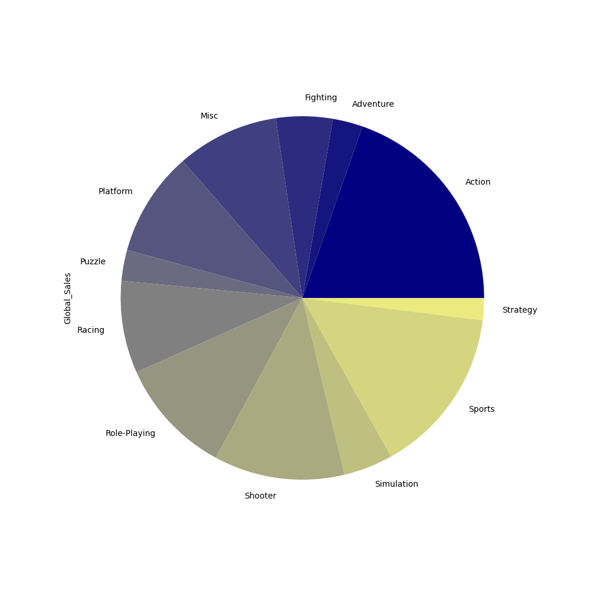
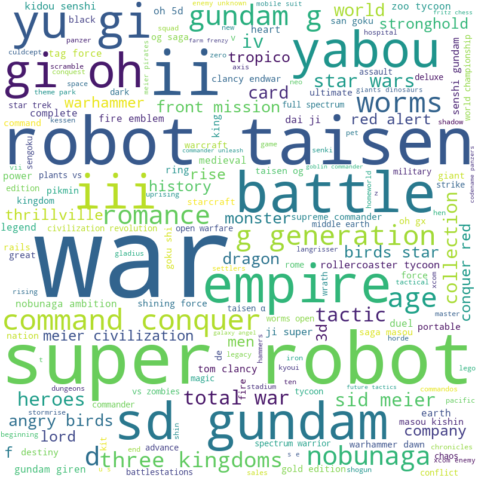

# Video Game Sales Analysis

## Dataset
https://www.kaggle.com/datasets/gregorut/videogamesales?datasetId=284 

This dataset contains a list of video games with sales greater than 100,000 copies. It was generated by a scrape of vgchartz.com.

 There appears to be some missing data past 2019.

Fields include:
* Rank - Ranking of overall sales
* Name - The games name
* Platform - Platform of the games release (i.e. PC,PS4, etc.)
* Year - Year of the game's release
* Genre - Genre of the game
* Publisher - Publisher of the game
* NA_Sales - Sales in North America (in millions)
* EU_Sales - Sales in Europe (in millions)
* JP_Sales - Sales in Japan (in millions)
* Other_Sales - Sales in the rest of the world (in millions)
* Global_Sales - Total worldwide sales.

## Pre-analysis
Looking at the fields above, here's a list of potential insights:
* Find top genres / genre distribution for each region
* Sales numbers by year per region
* Aggregate sales data for each platform. Maybe by region
* Most popular genre each year.
* Publishers with diverse releases (several genres) vs publishers with single genres: Is it more profitable to diversify or specialize?
* Which platforms supports the most number of games? Which platform supports the most variety of game types?
* Does a publisher’s success correlate to how many games it releases?
* Plot publisher growth over the years
* OVERALL: Aggregates based on platform, genre, region
* FOR FUN: Maybe do something with the game names, maybe a wordcloud?

## Key Highlights
Sales numbers are in millions of dollars. Find the rest of the data in the VGS Aggregates files.

### Total Sales by Genre per region

                  NA_Sales  EU_Sales  JP_Sales  Other_Sales  Global_Sales
    Genre                                                                
    Action          877.83    525.00    159.95       187.38       1751.18
    Adventure       105.80     64.13     52.07        16.81        239.04
    Fighting        223.59    101.32     87.35        36.68        448.91
    Misc            410.24    215.98    107.76        75.32        809.96
    Platform        447.05    201.63    130.77        51.59        831.37
    Puzzle          123.78     50.78     57.31        12.55        244.95
    Racing          359.42    238.39     56.69        77.27        732.04
    Role-Playing    327.28    188.06    352.31        59.61        927.37
    Shooter         582.60    313.27     38.28       102.69       1037.37
    Simulation      183.31    113.38     63.70        31.52        392.20
    Sports          683.35    376.85    135.37       134.97       1330.93
    Strategy         68.70     45.34     49.46        11.36        175.12

### Sales growth over years

### What is a company's profitability by game?
(Excluding publishers with small number of releases)

                                                sum  count  sum/count
    Publisher                                                        
    Nintendo                                1786.56    703   2.541337
    Sony Computer Entertainment Europe        23.89     15   1.592667
    Microsoft Game Studios                   245.79    189   1.300476
    Bethesda Softworks                        82.14     71   1.156901
    Enix Corporation                          33.74     30   1.124667
    SquareSoft                                57.65     52   1.108654
    LucasArts                                 87.34     90   0.970444
    Take-Two Interactive                     399.54    413   0.967409
    989 Studios                               13.32     14   0.951429
    Hasbro Interactive                        15.22     16   0.951250
    Sony Computer Entertainment              607.50    683   0.889458
    Electronic Arts                         1110.32   1351   0.821850
    Universal Interactive                     17.77     23   0.772609
    Activision                               727.46    975   0.746113
    Virgin Interactive                        43.87     62   0.707581
    Warner Bros. Interactive Entertainment   153.89    232   0.663319
    Square Enix                              145.18    233   0.623090
    GT Interactive                            25.23     45   0.560667
    Disney Interactive Studios               119.96    218   0.550275
    ASCII Entertainment                       10.89     20   0.544500
    Capcom                                   200.89    381   0.527270
    Ubisoft                                  474.72    921   0.515440
    MTV Games                                 20.97     41   0.511463
    Eidos Interactive                         98.98    198   0.499899
    THQ                                      340.77    715   0.476601
    Level 5                                   12.17     27   0.450741
    Atari                                    157.22    363   0.433113
    Sega                                     272.99    639   0.427214
    .....

### Genre Distribution

### Platform Data

Number of games by platform and genre

                                Games
    Platform    Genre                                                                
    PS2      Sports             400
    DS       Misc               393 
    PS3      Action             380 
    PS2      Action             348 
    DS       Action             343 
    X360     Action             324
    DS       Simulation         285 
    Wii      Misc               280
    ...

Total number of games for each platform

    Platform    Games
    DS      2163
    PS2     2161
    PS3     1329
    Wii     1325
    X360    1265
    PSP     1213
    PS      1196
    PC       960
    ...

## Wordclouds generated from the game names in each genre
 
See more in the wordclouds folder

### Strategy

# Takeaways

* ### North America and Europe have similiar video game buying habits with their top genres being (in order): Action, Sports, and Shooter.
* ### Role-playing games are extremely popular in Japan, sitting almost 200 million dollars above its runner up (Action).
* ### North America has the largest market for video games of every genre except for Role-playing.
* ### While most top publishers have ventured into all genres, a majority of their profits still come from a select few.
* ### While video game sales accross the world show a degree of correlation, sales in Japan are unaffected by outside fluctations.
* ### The Playstation series has the most support for Sports and Action games, while Xbox has the highest support for Shooters. 
* ### If you are going to make a Strategy game, include robots.

