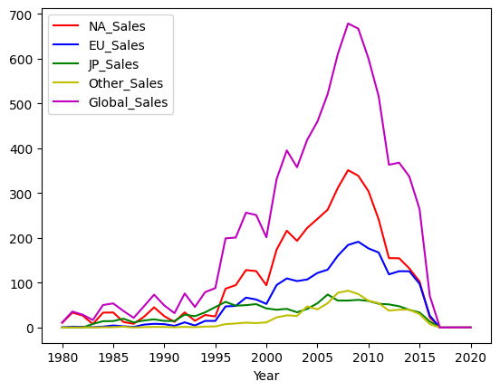

```python
import pandas as pd
import matplotlib.pyplot as plt
from prettytable import PrettyTable
```


```python
# Initialize dataframe
df = pd.read_csv('vgsales.csv', index_col='Rank')
```


```python
# Group by Genre 					--------------------------------------------------
df_genre = df[['Genre', 'NA_Sales', 'EU_Sales', 'JP_Sales', 'Other_Sales', 'Global_Sales']].groupby(['Genre'])
```


```python
# Sum / Total Sales
print(df_genre.sum())
```

                  NA_Sales  EU_Sales  JP_Sales  Other_Sales  Global_Sales
    Genre                                                                
    Action          877.83    525.00    159.95       187.38       1751.18
    Adventure       105.80     64.13     52.07        16.81        239.04
    Fighting        223.59    101.32     87.35        36.68        448.91
    Misc            410.24    215.98    107.76        75.32        809.96
    Platform        447.05    201.63    130.77        51.59        831.37
    Puzzle          123.78     50.78     57.31        12.55        244.95
    Racing          359.42    238.39     56.69        77.27        732.04
    Role-Playing    327.28    188.06    352.31        59.61        927.37
    Shooter         582.60    313.27     38.28       102.69       1037.37
    Simulation      183.31    113.38     63.70        31.52        392.20
    Sports          683.35    376.85    135.37       134.97       1330.93
    Strategy         68.70     45.34     49.46        11.36        175.12
    


```python
# Max
print(df_genre.max())
```

                  NA_Sales  EU_Sales  JP_Sales  Other_Sales  Global_Sales
    Genre                                                                
    Action            9.63      9.27      3.96        10.57         21.40
    Adventure         6.16      2.79      2.69         0.83         11.18
    Fighting          6.75      2.61      2.87         1.41         13.04
    Misc             14.97      9.26      4.16         2.85         29.02
    Platform         29.08      9.23      6.81         2.90         40.24
    Puzzle           23.20      5.36      5.32         1.18         30.26
    Racing           15.85     12.88      4.13         7.53         35.82
    Role-Playing     11.27      8.89     10.22         1.74         31.37
    Shooter          26.93      5.88      1.44         2.52         28.31
    Simulation        9.07     11.00      5.33         2.75         24.76
    Sports           41.49     29.02      3.77         8.46         82.74
    Strategy          3.18      2.27      1.61         0.59          5.45
    


```python
# Count
print(df_genre[['Global_Sales']].count())
```

                  Global_Sales
    Genre                     
    Action                3316
    Adventure             1286
    Fighting               848
    Misc                  1739
    Platform               886
    Puzzle                 582
    Racing                1249
    Role-Playing          1488
    Shooter               1310
    Simulation             867
    Sports                2346
    Strategy               681
    


```python
# Group by Publisher				----------------------------------------------

df_pub = df[['Publisher', 'NA_Sales', 'EU_Sales', 'JP_Sales', 'Other_Sales', 'Global_Sales']].groupby(['Publisher'])
```


```python
# Sum / Total Sales
print(df_pub.sum().sort_values('Global_Sales', ascending=False))
```

                                 NA_Sales  EU_Sales  JP_Sales  Other_Sales  \
    Publisher                                                                
    Nintendo                       816.87    418.74    455.42        95.33   
    Electronic Arts                595.07    371.27     14.04       129.77   
    Activision                     429.70    215.53      6.54        75.34   
    Sony Computer Entertainment    265.22    187.72     74.10        80.45   
    Ubisoft                        253.43    163.32      7.50        50.26   
    ...                               ...       ...       ...          ...   
    Ongakukan                        0.00      0.00      0.01         0.00   
    Commseed                         0.00      0.00      0.01         0.00   
    Takuyo                           0.00      0.00      0.01         0.00   
    Boost On                         0.00      0.00      0.01         0.00   
    Naxat Soft                       0.00      0.00      0.01         0.00   
    
                                 Global_Sales  
    Publisher                                  
    Nintendo                          1786.56  
    Electronic Arts                   1110.32  
    Activision                         727.46  
    Sony Computer Entertainment        607.50  
    Ubisoft                            474.72  
    ...                                   ...  
    Ongakukan                            0.01  
    Commseed                             0.01  
    Takuyo                               0.01  
    Boost On                             0.01  
    Naxat Soft                           0.01  
    
    [578 rows x 5 columns]
    


```python
# Max
print(df_pub.max().sort_values('Global_Sales', ascending=False))
```

                                 NA_Sales  EU_Sales  JP_Sales  Other_Sales  \
    Publisher                                                                
    Nintendo                        41.49     29.02     10.22         8.46   
    Microsoft Game Studios          14.97      4.94      0.24         1.67   
    Take-Two Interactive             9.63      9.27      0.97        10.57   
    Sony Computer Entertainment      6.85      5.09      3.28         7.53   
    Activision                       9.67      6.21      0.65         2.52   
    ...                               ...       ...       ...          ...   
    UIG Entertainment                0.00      0.01      0.00         0.00   
    Stainless Games                  0.01      0.01      0.00         0.00   
    Epic Games                       0.01      0.00      0.00         0.00   
    New World Computing              0.01      0.00      0.00         0.00   
    Naxat Soft                       0.00      0.00      0.01         0.00   
    
                                 Global_Sales  
    Publisher                                  
    Nintendo                            82.74  
    Microsoft Game Studios              21.82  
    Take-Two Interactive                21.40  
    Sony Computer Entertainment         14.98  
    Activision                          14.76  
    ...                                   ...  
    UIG Entertainment                    0.01  
    Stainless Games                      0.01  
    Epic Games                           0.01  
    New World Computing                  0.01  
    Naxat Soft                           0.01  
    
    [578 rows x 5 columns]
    


```python
# Min
print(df_pub.min().sort_values('Global_Sales', ascending=False))
```

                         NA_Sales  EU_Sales  JP_Sales  Other_Sales  Global_Sales
    Publisher                                                                   
    Palcom                   3.38      0.44      0.31         0.04          4.17
    Red Orb                  0.02      0.82      0.00         0.00          2.43
    UEP Systems              1.52      0.46      0.20         0.08          2.25
    Arena Entertainment      1.75      0.25      0.00         0.05          2.05
    Valve                    0.83      0.63      0.02         0.25          1.74
    ...                       ...       ...       ...          ...           ...
    Rain Games               0.00      0.01      0.00         0.00          0.01
    Rebellion                0.01      0.00      0.00         0.00          0.01
    Game Factory             0.01      0.00      0.00         0.00          0.01
    Reef Entertainment       0.00      0.00      0.00         0.00          0.01
    Falcom Corporation       0.00      0.00      0.01         0.00          0.01
    
    [578 rows x 5 columns]
    


```python
# Count
print(df_pub.count().sort_values('Global_Sales', ascending=False)['Global_Sales'])
```

    Publisher
    Electronic Arts                 1351
    Activision                       975
    Namco Bandai Games               932
    Ubisoft                          921
    Konami Digital Entertainment     832
                                    ... 
    Playmates                          1
    Playmore                           1
    Plenty                             1
    Pony Canyon                        1
    SCS Software                       1
    Name: Global_Sales, Length: 578, dtype: int64
    


```python
# Group by Publisher and Genre	----------------------------------------------

df_genre_pub = df[['Genre', 'Publisher', 'NA_Sales', 'EU_Sales', 'JP_Sales', 'Other_Sales', 'Global_Sales']].groupby(['Genre', 'Publisher'])
```


```python
# How much each publisher made per genre
print(df_genre_pub.sum().sort_values('Global_Sales', ascending=False).to_string())
```

                                                         NA_Sales  EU_Sales  JP_Sales  Other_Sales  Global_Sales
    Genre        Publisher                                                                                      
    Sports       Electronic Arts                           270.27    146.97      3.27        59.01        479.67
    Platform     Nintendo                                  220.14     85.21    102.36        19.47        427.21
    Shooter      Activision                                161.39     98.59      4.64        35.16        299.87
    Role-Playing Nintendo                                  105.63     63.92    102.24        13.07        284.90
    Sports       Nintendo                                   98.77     66.18     35.87        17.18        218.01
    Action       Take-Two Interactive                      101.45     70.44      4.44        34.78        211.08
    Misc         Nintendo                                   61.98     51.62     55.25        11.78        180.67
    Shooter      Electronic Arts                            81.15     56.03      2.93        18.20        158.26
    Racing       Nintendo                                   73.55     39.75     29.22         8.81        151.30
                 Electronic Arts                            75.52     51.20      1.20        17.90        145.77
    Action       Ubisoft                                    69.38     54.10      2.11        17.37        142.94
                 Activision                                 87.29     40.02      1.08        13.83        142.33
    ....
    


```python
# How many games did each publisher make per genre
print(df_genre_pub.size().to_string())
```

    Genre         Publisher                             
    Action        20th Century Fox Video Games                4
                  3DO                                        17
                  505 Games                                  21
                  5pb                                         5
                  989 Studios                                 2
                  ASC Games                                   1
                  Abylight                                    1
                  Acclaim Entertainment                      14
                  Ackkstudios                                 4
                  Acquire                                     2
                  Activision                                310
                  Activision Blizzard                         1
                  ...

```python
# Is it more profitable to specialize or diversify?
df_pub2 = df[['Publisher', 'Genre', 'Global_Sales']].groupby(['Publisher'])

pub2_nun = df_pub2.agg({'Genre': pd.Series.nunique, 'Global_Sales': pd.Series.sum})
print(pub2_nun.sort_values('Global_Sales', ascending=False).to_string())
```

                                            Genre  Global_Sales
    Publisher                                                  
    Nintendo                                   12       1786.56
    Electronic Arts                            12       1110.32
    Activision                                 12        727.46
    Sony Computer Entertainment                12        607.50
    Ubisoft                                    12        474.72
    Take-Two Interactive                       12        399.54
    THQ                                        12        340.77
    Konami Digital Entertainment               12        283.64
    Sega                                       12        272.99
    Namco Bandai Games                         12        254.09
    Microsoft Game Studios                     12        245.79
    Capcom                                     12        200.89
    Atari                                      12        157.22
    Warner Bros. Interactive Entertainment      9        153.89
    Square Enix                                 9        145.18
    Disney Interactive Studios                 10        119.96
    ...
    


```python
# Number of games and total sales - Here you can see each publisher's profitablity by game
pub2_games = df_pub2['Global_Sales'].agg(['sum', 'count'])
pub2_games['sum/count'] = pub2_games['sum'] / pub2_games['count']
print(pub2_games.sort_values('sum/count', ascending=False).to_string())
```

                                                sum  count  sum/count
    Publisher                                                        
    Palcom                                     4.17      1   4.170000
    Red Orb                                    5.24      2   2.620000
    Nintendo                                1786.56    703   2.541337
    Arena Entertainment                        4.72      2   2.360000
    UEP Systems                                2.25      1   2.250000
    RedOctane                                  8.68      4   2.170000
    Valve                                      1.74      1   1.740000
    Hello Games                                1.60      1   1.600000
    Sony Computer Entertainment Europe        23.89     15   1.592667
    Westwood Studios                           1.55      1   1.550000
    Microsoft Game Studios                   245.79    189   1.300476
    Imagic                                     4.82      4   1.205000
    Black Label Games                          1.20      1   1.200000
    Bethesda Softworks                        82.14     71   1.156901
    Maxis                                      3.39      3   1.130000
    Enix Corporation                          33.74     30   1.124667
    SquareSoft                                57.65     52   1.108654
    Valve Software                             3.23      3   1.076667
    LucasArts                                 87.34     90   0.970444
    Take-Two Interactive                     399.54    413   0.967409
    ...
    


```python
# Group by Platform				----------------------------------------------

df_plat = df[['Platform', 'NA_Sales', 'EU_Sales', 'JP_Sales', 'Other_Sales', 'Global_Sales']].groupby(['Platform'])
```


```python
# Total sales by platform
print(df_plat.sum().sort_values('Global_Sales', ascending=False).to_string())

```

              NA_Sales  EU_Sales  JP_Sales  Other_Sales  Global_Sales
    Platform                                                         
    PS2         583.84    339.29    139.20       193.44       1255.64
    X360        601.05    280.58     12.43        85.54        979.96
    PS3         392.26    343.71     79.99       141.93        957.84
    Wii         507.71    268.38     69.35        80.61        926.71
    DS          390.71    194.65    175.57        60.53        822.49
    PS          336.51    213.60    139.82        40.91        730.66
    GBA         187.54     75.25     47.33         7.73        318.50
    PSP         108.99     68.25     76.79        42.19        296.28
    PS4          96.80    123.70     14.30        43.36        278.10
    PC           93.28    139.68      0.17        24.86        258.82
    XB          186.69     60.95      1.38         8.72        258.26
    GB          114.32     47.82     85.12         8.20        255.45
    NES         125.94     21.15     98.65         5.31        251.07
    3DS          78.87     58.52     97.35        12.63        247.46
    N64         139.02     41.06     34.22         4.38        218.88
    SNES         61.23     19.04    116.55         3.22        200.05
    GC          133.46     38.71     21.58         5.18        199.36
    XOne         83.19     45.65      0.34        11.92        141.06
    2600         90.60      5.47      0.00         0.91         97.08
    WiiU         38.32     24.23     12.79         6.45         81.86
    PSV          16.20     16.33     20.96         8.45         61.93
    SAT           0.72      0.54     32.26         0.07         33.59
    GEN          19.27      5.52      2.67         0.89         28.36
    DC            5.43      1.69      8.56         0.27         15.97
    SCD           1.00      0.36      0.45         0.05          1.87
    NG            0.00      0.00      1.44         0.00          1.44
    WS            0.00      0.00      1.42         0.00          1.42
    TG16          0.00      0.00      0.16         0.00          0.16
    3DO           0.00      0.00      0.10         0.00          0.10
    GG            0.00      0.00      0.04         0.00          0.04
    PCFX          0.00      0.00      0.03         0.00          0.03
    


```python
# Group by Platform and Genre
df_plat_gen = df[['Platform', 'Genre', 'NA_Sales', 'EU_Sales', 'JP_Sales', 'Other_Sales', 'Global_Sales']].groupby(['Platform', 'Genre'])

# Number of Games per Platform and Genre
print(df_plat_gen.size().to_string())
```

    Platform  Genre       
    2600      Action           61
              Adventure         2
              Fighting          2
              Misc              5
              Platform          9
              Puzzle           11
              Racing            6
              Shooter          24
              Simulation        1
              Sports           12
    3DO       Adventure         1
    ...

    


```python
# # Group By Year					----------------------------------------------

df_year = df[['Year', 'Publisher', 'Platform', 'Genre', 'NA_Sales', 'EU_Sales', 'JP_Sales', 'Other_Sales', 'Global_Sales']].groupby(['Year'])
print(df_year.sum().to_string())
```

            NA_Sales  EU_Sales  JP_Sales  Other_Sales  Global_Sales
    Year                                                           
    1980.0     10.59      0.67      0.00         0.12         11.38
    1981.0     33.40      1.96      0.00         0.32         35.77
    1982.0     26.92      1.65      0.00         0.31         28.86
    1983.0      7.76      0.80      8.10         0.14         16.79
    1984.0     33.28      2.10     14.27         0.70         50.36
    1985.0     33.73      4.74     14.56         0.92         53.94
    1986.0     12.50      2.84     19.81         1.93         37.07
    1987.0      8.46      1.41     11.63         0.20         21.74
    1988.0     23.87      6.59     15.76         0.99         47.22
    1989.0     45.15      8.44     18.36         1.50         73.45
    1990.0     25.46      7.63     14.88         1.40         49.39
    1991.0     12.76      3.95     14.78         0.74         32.23
    1992.0     33.87     11.71     28.91         1.65         76.16
    1993.0     15.12      4.65     25.33         0.89         45.98
    1994.0     28.15     14.88     33.99         2.20         79.17
    1995.0     24.82     14.90     45.75         2.64         88.11
    1996.0     86.76     47.26     57.44         7.69        199.15
    1997.0     94.75     48.32     48.87         9.13        200.98
    1998.0    128.36     66.90     50.04        11.03        256.47
    1999.0    126.06     62.67     52.34        10.05        251.27
    2000.0     94.49     52.75     42.77        11.62        201.56
    2001.0    173.98     94.89     39.86        22.76        331.47
    2002.0    216.19    109.74     41.76        27.28        395.52
    2003.0    193.59    103.81     34.20        26.01        357.85
    2004.0    222.59    107.32     41.65        47.29        419.31
    2005.0    242.61    121.94     54.28        40.58        459.94
    2006.0    263.12    129.24     73.73        54.43        521.04
    2007.0    312.05    160.50     60.29        77.60        611.13
    2008.0    351.44    184.40     60.26        82.39        678.90
    2009.0    338.85    191.59     61.89        74.77        667.30
    2010.0    304.24    176.73     59.49        59.90        600.45
    2011.0    241.06    167.44     53.04        54.39        515.99
    2012.0    154.96    118.78     51.74        37.82        363.54
    2013.0    154.77    125.80     47.59        39.82        368.11
    2014.0    131.97    125.65     39.46        40.02        337.05
    2015.0    102.82     97.71     33.72        30.01        264.44
    2016.0     22.66     26.76     13.70         7.75         70.93
    2017.0      0.00      0.00      0.05         0.00          0.05
    2020.0      0.27      0.00      0.00         0.02          0.29
    


```python
dfsum = df_year.sum()
dfsum.plot(color=['r','b','g','y','m'])
plt.show()
```


    

    


```python
# Total Sales by region

total_na_sales = df['NA_Sales'].sum()
total_eu_sales = df['EU_Sales'].sum()
total_jp_sales = df['JP_Sales'].sum()
total_other_sales = df['Other_Sales'].sum()
total_global_sales = df['Global_Sales'].sum()

print(f"Total NA Sales: ${total_na_sales:.2f} (in millions)")
print(f"Total EU Sales: ${total_eu_sales:.2f} (in millions)")
print(f"Total JP Sales: ${total_jp_sales:.2f} (in millions)")
print(f"Total Other Sales: ${total_other_sales:.2f} (in millions)")
print(f"Total Sales: ${total_global_sales:.2f} (in millions)")
```

    Total NA Sales: $4392.95 (in millions)
    Total EU Sales: $2434.13 (in millions)
    Total JP Sales: $1291.02 (in millions)
    Total Other Sales: $797.75 (in millions)
    Total Sales: $8920.44 (in millions)
    


```python
# Max and Min by region

max_na = df.iloc[df['NA_Sales'].idxmax()-1] #rank starts at 1, index starts at 0 so we -1 from idx
min_na = df.iloc[df['NA_Sales'].idxmin()-1]

max_eu = df.iloc[df['EU_Sales'].idxmax()-1]
min_eu = df.iloc[df['EU_Sales'].idxmin()-1]

max_jp = df.iloc[df['JP_Sales'].idxmax()-1]
min_jp = df.iloc[df['JP_Sales'].idxmin()-1]

max_other = df.iloc[df['Other_Sales'].idxmax()-1]
min_other = df.iloc[df['Other_Sales'].idxmin()-1]

max_global = df.iloc[df['Global_Sales'].idxmax()-1]
min_global = df.iloc[df['Global_Sales'].idxmin()-1]

# # Show results in an ASCII table
max_t = PrettyTable(['Region', 'Name', 'Publisher', 'Platform', 'Year'])
min_t = PrettyTable(['Region', 'Name', 'Publisher', 'Platform', 'Year'])

max_t.add_row(['NA', max_na['Name'], max_na['Publisher'], max_na['Platform'], f"{max_na['Year']:.0f}"])
max_t.add_row(['EU', max_eu['Name'], max_eu['Publisher'], max_eu['Platform'], f"{max_eu['Year']:.0f}"])
max_t.add_row(['JP', max_jp['Name'], max_jp['Publisher'], max_jp['Platform'], f"{max_jp['Year']:.0f}"])
max_t.add_row(['Other', max_other['Name'], max_other['Publisher'], max_other['Platform'], f"{max_other['Year']:.0f}"])
max_t.add_row(['Global', max_global['Name'], max_global['Publisher'], max_global['Platform'], f"{max_global['Year']:.0f}"])


print('')
print('Highest Grossing Games of All-time by Region')
print(max_t)
```

    
    Highest Grossing Games of All-time by Region
    +--------+-------------------------------+----------------------+----------+------+
    | Region |              Name             |      Publisher       | Platform | Year |
    +--------+-------------------------------+----------------------+----------+------+
    |   NA   |           Wii Sports          |       Nintendo       |   Wii    | 2006 |
    |   EU   |           Wii Sports          |       Nintendo       |   Wii    | 2006 |
    |   JP   |    Pokemon Red/Pokemon Blue   |       Nintendo       |    GB    | 1996 |
    | Other  | Grand Theft Auto: San Andreas | Take-Two Interactive |   PS2    | 2004 |
    | Global |           Wii Sports          |       Nintendo       |   Wii    | 2006 |
    +--------+-------------------------------+----------------------+----------+------+
    


```python
min_t.add_row(['NA', min_na['Name'], min_na['Publisher'], min_na['Platform'], f"{min_na['Year']:.0f}"])
min_t.add_row(['EU', min_eu['Name'], min_eu['Publisher'], min_eu['Platform'], f"{min_eu['Year']:.0f}"])
min_t.add_row(['JP', min_jp['Name'], min_jp['Publisher'], min_jp['Platform'], f"{min_jp['Year']:.0f}"])
min_t.add_row(['Other', min_other['Name'], min_other['Publisher'], min_other['Platform'], f"{min_other['Year']:.0f}"])
min_t.add_row(['Global', min_global['Name'], min_global['Publisher'], min_global['Platform'], f"{min_global['Year']:.0f}"])

print('Lowest Grossing Games of All-time by Region')
print(min_t)
```

    Lowest Grossing Games of All-time by Region
    +--------+------------------------------------------------------------------------------------------+--------------------+----------+------+
    | Region |                                           Name                                           |     Publisher      | Platform | Year |
    +--------+------------------------------------------------------------------------------------------+--------------------+----------+------+
    |   NA   |                                 Monster Hunter Freedom 3                                 |       Capcom       |   PSP    | 2010 |
    |   EU   |                                    Final Fantasy XII                                     |    Square Enix     |   PS2    | 2006 |
    |   JP   |                                       Just Dance 3                                       |      Ubisoft       |   Wii    | 2011 |
    | Other  |                                    World of Warcraft                                     |     Activision     |    PC    | 2004 |
    | Global | Super Battle For Money Sentouchuu: Kyuukyoku no Shinobu to Battle Player Choujou Kessen! | Namco Bandai Games |   3DS    | 2016 |
    +--------+------------------------------------------------------------------------------------------+--------------------+----------+------+
    


```python
# Get rest of stats

stat_t = PrettyTable(['Region', 'count', 'mean', 'std', 'min', '25%', '50%', '75%', 'max'])
na_stats = df['NA_Sales'].describe()
eu_stats = df['EU_Sales'].describe()
jp_stats = df['JP_Sales'].describe()
other_stats = df['Other_Sales'].describe()
global_stats = df['Global_Sales'].describe()

stat_t.add_row(['NA', na_stats['count'],na_stats['mean'],na_stats['std'],na_stats['min'],na_stats['25%'],na_stats['50%'],na_stats['75%'], na_stats['max']])
stat_t.add_row(['EU', eu_stats['count'],eu_stats['mean'],eu_stats['std'],eu_stats['min'],eu_stats['25%'],eu_stats['50%'],eu_stats['75%'], eu_stats['max']])
stat_t.add_row(['JP', jp_stats['count'],jp_stats['mean'],jp_stats['std'],jp_stats['min'],jp_stats['25%'],jp_stats['50%'],jp_stats['75%'], jp_stats['max']])
stat_t.add_row(['Other', other_stats['count'],other_stats['mean'],other_stats['std'],other_stats['min'],other_stats['25%'],other_stats['50%'],other_stats['75%'], other_stats['max']])
stat_t.add_row(['Global', global_stats['count'],global_stats['mean'],global_stats['std'],global_stats['min'],global_stats['25%'],global_stats['50%'],global_stats['75%'], global_stats['max']])

print('Stat Distribution')
print(stat_t)
```

    Stat Distribution
    +--------+---------+---------------------+---------------------+------+------+------+------+-------+
    | Region |  count  |         mean        |         std         | min  | 25%  | 50%  | 75%  |  max  |
    +--------+---------+---------------------+---------------------+------+------+------+------+-------+
    |   NA   | 16598.0 | 0.26466742981082064 |  0.8166830292988796 | 0.0  | 0.0  | 0.08 | 0.24 | 41.49 |
    |   EU   | 16598.0 | 0.14665200626581515 |  0.5053512312869116 | 0.0  | 0.0  | 0.02 | 0.11 | 29.02 |
    |   JP   | 16598.0 |  0.077781660441017  | 0.30929064808220297 | 0.0  | 0.0  | 0.0  | 0.04 | 10.22 |
    | Other  | 16598.0 |  0.0480630196409206 | 0.18858840291271461 | 0.0  | 0.0  | 0.01 | 0.04 | 10.57 |
    | Global | 16598.0 |  0.5374406555006628 |  1.5550279355699124 | 0.01 | 0.06 | 0.17 | 0.47 | 82.74 |
    +--------+---------+---------------------+---------------------+------+------+------+------+-------+
    


```python

```
